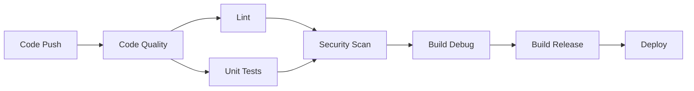

# Development Guide

## 🚀 Quick Start

### Prerequisites

- **Android Studio**: Arctic Fox (2020.3.1) or later
- **JDK**: 17 or later
- **Android SDK**: API 28-34
- **Android NDK**: 26.1.10909125
- **Git**: Latest version

### Setup

1. **Clone the repository**
   ```bash
   git clone https://github.com/itsnothuy/Iris.git
   cd Iris
   ```

2. **Run the setup script**
   ```bash
   chmod +x scripts/setup-dev.sh
   ./scripts/setup-dev.sh
   ```

3. **Open in Android Studio**
   - Open Android Studio
   - Select "Open an Existing Project"
   - Navigate to the cloned repository
   - Let Gradle sync complete

4. **Build and run**
   ```bash
   ./gradlew assembleDebug
   ```

## 🏗️ Build System

### Gradle Commands

```bash
# Build
./gradlew assembleDebug          # Build debug APK
./gradlew assembleRelease        # Build release APK
./gradlew bundleRelease          # Build release AAB

# Testing
./gradlew test                   # Run unit tests
./gradlew connectedAndroidTest   # Run instrumented tests
./gradlew jacocoTestReport       # Generate coverage report

# Code Quality
./gradlew ktlintCheck            # Check Kotlin code style
./gradlew ktlintFormat           # Format Kotlin code
./gradlew detekt                 # Run static analysis
./gradlew lint                   # Run Android lint

# Dependencies
./gradlew dependencyUpdates      # Check for dependency updates
./gradlew dependencyCheckAnalyze # Check for vulnerabilities
```

## 🧪 Testing

### Test Structure

```
app/src/
├── test/                    # Unit tests
│   └── java/
│       └── com/nervesparks/iris/
└── androidTest/             # Instrumented tests
    └── java/
        └── com/nervesparks/iris/
```

### Writing Tests

**Unit Test Example:**
```kotlin
@Test
fun `should process message correctly`() {
    // Given
    val message = "Hello, Iris"
    
    // When
    val result = viewModel.processMessage(message)
    
    // Then
    assertThat(result).isNotNull()
    assertThat(result.content).isEqualTo(message)
}
```

**Compose UI Test Example:**
```kotlin
@Test
fun chatScreen_displaysMessages() {
    composeTestRule.setContent {
        ChatScreen(viewModel = viewModel)
    }
    
    composeTestRule
        .onNodeWithText("Hello")
        .assertIsDisplayed()
}
```

### Running Tests

```bash
# All unit tests
./gradlew test

# Specific test class
./gradlew test --tests MainViewModelTest

# With coverage
./gradlew jacocoTestReport

# Instrumented tests
./gradlew connectedAndroidTest
```

## 🔍 Code Quality

### Pre-commit Hooks

Git hooks are automatically installed by `setup-dev.sh`:

- **ktlint**: Checks Kotlin code style
- **detekt**: Runs static analysis

To bypass (not recommended):
```bash
git commit --no-verify
```

### Manual Quality Checks

```bash
# Check everything
./gradlew check

# Individual checks
./gradlew ktlintCheck  # Code style
./gradlew detekt       # Static analysis
./gradlew lint         # Android lint
```

### Fixing Issues

```bash
# Auto-fix Kotlin formatting
./gradlew ktlintFormat

# Generate detekt baseline (if needed)
./gradlew detektBaseline
```

## 📦 Dependencies

### Adding Dependencies

1. **Check for vulnerabilities first:**
   ```bash
   # Research the dependency
   # Check GitHub stars, last update, security
   ```

2. **Add to `app/build.gradle.kts`:**
   ```kotlin
   dependencies {
       implementation("group:artifact:version")
   }
   ```

3. **Verify:**
   ```bash
   ./gradlew dependencyCheckAnalyze
   ```

4. **Test thoroughly**

### Updating Dependencies

```bash
# Check for updates
./gradlew dependencyUpdates

# Review and update build.gradle.kts
# Run tests to verify
./gradlew test connectedAndroidTest
```

## 🔒 Security

### Best Practices

1. **Never commit secrets**
   - Use `local.properties` for local secrets
   - Use GitHub Secrets for CI/CD
   - Add to `.gitignore`

2. **Validate inputs**
   ```kotlin
   require(input.isNotBlank()) { "Input required" }
   require(input.length <= MAX_LENGTH) { "Input too long" }
   ```

3. **Use encrypted storage**
   ```kotlin
   val sharedPreferences = EncryptedSharedPreferences.create(...)
   ```

4. **Check permissions**
   ```kotlin
   if (ContextCompat.checkSelfPermission(context, permission) 
       == PackageManager.PERMISSION_GRANTED) {
       // Use permission
   }
   ```

### Security Scanning

```bash
# Run security checks
./gradlew dependencyCheckAnalyze

# Review ProGuard rules
./gradlew assembleRelease
# Check mapping.txt
```

## 🚀 CI/CD Pipeline

### Workflows

Our CI/CD pipeline consists of:

1. **Enhanced CI** (`enhanced-ci.yml`)
   - Code quality checks
   - Lint and static analysis
   - Unit tests with coverage
   - Security scanning
   - Debug and release builds

2. **Multi-API Testing** (`multi-api-testing.yml`)
   - Tests on API levels 28, 33, 34
   - Robolectric tests
   - Instrumented tests on emulators

3. **Dependency Updates** (`dependency-updates.yml`)
   - Weekly dependency checks
   - Vulnerability scanning
   - Automated issue creation

4. **Release** (`release.yml`)
   - Tag-triggered builds
   - APK and AAB generation
   - GitHub release creation
   - Checksum generation

### Pipeline Stages



### GitHub Secrets Required

For release builds, configure these secrets:

- `RELEASE_STORE_FILE`: Base64-encoded keystore
- `RELEASE_STORE_PASSWORD`: Keystore password
- `RELEASE_KEY_ALIAS`: Key alias
- `RELEASE_KEY_PASSWORD`: Key password

## 📝 Pull Request Process

### Before Creating a PR

1. **Update from main**
   ```bash
   git checkout main
   git pull origin main
   git checkout your-branch
   git rebase main
   ```

2. **Run checks locally**
   ```bash
   ./gradlew check test
   ```

3. **Format code**
   ```bash
   ./gradlew ktlintFormat
   ```

4. **Commit with conventional commits**
   ```bash
   git commit -m "feat: add new feature"
   ```

### Creating a PR

1. Push your branch
2. Create PR on GitHub
3. Fill out PR template completely
4. Request review from maintainers
5. Address review feedback
6. Wait for CI to pass

### PR Checklist

- [ ] Builds successfully
- [ ] Tests pass
- [ ] Code coverage ≥ 80%
- [ ] No linting errors
- [ ] No security issues
- [ ] Documentation updated
- [ ] Architecture compliance verified

## 🏆 Code Review Guidelines

### As a Reviewer

- Be constructive and specific
- Explain the "why" behind suggestions
- Test the changes if possible
- Check architecture compliance
- Verify security implications

### As an Author

- Respond to all comments
- Ask questions if unclear
- Make requested changes promptly
- Thank reviewers
- Keep PRs small (~300 LOC)

## 📊 Performance Testing

### Profiling

```bash
# Build with profiling
./gradlew assembleDebug

# Use Android Studio Profiler
# - CPU Profiler
# - Memory Profiler
# - Network Profiler (should be empty!)
```

### Benchmarking

```kotlin
@Test
fun benchmark_inference() {
    val iterations = 100
    val startTime = System.currentTimeMillis()
    
    repeat(iterations) {
        model.inference(input)
    }
    
    val avgTime = (System.currentTimeMillis() - startTime) / iterations
    assertThat(avgTime).isLessThan(1000) // 1 second max
}
```

## 🐛 Debugging

### Logging

```kotlin
// Use structured logging
Log.d(TAG, "Processing message: ${message.id}")

// For releases, logs are stripped by ProGuard
if (BuildConfig.DEBUG) {
    Log.d(TAG, "Debug info")
}
```

### Debugging Native Code

```bash
# Attach native debugger in Android Studio
# Or use command line:
ndk-gdb --start --attach
```

### Common Issues

**Build fails:**
- Clean project: `./gradlew clean`
- Invalidate caches: File → Invalidate Caches / Restart
- Check Android SDK/NDK versions

**Tests fail:**
- Check test logs: `app/build/reports/tests/`
- Run single test: `./gradlew test --tests TestClass`

**Emulator issues:**
- Wipe data: AVD Manager → Wipe Data
- Recreate AVD with latest system image

## 📚 Resources

### Documentation

- [Architecture](../docs/architecture.md)
- [Contributing Guide](../CONTRIBUTING.md)
- [Security Policy](../SECURITY.md)
- [Code of Conduct](../CODE_OF_CONDUCT.md)

### External Resources

- [Android Developers](https://developer.android.com)
- [Kotlin Docs](https://kotlinlang.org/docs)
- [Jetpack Compose](https://developer.android.com/jetpack/compose)
- [llama.cpp](https://github.com/ggerganov/llama.cpp)

## 💡 Tips & Tricks

### Gradle

```bash
# Speed up builds
./gradlew assembleDebug --parallel --build-cache

# Profile build
./gradlew assembleDebug --profile

# Dependency tree
./gradlew app:dependencies
```

### Android Studio

- Use keyboard shortcuts (Cmd/Ctrl + Shift + A for actions)
- Enable auto-import for Kotlin
- Use live templates for common patterns
- Install recommended plugins (ktlint, detekt)

### Git

```bash
# Interactive rebase
git rebase -i HEAD~3

# Stash with message
git stash save "WIP: feature name"

# Cherry-pick commit
git cherry-pick <commit-hash>
```

## 🆘 Getting Help

### Before Asking

1. Check documentation
2. Search existing issues
3. Review stack trace carefully
4. Try to reproduce in isolation

### How to Ask

- Provide context
- Share error messages
- Include environment details
- Show what you've tried
- Create minimal reproduction

### Where to Ask

- **GitHub Issues**: Bug reports, feature requests
- **Discussions**: General questions, ideas
- **Security**: Private security advisories

---

**Last Updated**: November 2025  
**Maintained By**: iris_android contributors
