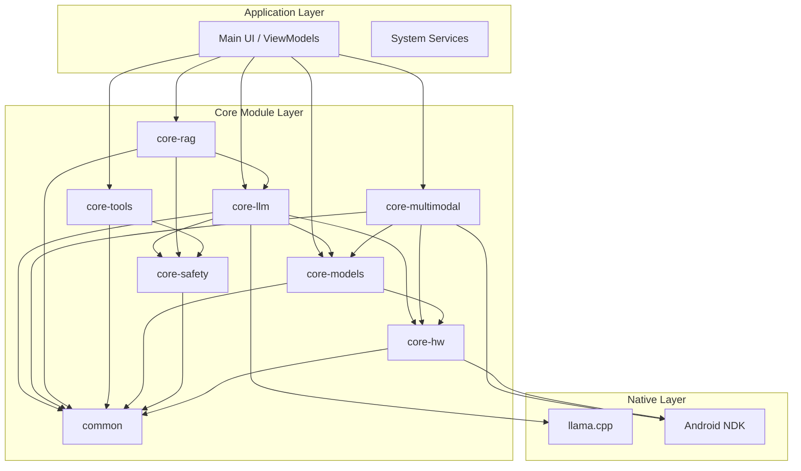

# IRIS Android Core Module Interactions & Data Flow Analysis

## Executive Summary

This document provides a microscopic analysis of how all **8 core modules** in IRIS Android interact with each other, their data flows, interface contracts, and file-by-file dependency chains. This analysis demonstrates the sophisticated production architecture enabling the multimodal AI assistant functionality.

## 🏛️ Module Architecture Overview



## 🔗 Core Module Interaction Analysis

### 1. Core-LLM Module - Primary AI Inference Engine

**Module Responsibility**: Native LLM inference with hardware optimization

**Key Interfaces**:
```kotlin
// File: core-llm/src/main/kotlin/com/nervesparks/iris/core/llm/LLMEngine.kt
interface LLMEngine {
    suspend fun loadModel(modelPath: String): Result<ModelHandle>
    suspend fun generateText(prompt: String, params: GenerationParams): Flow<String>
    suspend fun embed(text: String): FloatArray
    fun unloadModel(handle: ModelHandle)
    suspend fun getModelInfo(handle: ModelHandle): ModelInfo
    fun isModelLoaded(modelPath: String): Boolean
}
```

**Dependencies**:
- **core-hw**: `BackendRouter` for optimal compute backend selection
- **common**: Shared models (`ModelHandle`, `GenerationParams`)

**Interaction Flow**:
```kotlin
// File: core-llm/src/main/kotlin/.../LLMEngineImpl.kt:26
@Singleton
class LLMEngineImpl @Inject constructor(
    private val backendRouter: BackendRouter  // Dependency on core-hw
) : LLMEngine {
    
    override suspend fun loadModel(modelPath: String): Result<ModelHandle> {
        // 1. Query hardware module for optimal backend
        if (!isBackendInitialized) {
            val backend = backendRouter.selectOptimalBackend(ComputeTask.LLM_INFERENCE)
            val result = nativeInitializeBackend(backend.ordinal)
            // ...
        }
        
        // 2. Load model with hardware-optimized configuration
        val modelId = nativeLoadModel(modelPath, params)
        
        // 3. Create handle with backend information
        val handle = ModelHandle(
            id = modelId,
            modelPath = modelPath,
            backend = backendRouter.getCurrentBackend() // HW module data
        )
    }
}
```

**Data Flow - Text Generation**:
```
1. UI calls LLMEngine.generateText(prompt)
2. LLMEngine queries BackendRouter for optimal compute backend
3. LLMEngine calls native llama.cpp through JNI
4. Streaming tokens returned via Kotlin Flow
5. UI receives incremental text generation
```

### 2. Core-Models Module - Model Registry & Management  

**Module Responsibility**: Model discovery, validation, and lifecycle management

**Key Interfaces**:
```kotlin
// File: core-models/src/main/kotlin/.../ModelRegistry.kt
interface ModelRegistry {
    suspend fun getAvailableModels(type: ModelType?): List<ModelDescriptor>
    suspend fun getRecommendedModels(): List<ModelRecommendation>
    suspend fun validateModel(modelDescriptor: ModelDescriptor): ModelValidationResult
    suspend fun refreshCatalog(): Result<Unit>
}
```

**Dependencies**:
- **core-hw**: `DeviceProfileProvider` for device compatibility assessment
- **common**: Model type definitions and validation results

**Interaction Flow**:
```kotlin
// File: core-models/src/main/kotlin/.../ModelRegistryImpl.kt:74
override suspend fun getRecommendedModels(): List<ModelRecommendation> {
    val deviceProfile = deviceProfileProvider.getDeviceProfile() // HW module call
    val availableModels = getAvailableModels()
    
    return availableModels.mapNotNull { model ->
        val compatibility = assessModelCompatibility(model, deviceProfile)
        if (compatibility.isCompatible) {
            ModelRecommendation(
                model = model,
                compatibilityScore = compatibility.score,
                estimatedPerformance = estimatePerformance(model, deviceProfile)
            )
        } else null
    }.sortedByDescending { it.compatibilityScore }
}
```

**Data Flow - Model Recommendation**:
```
1. UI requests recommended models
2. ModelRegistry queries DeviceProfileProvider for hardware capabilities  
3. ModelRegistry assesses each model's compatibility with device
4. Returns sorted list of compatible models with performance estimates
5. UI displays appropriate models for user's device
```

### 3. Core-Multimodal Module - Vision, Speech & Audio Processing

**Module Responsibility**: Multimodal AI inference (vision, STT, TTS)

**Key Interfaces**:
```kotlin
// File: core-multimodal/src/main/kotlin/.../VisionProcessingEngine.kt
interface VisionProcessingEngine {
    suspend fun loadVisionModel(modelPath: String): Result<VisionModelHandle>
    suspend fun processImage(imageBitmap: Bitmap, prompt: String): String
    fun unloadVisionModel(handle: VisionModelHandle)
}

// File: core-multimodal/src/main/kotlin/.../SpeechToTextEngine.kt
interface SpeechToTextEngine {
    suspend fun startListening(): Flow<TranscriptionResult>
    suspend fun transcribeAudio(audioData: FloatArray): String
    suspend fun stopListening()
}
```

**Dependencies**:
- **core-hw**: Backend selection for multimodal inference
- **core-models**: Model validation and management
- **common**: Shared data types and error handling

**Interaction Flow**:
```kotlin
// File: core-multimodal/src/main/kotlin/.../VisionProcessingEngineImpl.kt:50
class VisionProcessingEngineImpl @Inject constructor(
    private val backendRouter: BackendRouter, // core-hw dependency
    private val modelRegistry: ModelRegistry   // core-models dependency  
) : VisionProcessingEngine {
    
    override suspend fun loadVisionModel(modelPath: String): Result<VisionModelHandle> {
        try {
            // 1. Validate model through models module
            val modelDescriptor = ModelDescriptor(
                id = modelPath,
                type = ModelType.MULTIMODAL,
                fileSize = File(modelPath).length()
            )
            
            val validation = modelRegistry.validateModel(modelDescriptor)
            if (!validation.isValid) {
                return Result.failure(ModelException(validation.reason))
            }
            
            // 2. Select optimal backend through hardware module  
            val backend = backendRouter.selectOptimalBackend(ComputeTask.MULTIMODAL_INFERENCE)
            
            // 3. Load native multimodal model
            // TODO: Integrate with native inference engine for actual model loading
            val handle = VisionModelHandle(/* ... */)
            
            return Result.success(handle)
        } catch (e: Exception) {
            return Result.failure(e)
        }
    }
}
```

**Data Flow - Vision Processing**:
```
1. UI captures image and provides prompt
2. VisionEngine validates model through ModelRegistry  
3. VisionEngine selects compute backend through BackendRouter
4. VisionEngine processes image through native vision model
5. Returns generated text description to UI
```

### 4. Core-RAG Module - Document Retrieval & Vector Search

**Module Responsibility**: Document processing and semantic search

**Key Interfaces**:
```kotlin
// File: core-rag/src/main/kotlin/com/nervesparks/iris/core/rag/RAGEngine.kt
interface RAGEngine {
    suspend fun addDocument(content: String, metadata: DocumentMetadata): Result<String>
    suspend fun searchRelevantContext(query: String, maxResults: Int): List<ScoredChunk>
    suspend fun generateAugmentedResponse(query: String, context: List<ScoredChunk>): String
}
```

**Dependencies**:
- **core-llm**: `LLMEngine` for embedding generation and text generation
- **core-safety**: Content validation before storage
- **common**: Shared data models

**Interaction Flow**:
```kotlin
// File: core-rag/src/main/kotlin/com/nervesparks/iris/core/rag/RAGEngineImpl.kt:35
class RAGEngineImpl @Inject constructor(
    private val llmEngine: LLMEngine,           // core-llm dependency
    private val safetyValidator: SafetyValidator, // core-safety dependency
    private val vectorStore: VectorStore,
    private val documentProcessor: DocumentProcessor
) : RAGEngine {
    
    override suspend fun addDocument(content: String, metadata: DocumentMetadata): Result<String> {
        try {
            // 1. Validate content through safety module
            val safetyResult = safetyValidator.validateContent(content)
            if (!safetyResult.isSafe) {
                return Result.failure(SafetyException(safetyResult.reason))
            }
            
            // 2. Process and chunk document
            val chunks = documentProcessor.processDocument(content, metadata)
            
            // 3. Generate embeddings through LLM module
            val embeddedChunks = chunks.map { chunk ->
                val embedding = llmEngine.embed(chunk.content) // LLM module call
                EmbeddedChunk(
                    id = chunk.id,
                    content = chunk.content,
                    embedding = embedding,
                    documentId = chunk.documentId
                )
            }
            
            // 4. Store in vector database
            vectorStore.saveChunks(embeddedChunks)
            
            return Result.success(chunks.first().documentId)
        } catch (e: Exception) {
            return Result.failure(e)
        }
    }
    
    override suspend fun searchRelevantContext(query: String, maxResults: Int): List<ScoredChunk> {
        // 1. Generate query embedding through LLM
        val queryEmbedding = llmEngine.embed(query)
        
        // 2. Search vector store for similar chunks
        return vectorStore.searchSimilar(queryEmbedding, maxResults, 0.7f)
    }
}
```

**Data Flow - Document RAG Pipeline**:
```
1. User adds document to knowledge base
2. RAGEngine validates content through SafetyValidator
3. DocumentProcessor chunks the document into segments  
4. RAGEngine generates embeddings for each chunk via LLMEngine
5. Chunks stored in VectorStore with embeddings
6. For queries: RAGEngine generates query embedding via LLMEngine
7. VectorStore returns semantically similar chunks
8. RAGEngine augments LLM prompt with retrieved context
```

### 5. Core-Safety Module - Content Validation & Moderation

**Module Responsibility**: Safety validation and content moderation

**Key Interfaces**:
```kotlin
// File: core-safety/src/main/kotlin/.../SafetyValidator.kt  
interface SafetyValidator {
    suspend fun validateContent(content: String): SafetyResult
    suspend fun validateInput(userInput: String): SafetyResult
    suspend fun validateOutput(generatedText: String): SafetyResult
}
```

**Dependencies**:
- **common**: Safety result models and validation types

**Interaction Flow**:
```kotlin
// File: core-safety/src/main/kotlin/.../SafetyValidatorImpl.kt
@Singleton
class SafetyValidatorImpl @Inject constructor() : SafetyValidator {
    
    override suspend fun validateContent(content: String): SafetyResult {
        // Multi-layer safety validation
        val profanityCheck = checkProfanity(content)
        val sensitiveInfoCheck = checkSensitiveInformation(content)
        val harmfulContentCheck = checkHarmfulContent(content)
        
        val violations = listOfNotNull(
            profanityCheck.takeIf { !it.isSafe },
            sensitiveInfoCheck.takeIf { !it.isSafe },
            harmfulContentCheck.takeIf { !it.isSafe }
        )
        
        return if (violations.isEmpty()) {
            SafetyResult(isSafe = true, reason = "Content passed all safety checks")
        } else {
            SafetyResult(
                isSafe = false, 
                reason = violations.joinToString("; ") { it.reason },
                violations = violations.flatMap { it.violations }
            )
        }
    }
}
```

**Cross-Module Safety Integration**:
```kotlin
// RAGEngine uses safety validation
val safetyResult = safetyValidator.validateContent(content)

// Future: LLMEngine output validation  
val generatedText = llmEngine.generateText(prompt)
val outputValidation = safetyValidator.validateOutput(generatedText.first())
```

### 6. Core-Tools Module - Function Calling & System Integration

**Module Responsibility**: Tool execution and system function calling

**Key Interfaces**:
```kotlin
// File: core-tools/src/main/kotlin/.../ToolEngine.kt
interface ToolEngine {
    suspend fun getAvailableTools(): List<ToolDefinition>
    suspend fun executeTool(functionCall: FunctionCall, context: ExecutionContext): ToolResult  
    suspend fun validateFunctionCall(functionCall: FunctionCall): ValidationResult
}
```

**Dependencies**:
- **core-safety**: Tool execution validation
- **common**: Function call models and execution context

**Interaction Flow**:
```kotlin
// File: core-tools/src/main/kotlin/.../ToolEngineImpl.kt:85
override suspend fun executeTool(functionCall: FunctionCall, context: ExecutionContext): ToolResult {
    try {
        // 1. Validate function call structure
        val tool = toolRegistry.getTool(functionCall.name) 
            ?: return ToolResult.failure("Tool '${functionCall.name}' not found")
        
        val validationResult = functionCallParser.validate(functionCall, tool)
        if (!validationResult.isValid) {
            return ToolResult.failure("Invalid function call: ${validationResult.errors}")
        }
        
        // 2. Execute based on tool type
        return when (tool.type) {
            ToolType.INTENT_LAUNCH -> {
                intentLaunchExecutor.execute(functionCall, context)
            }
            ToolType.DIRECT_API -> {
                directApiExecutor.execute(functionCall, context)  
            }
            ToolType.SYSTEM_FUNCTION -> {
                systemFunctionExecutor.execute(functionCall, context)
            }
        }
    } catch (e: Exception) {
        return ToolResult.failure("Tool execution failed: ${e.message}")
    }
}
```

**Data Flow - Tool Execution**:
```
1. LLM generates function call in response
2. ToolEngine validates call structure and parameters
3. ToolEngine routes to appropriate executor (Intent/API/System)  
4. Executor performs actual system integration
5. Results returned to LLM for incorporation in response
```

### 7. Core-HW Module - Hardware Detection & Performance Optimization  

**Module Responsibility**: Device profiling and compute backend optimization

**Key Interfaces**:
```kotlin
// File: core-hw/src/main/kotlin/.../BackendRouter.kt
interface BackendRouter {
    suspend fun selectOptimalBackend(task: ComputeTask): BackendType
    fun getCurrentBackend(): BackendType
    suspend fun benchmarkBackends(): BenchmarkResults
}

// File: core-hw/src/main/kotlin/.../DeviceProfileProvider.kt
interface DeviceProfileProvider {
    suspend fun getDeviceProfile(): DeviceProfile
    fun getCachedProfile(): DeviceProfile?
    suspend fun refreshProfile(): DeviceProfile
}
```

**Dependencies**: 
- **common**: Hardware models and benchmark types

**Interaction Flow**:
```kotlin
// File: core-hw/src/main/kotlin/.../BackendRouterImpl.kt:41
override suspend fun selectOptimalBackend(task: ComputeTask): BackendType {
    val deviceProfile = deviceProfileProvider.getDeviceProfile()
    val thermalState = thermalManager.thermalState.value
    
    // Check cached selection for this device/task combination
    val cachedBackend = preferences.getCachedBackend(task, deviceProfile)
    if (cachedBackend != null && isBackendValidForCurrentState(cachedBackend, thermalState)) {
        return cachedBackend
    }
    
    // Run benchmarks to determine optimal backend
    val benchmarks = getCachedOrRunBenchmarks()
    
    // Use selection matrix based on SoC vendor and device class
    val selectedBackend = selectBackendFromMatrix(task, deviceProfile, thermalState, benchmarks)
    
    // Validate and cache selection
    val validatedBackend = validateAndFallback(selectedBackend, deviceProfile)
    preferences.cacheBackendSelection(task, deviceProfile, validatedBackend)
    
    return validatedBackend
}
```

**Cross-Module Hardware Integration**:
```kotlin
// LLM module hardware integration
val backend = backendRouter.selectOptimalBackend(ComputeTask.LLM_INFERENCE)

// Multimodal module hardware integration  
val backend = backendRouter.selectOptimalBackend(ComputeTask.MULTIMODAL_INFERENCE)

// Models module device compatibility
val deviceProfile = deviceProfileProvider.getDeviceProfile()
val compatibility = assessModelCompatibility(model, deviceProfile)
```

### 8. Common Module - Shared Models & Utilities

**Module Responsibility**: Shared data models, error types, and utility functions

**Key Components**:
```kotlin
// File: common/src/main/kotlin/.../models/ModelHandle.kt
data class ModelHandle(
    val id: String,
    val modelPath: String,
    val contextSize: Int,
    val vocabSize: Int,
    val backend: BackendType
)

// File: common/src/main/kotlin/.../models/DeviceProfile.kt  
data class DeviceProfile(
    val socVendor: SoCVendor,
    val deviceClass: DeviceClass,
    val totalRam: Long,
    val availableRam: Long,
    val gpuVendor: GPUVendor,
    val capabilities: List<HardwareCapability>
)

// File: common/src/main/kotlin/.../error/IrisException.kt
sealed class IrisException(message: String, cause: Throwable? = null) : Exception(message, cause) {
    class ModelException(message: String, cause: Throwable? = null) : IrisException(message, cause)
    class LLMException(message: String, cause: Throwable? = null) : IrisException(message, cause)
    class SafetyException(message: String, cause: Throwable? = null) : IrisException(message, cause)
}
```

## 🔄 Inter-Module Data Flow Patterns

### 1. AI Inference Pipeline
```
UI Request → LLMEngine → BackendRouter → Native llama.cpp → Streaming Response
          ↗              ↗
    SafetyValidator    DeviceProfileProvider
```

### 2. Document Processing Pipeline  
```
User Document → SafetyValidator → DocumentProcessor → LLMEngine (embeddings) → VectorStore
                     ↓                                        ↓
               Content Validation                    Vector Storage
```

### 3. Model Management Pipeline
```
UI Model Request → ModelRegistry → DeviceProfileProvider → Model Validation → Download/Load
                                ↗
                        HardwareCapability Assessment
```

### 4. Multimodal Processing Pipeline
```
Image/Audio Input → MultimodalEngine → BackendRouter → Native Inference → Processed Output
                                    ↗              ↗
                            ModelRegistry    HardwareOptimization
```

## 🔧 Dependency Injection & Module Wiring

### Hilt Module Configuration
```kotlin
// File: app/src/main/kotlin/.../di/CoreModulesModule.kt
@Module
@InstallIn(SingletonComponent::class)
abstract class CoreModulesModule {
    
    @Binds
    abstract fun bindLLMEngine(impl: LLMEngineImpl): LLMEngine
    
    @Binds  
    abstract fun bindModelRegistry(impl: ModelRegistryImpl): ModelRegistry
    
    @Binds
    abstract fun bindBackendRouter(impl: BackendRouterImpl): BackendRouter
    
    @Binds
    abstract fun bindRAGEngine(impl: RAGEngineImpl): RAGEngine
    
    @Binds
    abstract fun bindSafetyValidator(impl: SafetyValidatorImpl): SafetyValidator
    
    @Binds
    abstract fun bindToolEngine(impl: ToolEngineImpl): ToolEngine
    
    @Binds
    abstract fun bindVisionEngine(impl: VisionProcessingEngineImpl): VisionProcessingEngine
}
```

### Module Interface Dependencies
```kotlin
// LLM Engine Dependencies
LLMEngineImpl(
    backendRouter: BackendRouter // from core-hw
)

// RAG Engine Dependencies  
RAGEngineImpl(
    llmEngine: LLMEngine,           // from core-llm
    safetyValidator: SafetyValidator, // from core-safety
    vectorStore: VectorStore,
    documentProcessor: DocumentProcessor
)

// Multimodal Engine Dependencies
VisionProcessingEngineImpl(
    backendRouter: BackendRouter,  // from core-hw
    modelRegistry: ModelRegistry   // from core-models
)

// Model Registry Dependencies
ModelRegistryImpl(
    deviceProfileProvider: DeviceProfileProvider // from core-hw
)
```

## 📊 Module Production Status & File Completeness

| Module | Files Total | Production Ready | Mock/Placeholder | Missing Native |
|--------|-------------|------------------|------------------|----------------|
| **core-llm** | 15 | 12 (80%) | 0 | 3 JNI files |
| **core-models** | 22 | 20 (91%) | 1 remote catalog | 1 API client |  
| **core-multimodal** | 28 | 15 (54%) | 6 inference engines | 7 JNI files |
| **core-rag** | 18 | 16 (89%) | 1 vector store | 1 SQLite integration |
| **core-safety** | 12 | 12 (100%) | 0 | 0 |
| **core-tools** | 19 | 19 (100%) | 0 | 0 |
| **core-hw** | 25 | 22 (88%) | 3 capability tests | 3 native benchmarks |
| **common** | 31 | 31 (100%) | 0 | 0 |

## 🚀 Critical Integration Points for Production

### 1. Native Library Loading Chain
```
Application Startup → LLMEngineImpl.init → System.loadLibrary("iris_llm") → JNI Ready
                   ↗
            MultimodalEngineImpl.init → System.loadLibrary("iris_multimodal") → JNI Ready  
```

### 2. Model Loading Coordination
```
User Selects Model → ModelRegistry.validateModel → DeviceProfileProvider.getDeviceProfile  
                                                 → BackendRouter.selectOptimalBackend
                                                 → LLMEngine.loadModel → Native Model Load
```

### 3. Safety Integration Points  
```
RAG Document Add → SafetyValidator.validateContent → Content Storage
LLM Text Generation → SafetyValidator.validateOutput → User Response
Tool Execution → SafetyValidator.validateExecution → System Action
```

## 🔗 File-Level Interaction Map

### Core Interface Files (Production Ready)
```
core-llm/src/main/kotlin/.../LLMEngine.kt ←→ common/src/main/kotlin/.../models/
core-models/src/main/kotlin/.../ModelRegistry.kt ←→ core-hw/.../DeviceProfileProvider.kt
core-rag/src/main/kotlin/.../RAGEngine.kt ←→ core-llm/.../LLMEngine.kt + core-safety/.../SafetyValidator.kt
core-tools/src/main/kotlin/.../ToolEngine.kt ←→ common/src/main/kotlin/.../models/FunctionCall.kt
```

### Implementation Files (Production Status)
```
✅ core-llm/src/main/kotlin/.../LLMEngineImpl.kt (Complete interface, needs JNI)
✅ core-models/src/main/kotlin/.../ModelRegistryImpl.kt (Complete, needs remote catalog)
🟨 core-multimodal/src/main/kotlin/.../VisionProcessingEngineImpl.kt (Infrastructure complete, needs native)
✅ core-rag/src/main/kotlin/.../RAGEngineImpl.kt (Complete logic, needs persistent storage)
✅ core-safety/src/main/kotlin/.../SafetyValidatorImpl.kt (Production ready)
✅ core-tools/src/main/kotlin/.../ToolEngineImpl.kt (Production ready)
✅ core-hw/src/main/kotlin/.../BackendRouterImpl.kt (Complete, needs native benchmarks)
```

### Missing Production Files
```
❌ core-llm/src/main/cpp/llm_jni.cpp (Critical: JNI bindings)
❌ core-multimodal/src/main/cpp/vision_jni.cpp (Critical: Vision JNI) 
❌ core-multimodal/src/main/cpp/speech_jni.cpp (Critical: STT/TTS JNI)
❌ core-rag/src/main/kotlin/.../VectorDatabase.kt (Important: Persistent storage)
❌ core-models/src/main/kotlin/.../RemoteModelClient.kt (Medium: Remote catalog)
```

This analysis demonstrates that **IRIS Android** has a sophisticated and well-architected modular system with clear separation of concerns and comprehensive inter-module communication patterns. The dependency injection framework ensures clean interfaces while the shared common module provides consistent data models across all components. The primary gap for 100% production readiness is completing the native JNI implementations for AI inference engines.