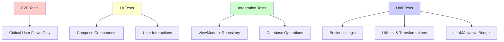

# Iris Android - Master Plan

## Executive Summary

Iris is an on-device, multimodal AI assistant for Android that prioritizes privacy, performance, and user experience. Built with Kotlin/Jetpack Compose and powered by LLaMA.cpp, it provides conversational AI capabilities without transmitting user data externally.

**Mission**: Create a production-ready Android AI assistant that demonstrates the viability of on-device inference while maintaining exceptional user experience and absolute privacy.

## Project Scope

### Core Features ✅
- **Conversational Chat Interface**: Natural language conversations with LLaMA models
- **Model Management**: Download, install, switch between different AI models
- **Parameter Configuration**: Adjust inference parameters (temperature, top-p, context length)
- **Local Storage**: Conversation history stored locally with encryption
- **Performance Monitoring**: Real-time inference metrics and system resource tracking

### Phase 1 (Current Sprint) 🚧
- Stabilize existing chat interface and model loading
- Implement comprehensive testing strategy
- Complete documentation and planning artifacts
- Establish CI/CD pipeline with quality gates

### Phase 2 (Future) 🔮
- **Multimodal Capabilities**: Image input and processing
- **Voice Interface**: Speech-to-text and text-to-speech integration
- **Advanced UI**: Conversation branching, export functionality
- **Model Optimization**: Custom quantization and optimization pipelines

### Explicitly Out of Scope ❌
- Cloud-based inference or model hosting
- User account systems or authentication
- Data analytics or telemetry collection
- Third-party API integrations for AI services

## Technical Architecture

### Technology Stack

```mermaid
graph TD
    A[Android UI Layer] --> B[Jetpack Compose]
    A --> C[Material Design 3]
    
    D[Business Logic] --> E[Kotlin Coroutines]
    D --> F[Flows & StateFlow]
    D --> G[ViewModel Pattern]
    
    H[Data Layer] --> I[Room Database]
    H --> J[DataStore Preferences]
    H --> K[Local File Storage]
    
    L[AI Inference] --> M[LLaMA.cpp Native]
    L --> N[JNI Bridge]
    L --> O[Memory Management]
    
    P[Build System] --> Q[Gradle Kotlin DSL]
    P --> R[Android Gradle Plugin]
    P --> S[Native Build Pipeline]
```


### Module Architecture
- **app/**: Main Android application with UI and business logic
- **llama/**: Native library module wrapping LLaMA.cpp with JNI
- **model_pack/**: Model packaging and distribution utilities

### Key Architectural Decisions
- **[ADR-0001](adr/0001-use-copilot-sonnet4.md)**: Copilot Pro with Claude Sonnet 4 for development
- **Build Tool**: Gradle over Bazel for Android ecosystem integration
- **UI Framework**: Jetpack Compose for modern, declarative UI
- **Async Patterns**: Kotlin Coroutines and Flows for reactive programming
- **Database**: Room for structured data, DataStore for preferences

## Development Milestones

### Milestone 1: Foundation & Planning (Current)
**Target**: End of October 2025  
**Goals**:
- ✅ Complete planning documentation (this plan + page specs)
- ✅ Establish development workflow and quality standards
- 🚧 Implement comprehensive test coverage (unit + UI)
- 🚧 Set up CI/CD pipeline with quality gates
- 🚧 Stabilize core chat functionality

**Acceptance Criteria**:
- All page specifications completed and reviewed
- Test coverage ≥80% on business logic modules
- CI pipeline running on all PRs with lint, test, build
- Core chat flow works reliably with at least one model

### Milestone 2: Performance & Quality (November 2025)
**Target**: End of November 2025  
**Goals**:
- Optimize model loading and inference performance
- Implement thermal and memory management
- Complete accessibility and internationalization
- Production-ready UI polish and error handling

**Acceptance Criteria**:
- Model loading <10 seconds for 7B parameter models
- Inference respects thermal throttling limits
- All UI components meet accessibility standards
- Error states gracefully handled with user feedback

### Milestone 3: Distribution & Polish (December 2025)
**Target**: End of December 2025  
**Goals**:
- App store distribution preparation
- Comprehensive documentation for users and developers
- Performance benchmarking and optimization
- Community feedback integration

**Acceptance Criteria**:
- Play Store release candidate ready
- User documentation and onboarding flow complete
- Performance benchmarks documented and meeting targets
- Open source release with contribution guidelines

## Risk Assessment & Mitigation

### High-Risk Areas 🔴

**Performance Constraints**
- *Risk*: Large language models consume significant memory and computation
- *Impact*: App crashes, poor user experience, device thermal issues
- *Mitigation*: Implement memory monitoring, model quantization, thermal throttling

**Model Distribution**
- *Risk*: Large model files (GB+) challenging to distribute via app stores
- *Impact*: User acquisition barriers, storage constraints
- *Mitigation*: On-demand model downloads, compression, incremental loading

**Device Compatibility**
- *Risk*: Wide range of Android devices with varying capabilities
- *Impact*: Inconsistent performance, crashes on lower-end devices
- *Mitigation*: Device capability detection, model size recommendations, graceful degradation

### Medium-Risk Areas 🟡

**User Experience Complexity**
- *Risk*: AI model configuration can be overwhelming for general users
- *Impact*: Poor adoption, user frustration
- *Mitigation*: Smart defaults, progressive disclosure, guided onboarding

**Development Velocity**
- *Risk*: Native development and AI integration slow down iteration
- *Impact*: Missed milestones, technical debt accumulation
- *Mitigation*: Comprehensive planning, automated testing, Copilot assistance

### Low-Risk Areas 🟢

**Privacy Compliance**
- *Risk*: Regulatory requirements for data handling
- *Impact*: Legal compliance issues
- *Mitigation*: On-device processing eliminates most privacy concerns

## Testing Strategy

### Test Pyramid



### Coverage Targets
- **Unit Tests**: ≥80% line coverage on business logic
- **Integration Tests**: All ViewModel-Repository interactions
- **UI Tests**: All user-facing Compose components
- **E2E Tests**: Complete chat flow, model switching

### Performance Testing
- **Memory Usage**: Monitor during inference, detect leaks
- **Inference Speed**: Benchmark across different models and devices
- **Thermal Impact**: Measure temperature increase during extended use
- **Battery Consumption**: Track power usage patterns

### Security Testing
- **Data Isolation**: Verify conversation data remains local
- **Input Validation**: Test against malicious or malformed inputs
- **Permission Usage**: Minimal permissions, proper justification

## CI/CD Pipeline

### GitHub Actions Workflow

```yaml
# Simplified workflow overview
name: Build and Test
on: [pull_request, push]
jobs:
  lint:
    - ktlint, detekt static analysis
  test:
    - Unit tests with coverage reporting
    - Integration tests
  ui-test:
    - Compose UI tests on emulator
  build:
    - assembleDebug, assembleRelease
    - Upload artifacts
```

### Quality Gates
1. **Lint Check**: No warnings allowed, style compliance required
2. **Test Coverage**: ≥80% on modified business logic modules
3. **Build Success**: Clean assembly for debug and release variants
4. **Security Scan**: Dependency vulnerability checking
5. **Performance**: No memory leaks detected in UI tests

### Branch Protection
- Require PR review from code owner
- Require status checks to pass
- No direct pushes to main branch
- Automatic branch deletion after merge

## Resource Planning

### Development Environment
- **Hardware**: macOS/Linux development machines with ≥16GB RAM
- **Emulators**: Android API 24+ with various screen sizes and memory configurations
- **Devices**: Physical testing on range of Android devices (flagship, mid-range, budget)

### Build Infrastructure
- **CI/CD**: GitHub Actions with macOS runners for Android builds
- **Storage**: GitHub Packages for internal artifacts, Git LFS for large test assets
- **Monitoring**: Build time tracking, test result trending

### External Dependencies
- **LLaMA.cpp**: Upstream dependency, monitor for breaking changes
- **Android Libraries**: Jetpack Compose, lifecycle components
- **Models**: Hugging Face model hub for LLaMA variants

## Success Metrics

### Technical Quality
- **Code Coverage**: ≥80% across all business logic modules
- **Build Performance**: CI pipeline <15 minutes end-to-end
- **App Performance**: Model loading <10s, inference <2s per response
- **Stability**: Zero crashes in critical user flows

### User Experience
- **Onboarding**: First successful conversation within 5 minutes
- **Model Management**: Download and switch models within 30 seconds
- **Response Quality**: Coherent responses matching user intent
- **Privacy Assurance**: Clear messaging about local processing

### Development Experience
- **Documentation Coverage**: All public APIs and critical flows documented
- **Development Velocity**: New features deliverable within 2-week sprints
- **Code Quality**: Zero high-severity static analysis issues
- **Contribution Ready**: External developers can set up and contribute

## Communication Plan

### Documentation Updates
- **Weekly**: Progress updates in milestone tracking
- **Sprint Review**: Demo working features, update roadmap
- **Major Changes**: ADR documentation for architectural decisions
- **Release**: Comprehensive changelog and migration guides

### Stakeholder Communication
- **Internal Team**: Daily standups, weekly sprint planning
- **Open Source**: GitHub issues, discussions, and project boards
- **Community**: Blog posts on key milestones and learnings

---

## Appendix

### Reference Architecture
- **Technical Architecture & Engineering Plan**: Baseline system design
- **LLaMA.cpp Documentation**: Integration patterns and best practices
- **Android Architecture Patterns**: MVVM with Repository pattern

### External Dependencies
- **Core**: Kotlin 1.9+, Android API 24+, Compose BOM 2024.02+
- **AI**: LLaMA.cpp latest stable, ONNX Runtime (future)
- **Build**: AGP 8.2+, Gradle 8.4+, NDK 26+

### Glossary
- **LLaMA**: Large Language Model Meta AI
- **JNI**: Java Native Interface for native code integration
- **ADR**: Architecture Decision Record
- **CI/CD**: Continuous Integration/Continuous Deployment

*This plan is a living document updated with each milestone and major decision.*