# Architecture Document: iris_android
## On-Device AI Assistant for Android

### Version: 1.0
### Date: November 2025

---

## 1. Introduction & Goals

### 1.1 Project Overview

**iris_android** is a fully offline, on-device AI assistant for Android that provides intelligent conversational AI capabilities without requiring internet connectivity or cloud services. The application leverages state-of-the-art mobile AI technologies to deliver real-time language model inference, personal knowledge retrieval, multimodal input processing, and deep Android system integration.

### 1.2 Core Goals

- **Privacy-First**: All AI processing occurs on-device with no data transmission to external servers
- **Performance**: Real-time or near real-time inference on mid-range to flagship Android devices
- **Intelligence**: Advanced capabilities including RAG, tool calling, and multimodal understanding
- **Integration**: Deep Android ecosystem integration via intents and system APIs
- **Safety**: Comprehensive content filtering and user consent mechanisms
- **Efficiency**: Optimized for mobile constraints (battery, thermal, memory)

### 1.3 Target Devices

- **Primary**: Snapdragon 8 Gen1+ and Exynos 2200+ devices with 8GB+ RAM
- **Secondary**: Mid-range devices with 6GB+ RAM and capable GPUs
- **Fallback**: CPU-only operation on devices with 4GB+ RAM

---

## 2. High-Level System Overview

### 2.1 System Context Diagram

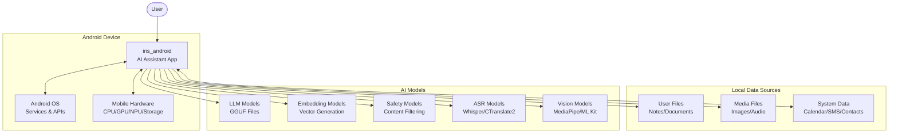
```mermaid
graph TB
    User([User]) 
    
    subgraph "Android Device"
        IrisApp[iris_android<br/>AI Assistant App]
        AndroidOS[Android OS<br/>Services & APIs]
        Hardware[Mobile Hardware<br/>CPU/GPU/NPU/Storage]
    end
    
    subgraph "Local Data Sources"
        UserFiles[User Files<br/>Notes/Documents]
        MediaFiles[Media Files<br/>Images/Audio]
        SystemData[System Data<br/>Calendar/SMS/Contacts]
    end
    
    subgraph "AI Models"
        LLMModels[LLM Models<br/>GGUF Files]
        EmbedModels[Embedding Models<br/>Vector Generation]
        SafetyModels[Safety Models<br/>Content Filtering]
        ASRModels[ASR Models<br/>Whisper/CTranslate2]
        VisionModels[Vision Models<br/>MediaPipe/ML Kit]
    end
    
    User --> IrisApp
    IrisApp <--> AndroidOS
    IrisApp <--> Hardware
    IrisApp --> UserFiles
    IrisApp --> MediaFiles
    IrisApp <--> SystemData
    IrisApp --> LLMModels
    IrisApp --> EmbedModels
    IrisApp --> SafetyModels
    IrisApp --> ASRModels
    IrisApp --> VisionModels
```

### 2.1.1 Simplified System Architecture

```mermaid
graph TD
  User((User))

  subgraph Android_Device["Android Device"]
    subgraph Android_OS["Android OS & Services"]
      Activity[Activities & Services]
      Permissions[Runtime Permissions]
      Thermal[ADPF / Thermal APIs]
      Storage[App Storage / File System]
    end

    subgraph Iris_App["iris_android App"]
      UI[Chat UI & Model Manager]
      CoreLLM[core-llm<br/>LLM Engine]
      CoreHW[core-hw<br/>Hardware Abstraction]
      CoreRAG[core-rag<br/>RAG Engine]
      CoreASR[core-asr<br/>ASR Engine]
      CoreVision[core-vision<br/>Vision Engine]
      CoreTools[core-tools<br/>Tool Engine]
      CoreSafety[core-safety<br/>Safety Engine]
    end

    CPU[CPU (ARM cores)]
    GPU[GPU (Adreno / Mali / Xclipse)]
    NPU[NPU / DSP (Hexagon / QNN)]
    LocalData[Local Content<br/>Notes/Files/Screenshots]
  end

  User -->|Text/Voice/Image| UI
  UI --> CoreLLM
  UI --> CoreRAG
  UI --> CoreASR
  UI --> CoreVision
  UI --> CoreTools
  UI --> CoreSafety

  CoreLLM --> CPU
  CoreLLM --> GPU
  CoreLLM --> NPU

  CoreRAG --> LocalData
  CoreTools --> Android_OS
```

### 2.2 Key Architectural Principles

- **Layered Architecture**: Clear separation between UI, business logic, and hardware abstraction
- **Plugin-Based Backends**: Modular hardware acceleration with runtime selection
- **Event-Driven Processing**: Asynchronous operations with reactive state management
- **Fail-Safe Design**: Graceful degradation when hardware features unavailable
- **Resource Management**: Adaptive performance based on thermal and battery constraints

---

## 3. Module Architecture

### 3.1 Container/Module Overview

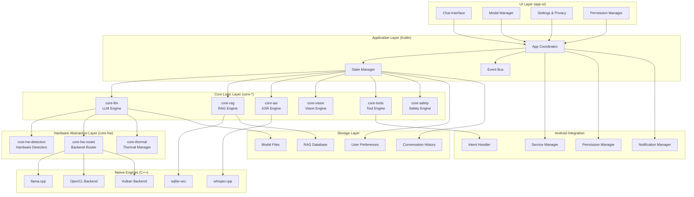
```mermaid
graph TB
    subgraph "UI Layer (app-ui)"
        ChatUI[Chat Interface]
        ModelMgr[Model Manager]
        Settings[Settings & Privacy]
        PermUI[Permission Manager]
    end
    
    subgraph "Application Layer (Kotlin)"
        AppCore[App Coordinator]
        StateManager[State Manager]
        EventBus[Event Bus]
    end
    
    subgraph "Core Logic Layer (core-*)"
        CoreLLM[core-llm<br/>LLM Engine]
        CoreRAG[core-rag<br/>RAG Engine]
        CoreASR[core-asr<br/>ASR Engine]
        CoreVision[core-vision<br/>Vision Engine]
        CoreTools[core-tools<br/>Tool Engine]
        CoreSafety[core-safety<br/>Safety Engine]
    end
    
    subgraph "Hardware Abstraction Layer (core-hw)"
        HWDetection[core-hw-detection<br/>Hardware Detection]
        BackendRouter[core-hw-router<br/>Backend Router]
        ThermalMgr[core-thermal<br/>Thermal Manager]
    end
    
    subgraph "Native Engines (C++)"
        LlamaCpp[llama.cpp]
        WhisperCpp[whisper.cpp]
        SQLiteVec[sqlite-vec]
        OpenCLBackend[OpenCL Backend]
        VulkanBackend[Vulkan Backend]
    end
    
    subgraph "Storage Layer"
        ModelStorage[Model Files]
        RAGDatabase[RAG Database]
        UserData[User Preferences]
        ConversationDB[Conversation History]
    end
    
    subgraph "Android Integration"
        IntentHandler[Intent Handler]
        ServiceMgr[Service Manager]
        PermissionMgr[Permission Manager]
        NotificationMgr[Notification Manager]
    end
    
    ChatUI --> AppCore
    ModelMgr --> AppCore
    Settings --> AppCore
    PermUI --> AppCore
    
    AppCore --> StateManager
    AppCore --> EventBus
    
    StateManager --> CoreLLM
    StateManager --> CoreRAG
    StateManager --> CoreASR
    StateManager --> CoreVision
    StateManager --> CoreTools
    StateManager --> CoreSafety
    
    CoreLLM --> HWDetection
    CoreLLM --> BackendRouter
    CoreLLM --> ThermalMgr
    
    BackendRouter --> LlamaCpp
    BackendRouter --> OpenCLBackend
    BackendRouter --> VulkanBackend
    
    CoreASR --> WhisperCpp
    CoreRAG --> SQLiteVec
    
    CoreTools --> IntentHandler
    AppCore --> ServiceMgr
    AppCore --> PermissionMgr
    AppCore --> NotificationMgr
    
    CoreLLM --> ModelStorage
    CoreRAG --> RAGDatabase
    StateManager --> UserData
    StateManager --> ConversationDB
```

### 3.2 Module Responsibilities

#### 3.2.1 UI Layer Modules (`app-ui`)

**Chat Interface (`ui-chat`)**
- Responsibilities: Conversation display, message input, voice/image capture
- Key Technologies: Jetpack Compose, Material Design 3, CameraX
- Dependencies: App Coordinator, State Manager

**Model Manager (`ui-models`)**
- Responsibilities: Model download, verification, selection, performance benchmarking
- Key Technologies: DownloadManager, WorkManager, Compose
- Dependencies: LLM Engine, Hardware Detection

**Settings & Privacy (`ui-settings`)**
- Responsibilities: Configuration UI, privacy controls, safety settings
- Key Technologies: DataStore Preferences, Compose
- Dependencies: All engine modules for configuration

#### 3.2.2 Core Logic Layer (`core-*`)

**LLM Engine (`core-llm`)**
- Responsibilities: Model loading, text generation, context management, speculative decoding
- Key Technologies: JNI, llama.cpp, multi-threading
- Dependencies: Hardware Abstraction Layer, Model Storage
- Public Interface:
  ```kotlin
  interface LLMEngine {
      suspend fun loadModel(modelPath: String): Result<ModelHandle>
      suspend fun generateText(prompt: String, params: GenerationParams): Flow<String>
      suspend fun embed(text: String): FloatArray
      fun unloadModel(handle: ModelHandle)
  }
  ```

**RAG Engine (`core-rag`)**
- Responsibilities: Document indexing, vector search, prompt augmentation
- Key Technologies: sqlite-vec, background processing, embedding models
- Dependencies: LLM Engine (for embeddings), SQLite database
- Public Interface:
  ```kotlin
  interface RAGEngine {
      suspend fun indexDocument(document: Document): Result<Unit>
      suspend fun search(query: String, limit: Int): List<RetrievedChunk>
      suspend fun deleteIndex(documentId: String): Result<Unit>
  }
  ```

**ASR Engine (`core-asr`)**
- Responsibilities: Audio recording, speech-to-text conversion, voice activity detection
- Key Technologies: whisper.cpp/CTranslate2, AudioRecord, VAD
- Dependencies: Hardware layer for optimal backend selection
- Public Interface:
  ```kotlin
  interface ASREngine {
      suspend fun transcribe(audioData: ByteArray): Result<String>
      fun startRecording(): Flow<AudioLevel>
      suspend fun stopRecording(): Result<ByteArray>
  }
  ```

**Vision Engine (`core-vision`)**
- Responsibilities: Image analysis, OCR, object detection, scene understanding
- Key Technologies: MediaPipe, ML Kit, TensorFlow Lite
- Dependencies: NNAPI, GPU acceleration where available
- Public Interface:
  ```kotlin
  interface VisionEngine {
      suspend fun analyzeImage(bitmap: Bitmap): ImageAnalysisResult
      suspend fun extractText(bitmap: Bitmap): String
      suspend fun detectObjects(bitmap: Bitmap): List<DetectedObject>
  }
  ```

**Tool Engine (`core-tools`)**
- Responsibilities: Function call parsing, Android intent execution, user confirmation
- Key Technologies: JSON parsing, Android Intents, dynamic shortcuts
- Dependencies: Permission Manager, Intent Handler
- Public Interface:
  ```kotlin
  interface ToolEngine {
      suspend fun executeFunction(functionCall: FunctionCall): Result<ExecutionResult>
      fun getAvailableTools(): List<ToolDefinition>
      suspend fun requestUserConfirmation(action: ToolAction): Boolean
  }
  ```

**Safety Engine (`core-safety`)**
- Responsibilities: Content filtering, prompt injection detection, policy enforcement
- Key Technologies: Prompt Guard models, content classifiers, rule-based filters
- Dependencies: Small model inference, user preferences
- Public Interface:
  ```kotlin
  interface SafetyEngine {
      suspend fun checkInput(text: String): SafetyResult
      suspend fun checkOutput(text: String): SafetyResult
      fun updateSafetyLevel(level: SafetyLevel)
  }
  ```

#### 3.2.3 Hardware Abstraction Layer (`core-hw`)

**Hardware Detection (`core-hw-detection`)**
- Responsibilities: SoC identification, capability detection, benchmark execution
- Key Technologies: Android Build APIs, OpenGL queries, performance testing
- Dependencies: Native backend libraries

**Backend Router (`core-hw-router`)**
- Responsibilities: Optimal backend selection, runtime switching, performance monitoring
- Key Technologies: JNI, OpenCL/Vulkan detection, QNN integration
- Dependencies: All native AI backends

**Thermal Manager (`core-thermal`)**
- Responsibilities: Thermal monitoring, performance scaling, battery optimization
- Key Technologies: ADPF APIs, ThermalManager, PerformanceHintManager
- Dependencies: Hardware detection, all compute engines

---

## 4. Data & Control Flows

### 4.1 Text Query Flow

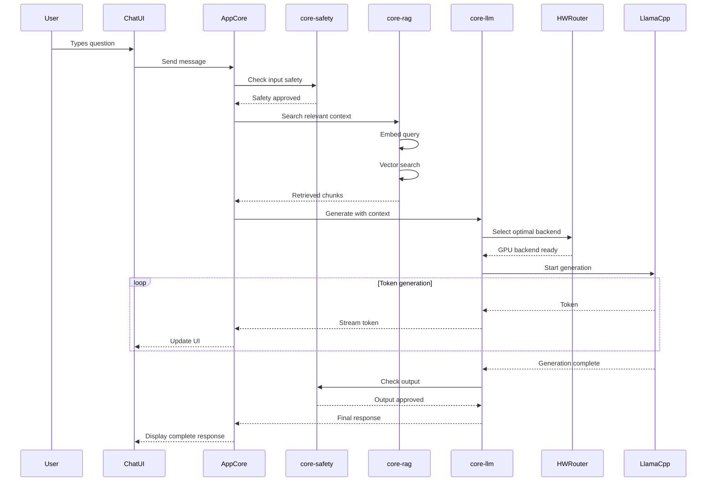
```mermaid
sequenceDiagram
    participant User
    participant ChatUI
    participant AppCore
    participant CoreSafety as core-safety
    participant CoreRAG as core-rag
    participant CoreLLM as core-llm
    participant HWRouter
    participant LlamaCpp
    
    User->>ChatUI: Types question
    ChatUI->>AppCore: Send message
    AppCore->>CoreSafety: Check input safety
    CoreSafety-->>AppCore: Safety approved
    
    AppCore->>CoreRAG: Search relevant context
    CoreRAG->>CoreRAG: Embed query
    CoreRAG->>CoreRAG: Vector search
    CoreRAG-->>AppCore: Retrieved chunks
    
    AppCore->>CoreLLM: Generate with context
    CoreLLM->>HWRouter: Select optimal backend
    HWRouter-->>CoreLLM: GPU backend ready
    CoreLLM->>LlamaCpp: Start generation
    
    loop Token generation
        LlamaCpp-->>CoreLLM: Token
        CoreLLM-->>AppCore: Stream token
        AppCore-->>ChatUI: Update UI
    end
    
    LlamaCpp-->>CoreLLM: Generation complete
    CoreLLM->>CoreSafety: Check output
    CoreSafety-->>CoreLLM: Output approved
    CoreLLM-->>AppCore: Final response
    AppCore-->>ChatUI: Display complete response
```

### 4.2 Voice Query with Tool Execution Flow

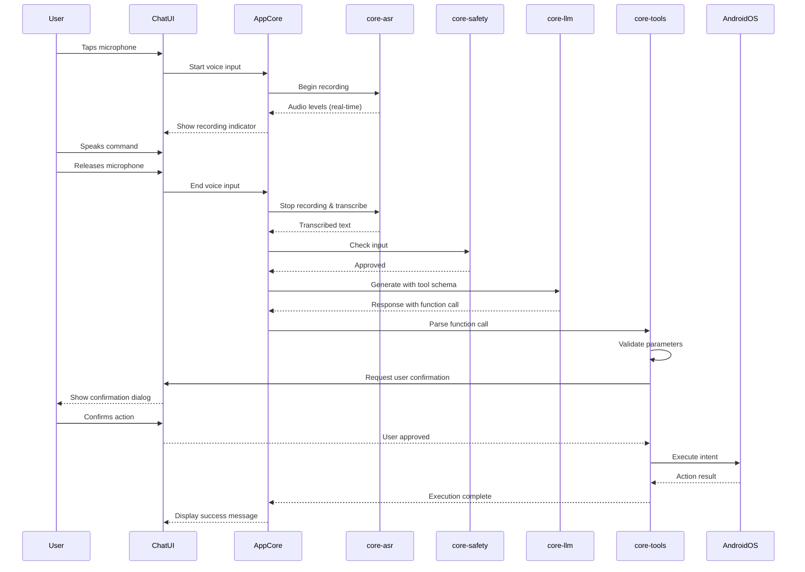
```mermaid
sequenceDiagram
    participant User
    participant ChatUI
    participant AppCore
    participant CoreASR as core-asr
    participant CoreSafety as core-safety
    participant CoreLLM as core-llm
    participant CoreTools as core-tools
    participant AndroidOS
    
    User->>ChatUI: Taps microphone
    ChatUI->>AppCore: Start voice input
    AppCore->>CoreASR: Begin recording
    CoreASR-->>AppCore: Audio levels (real-time)
    AppCore-->>ChatUI: Show recording indicator
    
    User->>ChatUI: Speaks command
    User->>ChatUI: Releases microphone
    ChatUI->>AppCore: End voice input
    AppCore->>CoreASR: Stop recording & transcribe
    CoreASR-->>AppCore: Transcribed text
    
    AppCore->>CoreSafety: Check input
    CoreSafety-->>AppCore: Approved
    AppCore->>CoreLLM: Generate with tool schema
    CoreLLM-->>AppCore: Response with function call
    
    AppCore->>CoreTools: Parse function call
    CoreTools->>CoreTools: Validate parameters
    CoreTools->>ChatUI: Request user confirmation
    ChatUI-->>User: Show confirmation dialog
    User->>ChatUI: Confirms action
    ChatUI-->>CoreTools: User approved
    
    CoreTools->>AndroidOS: Execute intent
    AndroidOS-->>CoreTools: Action result
    CoreTools-->>AppCore: Execution complete
    AppCore-->>ChatUI: Display success message
```

### 4.3 RAG Document Indexing Flow

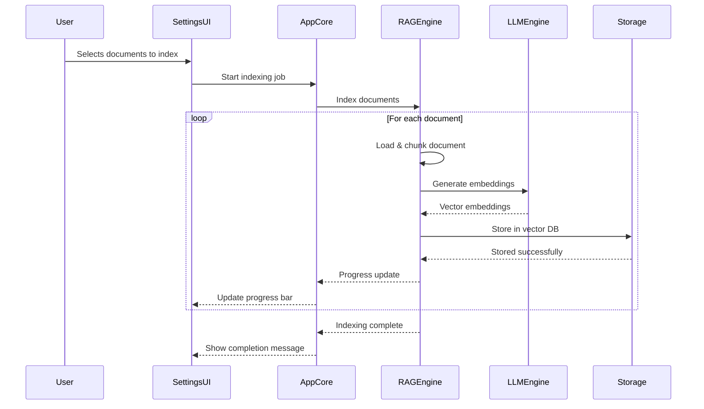
```mermaid
sequenceDiagram
    participant User
    participant SettingsUI
    participant AppCore
    participant RAGEngine
    participant LLMEngine
    participant Storage
    
    User->>SettingsUI: Selects documents to index
    SettingsUI->>AppCore: Start indexing job
    AppCore->>RAGEngine: Index documents
    
    loop For each document
        RAGEngine->>RAGEngine: Load & chunk document
        RAGEngine->>LLMEngine: Generate embeddings
        LLMEngine-->>RAGEngine: Vector embeddings
        RAGEngine->>Storage: Store in vector DB
        Storage-->>RAGEngine: Stored successfully
        RAGEngine-->>AppCore: Progress update
        AppCore-->>SettingsUI: Update progress bar
    end
    
    RAGEngine-->>AppCore: Indexing complete
    AppCore-->>SettingsUI: Show completion message
```

### 4.4 Image Analysis Flow

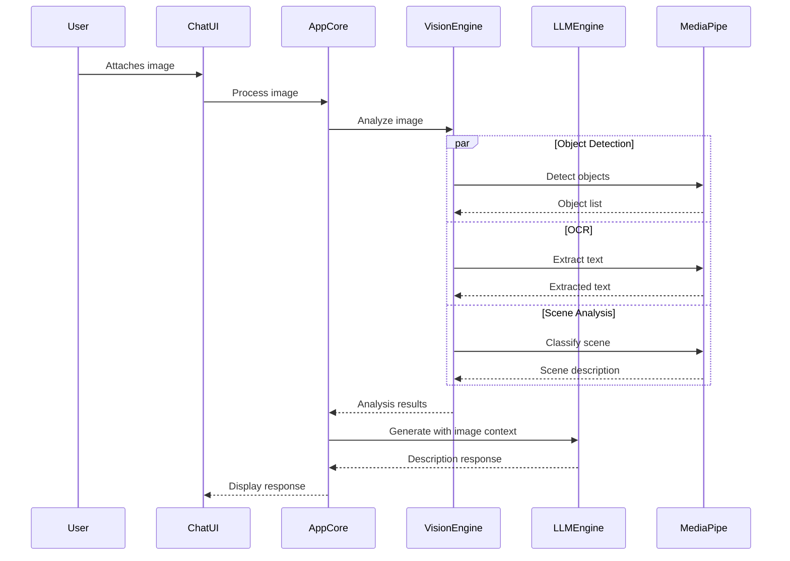
```mermaid
sequenceDiagram
    participant User
    participant ChatUI
    participant AppCore
    participant VisionEngine
    participant LLMEngine
    participant MediaPipe
    
    User->>ChatUI: Attaches image
    ChatUI->>AppCore: Process image
    AppCore->>VisionEngine: Analyze image
    
    par Object Detection
        VisionEngine->>MediaPipe: Detect objects
        MediaPipe-->>VisionEngine: Object list
    and OCR
        VisionEngine->>MediaPipe: Extract text
        MediaPipe-->>VisionEngine: Extracted text
    and Scene Analysis
        VisionEngine->>MediaPipe: Classify scene
        MediaPipe-->>VisionEngine: Scene description
    end
    
    VisionEngine-->>AppCore: Analysis results
    AppCore->>LLMEngine: Generate with image context
    LLMEngine-->>AppCore: Description response
    AppCore-->>ChatUI: Display response
```

---

## 5. Hardware & Backend Architecture

### 5.1 Hardware Detection & Backend Selection

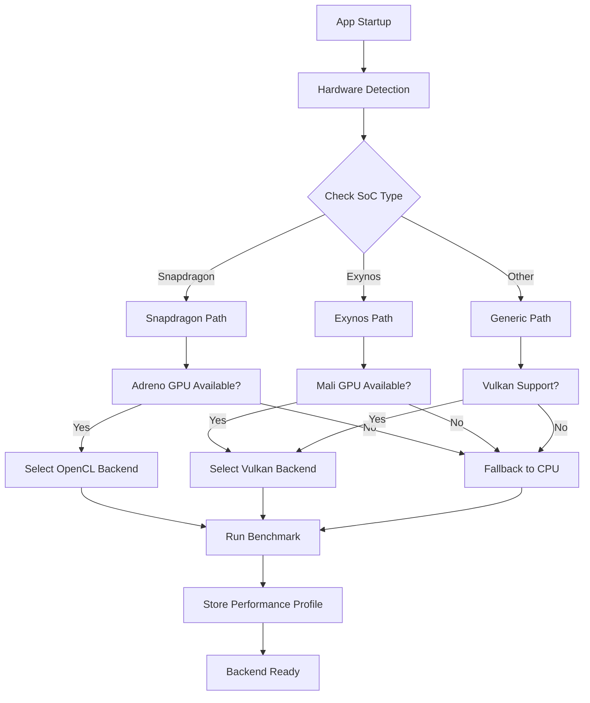
```mermaid
graph TD
    AppStart[App Startup] --> HWDetect[Hardware Detection]
    
    HWDetect --> CheckSoC{Check SoC Type}
    CheckSoC -->|Snapdragon| SnapdragonPath[Snapdragon Path]
    CheckSoC -->|Exynos| ExynosPath[Exynos Path]
    CheckSoC -->|Other| GenericPath[Generic Path]
    
    SnapdragonPath --> AdrenaGPU[Adreno GPU Available?]
    AdrenaGPU -->|Yes| OpenCLBackend[Select OpenCL Backend]
    AdrenaGPU -->|No| CPUBackend[Fallback to CPU]
    
    ExynosPath --> MaliGPU[Mali GPU Available?]
    MaliGPU -->|Yes| VulkanBackend[Select Vulkan Backend]
    MaliGPU -->|No| CPUBackend
    
    GenericPath --> VulkanSupport[Vulkan Support?]
    VulkanSupport -->|Yes| VulkanBackend
    VulkanSupport -->|No| CPUBackend
    
    OpenCLBackend --> BenchmarkTest[Run Benchmark]
    VulkanBackend --> BenchmarkTest
    CPUBackend --> BenchmarkTest
    
    BenchmarkTest --> StoreProfile[Store Performance Profile]
    StoreProfile --> BackendReady[Backend Ready]
```

### 5.2 Backend Configuration Matrix

| Device Type | SoC Family | GPU | Preferred Backend | LLM Model Size | ASR Model | Safety Model Location |
|-------------|------------|-----|-------------------|----------------|-----------|----------------------|
| Flagship | Snapdragon 8 Gen2+ | Adreno 740+ | OpenCL | 7B Q4_0 | Whisper Base | Hexagon DSP |
| Flagship | Exynos 2300+ | Xclipse 930+ | Vulkan | 7B Q4_K_M | Whisper Base | CPU |
| Mid-range | Snapdragon 7 Gen1+ | Adreno 660+ | OpenCL | 3B Q4_0 | Whisper Tiny | CPU |
| Mid-range | Exynos 1380+ | Mali G68+ | Vulkan | 3B Q4_0 | Whisper Tiny | CPU |
| Budget | Any | Any | CPU Only | 1.5B Q4_0 | Whisper Tiny | CPU |

### 5.3 Runtime Backend Architecture

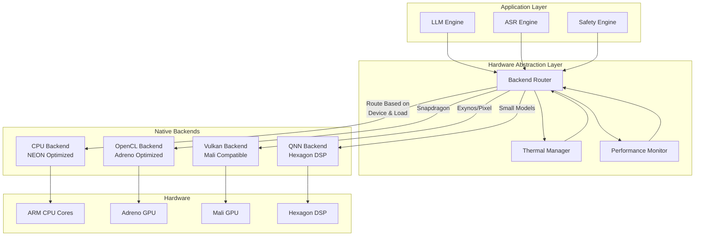
```mermaid
graph TB
    subgraph "Application Layer"
        LLMEngine[LLM Engine]
        ASREngine[ASR Engine]
        SafetyEngine[Safety Engine]
    end
    
    subgraph "Hardware Abstraction Layer"
        BackendRouter[Backend Router]
        ThermalManager[Thermal Manager]
        PerformanceMonitor[Performance Monitor]
    end
    
    subgraph "Native Backends"
        CPUBackend[CPU Backend<br/>NEON Optimized]
        OpenCLBackend[OpenCL Backend<br/>Adreno Optimized]
        VulkanBackend[Vulkan Backend<br/>Mali Compatible]
        QNNBackend[QNN Backend<br/>Hexagon DSP]
    end
    
    subgraph "Hardware"
        CPU[ARM CPU Cores]
        AdrenoGPU[Adreno GPU]
        MaliGPU[Mali GPU]
        HexagonDSP[Hexagon DSP]
    end
    
    LLMEngine --> BackendRouter
    ASREngine --> BackendRouter
    SafetyEngine --> BackendRouter
    
    BackendRouter --> ThermalManager
    BackendRouter --> PerformanceMonitor
    
    ThermalManager --> BackendRouter
    PerformanceMonitor --> BackendRouter
    
    BackendRouter -->|Route Based on<br/>Device & Load| CPUBackend
    BackendRouter -->|Snapdragon| OpenCLBackend
    BackendRouter -->|Exynos/Pixel| VulkanBackend
    BackendRouter -->|Small Models| QNNBackend
    
    CPUBackend --> CPU
    OpenCLBackend --> AdrenoGPU
    VulkanBackend --> MaliGPU
    QNNBackend --> HexagonDSP
```

---

## 6. RAG (Retrieval-Augmented Generation) Architecture

### 6.1 RAG System Components

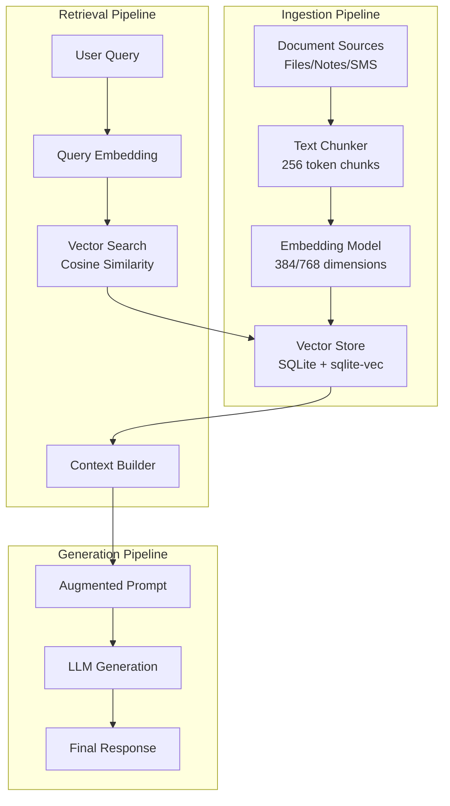
```mermaid
graph TB
    subgraph "Ingestion Pipeline"
        DocumentSource[Document Sources<br/>Files/Notes/SMS]
        Chunker[Text Chunker<br/>256 token chunks]
        EmbeddingModel[Embedding Model<br/>384/768 dimensions]
        VectorStore[Vector Store<br/>SQLite + sqlite-vec]
    end
    
    subgraph "Retrieval Pipeline"
        UserQuery[User Query]
        QueryEmbedding[Query Embedding]
        VectorSearch[Vector Search<br/>Cosine Similarity]
        ContextBuilder[Context Builder]
    end
    
    subgraph "Generation Pipeline"
        AugmentedPrompt[Augmented Prompt]
        LLMGeneration[LLM Generation]
        Response[Final Response]
    end
    
    DocumentSource --> Chunker
    Chunker --> EmbeddingModel
    EmbeddingModel --> VectorStore
    
    UserQuery --> QueryEmbedding
    QueryEmbedding --> VectorSearch
    VectorSearch --> VectorStore
    VectorStore --> ContextBuilder
    
    ContextBuilder --> AugmentedPrompt
    AugmentedPrompt --> LLMGeneration
    LLMGeneration --> Response
```

### 6.2 Vector Store Schema

```sql
-- SQLite schema with sqlite-vec extension

CREATE VIRTUAL TABLE IF NOT EXISTS embeddings USING vec0(
    id TEXT PRIMARY KEY,
    embedding FLOAT[768],  -- 768-dimensional embeddings
    metadata TEXT  -- JSON metadata
);

CREATE TABLE IF NOT EXISTS documents (
    id TEXT PRIMARY KEY,
    content TEXT,
    source TEXT,  -- 'note', 'pdf', 'sms', etc.
    timestamp DATETIME,
    hash TEXT,  -- Content hash for change detection
    indexed BOOLEAN DEFAULT FALSE
);

CREATE TABLE IF NOT EXISTS chunks (
    id TEXT PRIMARY KEY,  -- Format: "doc_id_chunk_index"
    document_id TEXT,
    chunk_index INTEGER,
    content TEXT,
    token_count INTEGER,
    FOREIGN KEY (document_id) REFERENCES documents(id)
);

CREATE INDEX idx_documents_source ON documents(source);
CREATE INDEX idx_documents_timestamp ON documents(timestamp);
CREATE INDEX idx_chunks_document ON chunks(document_id);
```

### 6.3 RAG Query Processing Flow

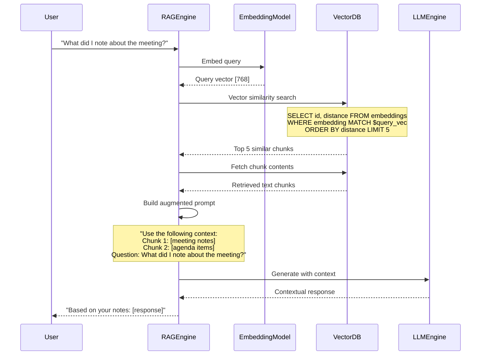
```mermaid
sequenceDiagram
    participant User
    participant RAGEngine
    participant EmbeddingModel
    participant VectorDB
    participant LLMEngine
    
    User->>RAGEngine: "What did I note about the meeting?"
    RAGEngine->>EmbeddingModel: Embed query
    EmbeddingModel-->>RAGEngine: Query vector [768]
    
    RAGEngine->>VectorDB: Vector similarity search
    Note over VectorDB: SELECT id, distance FROM embeddings<br/>WHERE embedding MATCH $query_vec<br/>ORDER BY distance LIMIT 5
    VectorDB-->>RAGEngine: Top 5 similar chunks
    
    RAGEngine->>VectorDB: Fetch chunk contents
    VectorDB-->>RAGEngine: Retrieved text chunks
    
    RAGEngine->>RAGEngine: Build augmented prompt
    Note over RAGEngine: "Use the following context:<br/>Chunk 1: [meeting notes]<br/>Chunk 2: [agenda items]<br/>Question: What did I note about the meeting?"
    
    RAGEngine->>LLMEngine: Generate with context
    LLMEngine-->>RAGEngine: Contextual response
    RAGEngine-->>User: "Based on your notes: [response]"
```

---

## 7. Multimodal (ASR & Vision) Architecture

### 7.1 Audio Processing Pipeline

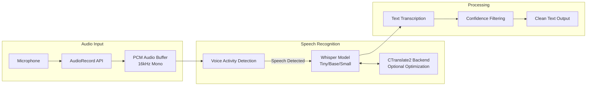
```mermaid
graph LR
    subgraph "Audio Input"
        Microphone[Microphone]
        AudioRecord[AudioRecord API]
        AudioBuffer[PCM Audio Buffer<br/>16kHz Mono]
    end
    
    subgraph "Speech Recognition"
        VAD[Voice Activity Detection]
        WhisperModel[Whisper Model<br/>Tiny/Base/Small]
        CTranslate2[CTranslate2 Backend<br/>Optional Optimization]
    end
    
    subgraph "Processing"
        Transcription[Text Transcription]
        ConfidenceCheck[Confidence Filtering]
        TextOutput[Clean Text Output]
    end
    
    Microphone --> AudioRecord
    AudioRecord --> AudioBuffer
    AudioBuffer --> VAD
    VAD -->|Speech Detected| WhisperModel
    WhisperModel <--> CTranslate2
    WhisperModel --> Transcription
    Transcription --> ConfidenceCheck
    ConfidenceCheck --> TextOutput
```

### 7.2 Vision Processing Pipeline

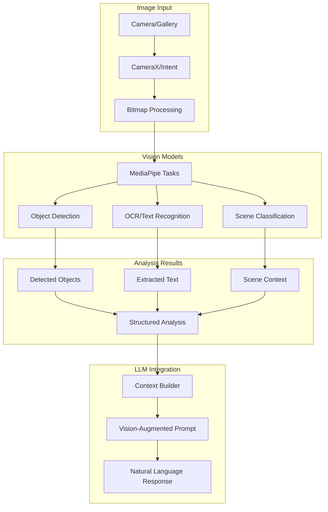
```mermaid
graph TB
    subgraph "Image Input"
        Camera[Camera/Gallery]
        ImageCapture[CameraX/Intent]
        Bitmap[Bitmap Processing]
    end
    
    subgraph "Vision Models"
        MediaPipe[MediaPipe Tasks]
        ObjectDetector[Object Detection]
        TextRecognizer[OCR/Text Recognition]
        SceneClassifier[Scene Classification]
    end
    
    subgraph "Analysis Results"
        ObjectList[Detected Objects]
        ExtractedText[Extracted Text]
        SceneDescription[Scene Context]
        StructuredOutput[Structured Analysis]
    end
    
    subgraph "LLM Integration"
        ContextBuilder[Context Builder]
        VisionPrompt[Vision-Augmented Prompt]
        LLMResponse[Natural Language Response]
    end
    
    Camera --> ImageCapture
    ImageCapture --> Bitmap
    
    Bitmap --> MediaPipe
    MediaPipe --> ObjectDetector
    MediaPipe --> TextRecognizer
    MediaPipe --> SceneClassifier
    
    ObjectDetector --> ObjectList
    TextRecognizer --> ExtractedText
    SceneClassifier --> SceneDescription
    
    ObjectList --> StructuredOutput
    ExtractedText --> StructuredOutput
    SceneDescription --> StructuredOutput
    
    StructuredOutput --> ContextBuilder
    ContextBuilder --> VisionPrompt
    VisionPrompt --> LLMResponse
```

### 7.3 Multimodal Model Selection Strategy

| Device Tier | ASR Model | Vision Backend | Performance Target |
|-------------|-----------|----------------|-------------------|
| Flagship | Whisper Base/Small | MediaPipe + GPU | Real-time processing |
| Mid-range | Whisper Tiny/Base | MediaPipe + NNAPI | <3s processing |
| Budget | Whisper Tiny | ML Kit + CPU | <5s processing |

---

## 8. Tool Calling & Android Integration

### 8.1 Tool Execution Architecture

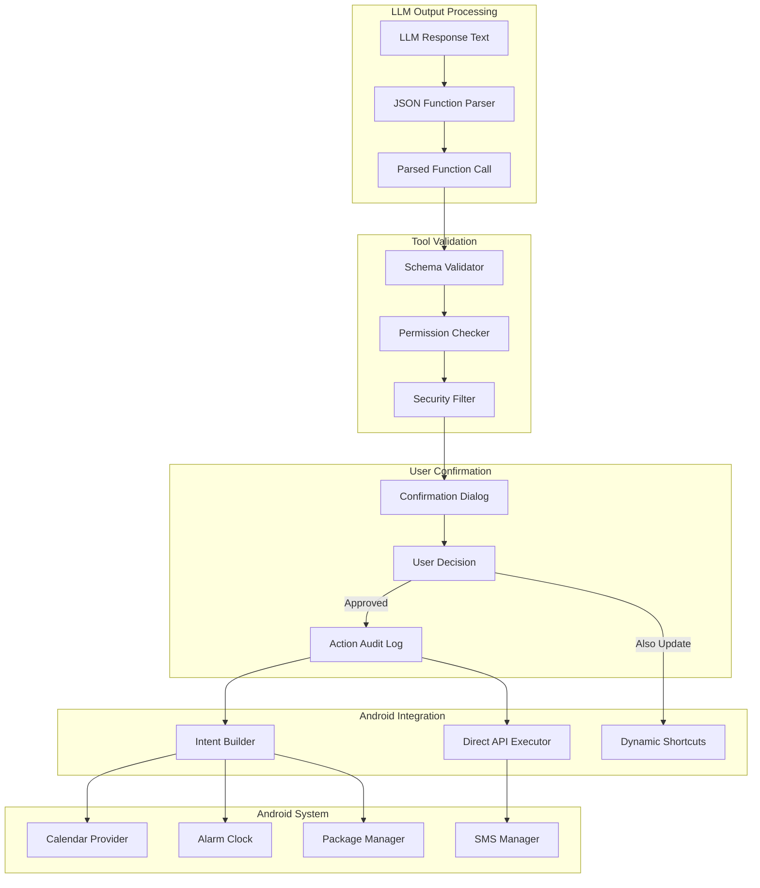
```mermaid
graph TB
    subgraph "LLM Output Processing"
        LLMResponse[LLM Response Text]
        JSONParser[JSON Function Parser]
        FunctionCall[Parsed Function Call]
    end
    
    subgraph "Tool Validation"
        SchemaValidator[Schema Validator]
        PermissionChecker[Permission Checker]
        SecurityFilter[Security Filter]
    end
    
    subgraph "User Confirmation"
        ConfirmationUI[Confirmation Dialog]
        UserApproval[User Decision]
        AuditLogger[Action Audit Log]
    end
    
    subgraph "Android Integration"
        IntentBuilder[Intent Builder]
        APIExecutor[Direct API Executor]
        ShortcutManager[Dynamic Shortcuts]
    end
    
    subgraph "Android System"
        CalendarProvider[Calendar Provider]
        SMSManager[SMS Manager]
        AlarmClock[Alarm Clock]
        AppLauncher[Package Manager]
    end
    
    LLMResponse --> JSONParser
    JSONParser --> FunctionCall
    FunctionCall --> SchemaValidator
    SchemaValidator --> PermissionChecker
    PermissionChecker --> SecurityFilter
    SecurityFilter --> ConfirmationUI
    ConfirmationUI --> UserApproval
    UserApproval -->|Approved| AuditLogger
    AuditLogger --> IntentBuilder
    AuditLogger --> APIExecutor
    IntentBuilder --> CalendarProvider
    APIExecutor --> SMSManager
    IntentBuilder --> AlarmClock
    IntentBuilder --> AppLauncher
    UserApproval -->|Also Update| ShortcutManager
```

### 8.2 Tool Schema Definition

```kotlin
data class ToolDefinition(
    val name: String,
    val description: String,
    val parameters: Map<String, ParameterSpec>,
    val requiredPermissions: List<String>,
    val executionType: ExecutionType
)

enum class ExecutionType {
    INTENT_LAUNCH,      // Opens app with pre-filled data
    DIRECT_API,         // Direct API execution with permission
    BACKGROUND_TASK     // Background operation
}

// Example tool definitions
val TOOL_DEFINITIONS = listOf(
    ToolDefinition(
        name = "create_calendar_event",
        description = "Create a calendar event",
        parameters = mapOf(
            "title" to ParameterSpec("string", true),
            "datetime" to ParameterSpec("string", true),
            "duration_mins" to ParameterSpec("integer", false, 60)
        ),
        requiredPermissions = listOf("android.permission.WRITE_CALENDAR"),
        executionType = ExecutionType.INTENT_LAUNCH
    ),
    ToolDefinition(
        name = "send_sms",
        description = "Send SMS message",
        parameters = mapOf(
            "to" to ParameterSpec("string", true),
            "message" to ParameterSpec("string", true)
        ),
        requiredPermissions = listOf("android.permission.SEND_SMS"),
        executionType = ExecutionType.INTENT_LAUNCH
    )
)
```

### 8.3 Tool Execution Flow

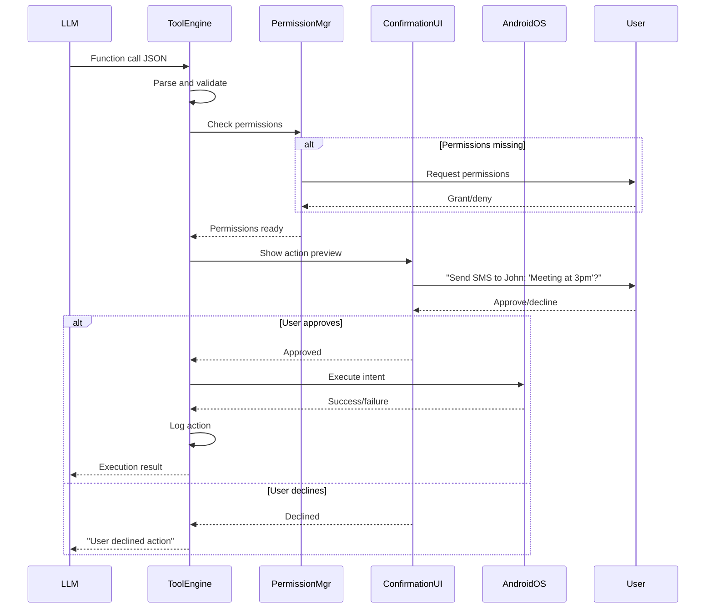
```mermaid
sequenceDiagram
    participant LLM
    participant ToolEngine
    participant PermissionMgr
    participant ConfirmationUI
    participant AndroidOS
    participant User
    
    LLM->>ToolEngine: Function call JSON
    ToolEngine->>ToolEngine: Parse and validate
    ToolEngine->>PermissionMgr: Check permissions
    
    alt Permissions missing
        PermissionMgr->>User: Request permissions
        User-->>PermissionMgr: Grant/deny
    end
    
    PermissionMgr-->>ToolEngine: Permissions ready
    ToolEngine->>ConfirmationUI: Show action preview
    ConfirmationUI->>User: "Send SMS to John: 'Meeting at 3pm'?"
    User-->>ConfirmationUI: Approve/decline
    
    alt User approves
        ConfirmationUI-->>ToolEngine: Approved
        ToolEngine->>AndroidOS: Execute intent
        AndroidOS-->>ToolEngine: Success/failure
        ToolEngine->>ToolEngine: Log action
        ToolEngine-->>LLM: Execution result
    else User declines
        ConfirmationUI-->>ToolEngine: Declined
        ToolEngine-->>LLM: "User declined action"
    end
```

---

## 9. Safety & Guardrails

### 9.1 Multi-Layer Safety Architecture

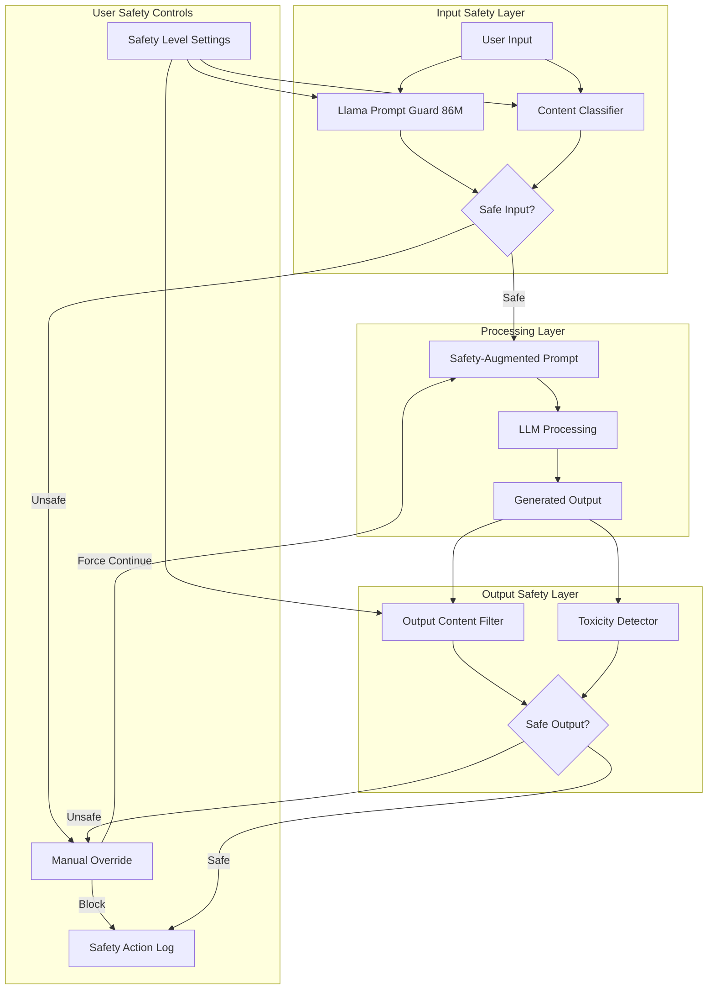
```mermaid
graph TB
    subgraph "Input Safety Layer"
        UserInput[User Input]
        PromptGuard[Llama Prompt Guard 86M]
        ContentClassifier[Content Classifier]
        InputDecision{Safe Input?}
    end
    
    subgraph "Processing Layer"
        SafetyPrompt[Safety-Augmented Prompt]
        LLMProcessing[LLM Processing]
        GeneratedOutput[Generated Output]
    end
    
    subgraph "Output Safety Layer"
        OutputFilter[Output Content Filter]
        ToxicityDetector[Toxicity Detector]
        OutputDecision{Safe Output?}
    end
    
    subgraph "User Safety Controls"
        SafetySettings[Safety Level Settings]
        UserOverride[Manual Override]
        TransparencyLog[Safety Action Log]
    end
    
    UserInput --> PromptGuard
    UserInput --> ContentClassifier
    PromptGuard --> InputDecision
    ContentClassifier --> InputDecision
    
    InputDecision -->|Safe| SafetyPrompt
    InputDecision -->|Unsafe| UserOverride
    UserOverride -->|Force Continue| SafetyPrompt
    UserOverride -->|Block| TransparencyLog
    
    SafetyPrompt --> LLMProcessing
    LLMProcessing --> GeneratedOutput
    
    GeneratedOutput --> OutputFilter
    GeneratedOutput --> ToxicityDetector
    OutputFilter --> OutputDecision
    ToxicityDetector --> OutputDecision
    
    OutputDecision -->|Safe| TransparencyLog
    OutputDecision -->|Unsafe| UserOverride
    
    SafetySettings --> PromptGuard
    SafetySettings --> ContentClassifier
    SafetySettings --> OutputFilter
```

### 9.2 Safety Model Integration

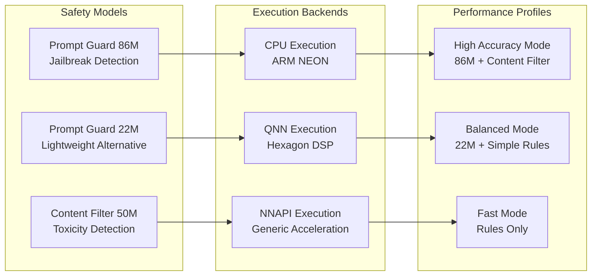
```mermaid
graph LR
    subgraph "Safety Models"
        PromptGuard86M[Prompt Guard 86M<br/>Jailbreak Detection]
        PromptGuard22M[Prompt Guard 22M<br/>Lightweight Alternative]
        ContentFilter[Content Filter 50M<br/>Toxicity Detection]
    end
    
    subgraph "Execution Backends"
        CPUExecution[CPU Execution<br/>ARM NEON]
        QNNExecution[QNN Execution<br/>Hexagon DSP]
        NNAPIExecution[NNAPI Execution<br/>Generic Acceleration]
    end
    
    subgraph "Performance Profiles"
        HighAccuracy[High Accuracy Mode<br/>86M + Content Filter]
        Balanced[Balanced Mode<br/>22M + Simple Rules]
        FastMode[Fast Mode<br/>Rules Only]
    end
    
    PromptGuard86M --> CPUExecution
    PromptGuard22M --> QNNExecution
    ContentFilter --> NNAPIExecution
    
    CPUExecution --> HighAccuracy
    QNNExecution --> Balanced
    NNAPIExecution --> FastMode
```

### 9.3 Safety Policy Configuration

```kotlin
data class SafetyConfig(
    val level: SafetyLevel,
    val enablePromptGuard: Boolean,
    val enableOutputFilter: Boolean,
    val blockedCategories: Set<ContentCategory>,
    val allowUserOverride: Boolean,
    val logSafetyActions: Boolean
)

enum class SafetyLevel {
    STRICT,     // Maximum filtering, minimal false positives
    STANDARD,   // Balanced approach, reasonable filtering
    PERMISSIVE, // Minimal filtering, user responsibility
    CUSTOM      // User-defined category selection
}

enum class ContentCategory {
    HATE_SPEECH,
    HARASSMENT,
    VIOLENCE,
    SELF_HARM,
    SEXUAL_CONTENT,
    ILLEGAL_ACTIVITY,
    PROMPT_INJECTION,
    PRIVACY_VIOLATION
}
```

---

## 10. Performance, Battery & Thermal Management

### 10.1 Adaptive Performance Architecture

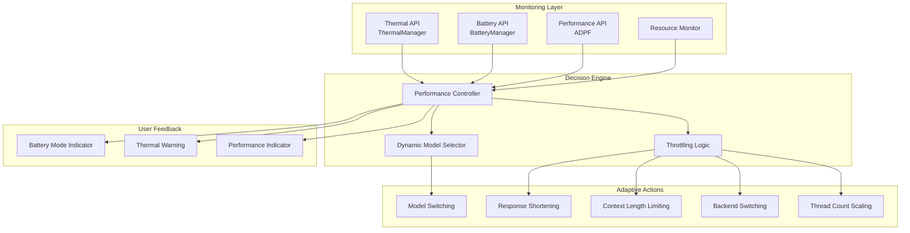
```mermaid
graph TB
    subgraph "Monitoring Layer"
        ThermalAPI[Thermal API<br/>ThermalManager]
        BatteryAPI[Battery API<br/>BatteryManager]
        PerformanceAPI[Performance API<br/>ADPF]
        ResourceMonitor[Resource Monitor]
    end
    
    subgraph "Decision Engine"
        PerformanceController[Performance Controller]
        ThrottlingLogic[Throttling Logic]
        ModelSelector[Dynamic Model Selector]
    end
    
    subgraph "Adaptive Actions"
        ThreadScaling[Thread Count Scaling]
        ModelSwitching[Model Switching]
        BackendSwitching[Backend Switching]
        ContextLimiting[Context Length Limiting]
        ResponseShortening[Response Shortening]
    end
    
    subgraph "User Feedback"
        PerformanceIndicator[Performance Indicator]
        ThermalWarning[Thermal Warning]
        BatteryOptimization[Battery Mode Indicator]
    end
    
    ThermalAPI --> PerformanceController
    BatteryAPI --> PerformanceController
    PerformanceAPI --> PerformanceController
    ResourceMonitor --> PerformanceController
    
    PerformanceController --> ThrottlingLogic
    PerformanceController --> ModelSelector
    
    ThrottlingLogic --> ThreadScaling
    ThrottlingLogic --> BackendSwitching
    ThrottlingLogic --> ContextLimiting
    ThrottlingLogic --> ResponseShortening
    
    ModelSelector --> ModelSwitching
    
    PerformanceController --> PerformanceIndicator
    PerformanceController --> ThermalWarning
    PerformanceController --> BatteryOptimization
```

### 10.2 Performance Scaling Strategy

| Thermal State | Action | Thread Count | Model Size | Backend | Context Limit |
|---------------|--------|--------------|------------|---------|---------------|
| THERMAL_STATUS_NONE | Full Performance | 8 threads | 7B | GPU | 4096 tokens |
| THERMAL_STATUS_LIGHT | Slight Reduction | 6 threads | 7B | GPU | 3072 tokens |
| THERMAL_STATUS_MODERATE | Reduced Performance | 4 threads | 3B | GPU | 2048 tokens |
| THERMAL_STATUS_SEVERE | Minimal Performance | 2 threads | 1.5B | CPU | 1024 tokens |
| THERMAL_STATUS_CRITICAL | Emergency Throttle | 1 thread | 1.5B | CPU | 512 tokens |

### 10.3 Battery Optimization Modes

```kotlin
enum class BatteryMode {
    PERFORMANCE,    // No restrictions, maximum capability
    BALANCED,       // Moderate optimizations
    POWER_SAVER,    // Aggressive power saving
    EMERGENCY       // Minimal functionality only
}

data class BatteryOptimizations(
    val maxThreads: Int,
    val preferredModelSize: ModelSize,
    val enableGPU: Boolean,
    val enableRAG: Boolean,
    val enableMultimodal: Boolean,
    val maxResponseTokens: Int,
    val backgroundProcessing: Boolean
)

val BATTERY_OPTIMIZATIONS = mapOf(
    BatteryMode.PERFORMANCE to BatteryOptimizations(8, ModelSize.LARGE, true, true, true, 2048, true),
    BatteryMode.BALANCED to BatteryOptimizations(6, ModelSize.MEDIUM, true, true, true, 1024, true),
    BatteryMode.POWER_SAVER to BatteryOptimizations(4, ModelSize.SMALL, false, false, false, 512, false),
    BatteryMode.EMERGENCY to BatteryOptimizations(2, ModelSize.TINY, false, false, false, 256, false)
)
```

---

## 11. Deployment, Configuration & Environments

### 11.1 APK Structure & Build Configuration

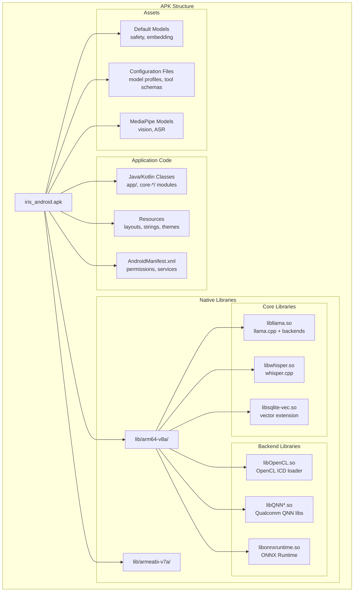
```mermaid
graph TB
    subgraph "APK Structure"
        APK[iris_android.apk]
        
        subgraph "Application Code"
            JavaKotlin[Java/Kotlin Classes<br/>app/, core-*/ modules]
            Resources[Resources<br/>layouts, strings, themes]
            Manifest[AndroidManifest.xml<br/>permissions, services]
        end
        
        subgraph "Native Libraries"
            ARM64[lib/arm64-v8a/]
            ARMV7[lib/armeabi-v7a/]
            
            subgraph "Core Libraries"
                LlamaCppSo[libllama.so<br/>llama.cpp + backends]
                WhisperSo[libwhisper.so<br/>whisper.cpp]
                SQLiteVecSo[libsqlite-vec.so<br/>vector extension]
            end
            
            subgraph "Backend Libraries"
                OpenCLSo[libOpenCL.so<br/>OpenCL ICD loader]
                QNNSo[libQNN*.so<br/>Qualcomm QNN libs]
                ONNXSo[libonnxruntime.so<br/>ONNX Runtime]
            end
        end
        
        subgraph "Assets"
            DefaultModels[Default Models<br/>safety, embedding]
            Configurations[Configuration Files<br/>model profiles, tool schemas]
            MediaPipeModels[MediaPipe Models<br/>vision, ASR]
        end
    end
    
    APK --> JavaKotlin
    APK --> Resources
    APK --> Manifest
    APK --> ARM64
    APK --> ARMV7
    ARM64 --> LlamaCppSo
    ARM64 --> WhisperSo
    ARM64 --> SQLiteVecSo
    ARM64 --> OpenCLSo
    ARM64 --> QNNSo
    ARM64 --> ONNXSo
    APK --> DefaultModels
    APK --> Configurations
    APK --> MediaPipeModels
```

### 11.2 Build System Architecture

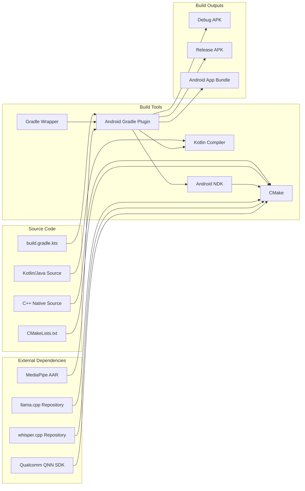
```mermaid
graph LR
    subgraph "Source Code"
        KotlinSource[Kotlin/Java Source]
        CppSource[C++ Native Source]
        CMakeLists[CMakeLists.txt]
        GradleBuild[build.gradle.kts]
    end
    
    subgraph "Build Tools"
        GradleWrapper[Gradle Wrapper]
        AndroidGradle[Android Gradle Plugin]
        KotlinCompiler[Kotlin Compiler]
        NDKBuild[Android NDK]
        CMake[CMake]
    end
    
    subgraph "External Dependencies"
        LlamaCppRepo[llama.cpp Repository]
        WhisperCppRepo[whisper.cpp Repository]
        MediaPipeAAR[MediaPipe AAR]
        QualcommSDK[Qualcomm QNN SDK]
    end
    
    subgraph "Build Outputs"
        APKDebug[Debug APK]
        APKRelease[Release APK]
        AABRelease[Android App Bundle]
    end
    
    KotlinSource --> KotlinCompiler
    CppSource --> CMake
    CMakeLists --> CMake
    GradleBuild --> AndroidGradle
    
    GradleWrapper --> AndroidGradle
    AndroidGradle --> KotlinCompiler
    AndroidGradle --> NDKBuild
    NDKBuild --> CMake
    
    LlamaCppRepo --> CMake
    WhisperCppRepo --> CMake
    MediaPipeAAR --> AndroidGradle
    QualcommSDK --> CMake
    
    AndroidGradle --> APKDebug
    AndroidGradle --> APKRelease
    AndroidGradle --> AABRelease
```

### 11.3 Environment Configuration

```kotlin
// Build configuration per environment
data class BuildConfig(
    val environment: Environment,
    val enableGPUBackends: Boolean,
    val includeQNNSupport: Boolean,
    val includeCTranslate2: Boolean,
    val debugTools: Boolean,
    val crashReporting: Boolean,
    val modelAssets: Set<ModelAsset>
)

enum class Environment {
    DEBUG,
    STAGING,
    RELEASE
}

val BUILD_CONFIGURATIONS = mapOf(
    Environment.DEBUG to BuildConfig(
        environment = Environment.DEBUG,
        enableGPUBackends = true,
        includeQNNSupport = true,
        includeCTranslate2 = true,
        debugTools = true,
        crashReporting = false,
        modelAssets = setOf(ModelAsset.SAFETY_TINY, ModelAsset.WHISPER_TINY)
    ),
    Environment.RELEASE to BuildConfig(
        environment = Environment.RELEASE,
        enableGPUBackends = true,
        includeQNNSupport = true,
        includeCTranslate2 = false,
        debugTools = false,
        crashReporting = true,
        modelAssets = setOf(ModelAsset.SAFETY_SMALL, ModelAsset.EMBEDDING_SMALL)
    )
)
```

---

## 12. Extensibility & Future Work

### 12.1 Plugin Architecture for Extensions

```mermaid
graph TB
    subgraph "Core Platform"
        CoreAPI[Core API Interface]
        PluginManager[Plugin Manager]
        EventBus[Event Bus]
        ServiceRegistry[Service Registry]
    end
    
    subgraph "Extension Points"
        ModelProviders[Model Providers<br/>Custom model formats]
        BackendProviders[Backend Providers<br/>Custom acceleration]
        ToolProviders[Tool Providers<br/>Custom actions]
        DataSources[Data Sources<br/>Custom indexing]
        SafetyProviders[Safety Providers<br/>Custom filtering]
    end
    
    subgraph "Future Extensions"
        SmartHomePlugin[Smart Home Plugin<br/>IoT integration]
        WebSearchPlugin[Web Search Plugin<br/>Local web crawling]
        CodeAssistPlugin[Code Assistant Plugin<br/>Development tools]
        HealthPlugin[Health Plugin<br/>Fitness integration]
    end
    
    CoreAPI --> PluginManager
    PluginManager --> EventBus
    PluginManager --> ServiceRegistry
    
    PluginManager --> ModelProviders
    PluginManager --> BackendProviders
    PluginManager --> ToolProviders
    PluginManager --> DataSources
    PluginManager --> SafetyProviders
    
    ToolProviders --> SmartHomePlugin
    DataSources --> WebSearchPlugin
    ModelProviders --> CodeAssistPlugin
    DataSources --> HealthPlugin
```

### 12.2 Planned Future Enhancements

#### Phase 2 Enhancements (6-12 months)
- **Advanced Multimodal Models**: Integration of lightweight vision-language models (LLaVA, Qwen-VL)
- **Speculative Decoding**: Two-model speculative decoding for 2-3x speedup
- **Advanced RAG**: Hierarchical retrieval, query expansion, multi-modal embeddings
- **Federated Learning**: Privacy-preserving model personalization

#### Phase 3 Enhancements (12-18 months)
- **On-Device Fine-tuning**: LoRA-based model adaptation
- **Advanced Tool Ecosystem**: Smart home integration, API calling, workflow automation
- **Multi-Agent Systems**: Specialized agents for different domains
- **Edge-Cloud Hybrid**: Optional cloud acceleration with privacy controls

#### Long-term Vision (18+ months)
- **Neuromorphic Computing**: Integration with specialized AI chips
- **Advanced Memory Systems**: Long-term episodic memory, knowledge graphs
- **Cross-Device Sync**: Secure synchronization across user devices
- **AR/VR Integration**: Spatial computing capabilities

### 12.3 Extension API Design

```kotlin
// Core extension interfaces
interface ModelProvider {
    suspend fun loadModel(config: ModelConfig): Result<ModelHandle>
    suspend fun unloadModel(handle: ModelHandle): Result<Unit>
    fun getSupportedFormats(): List<ModelFormat>
}

interface BackendProvider {
    fun isSupported(device: DeviceProfile): Boolean
    suspend fun initialize(): Result<BackendHandle>
    suspend fun execute(operation: ComputeOperation): Result<ComputeResult>
}

interface ToolProvider {
    fun getAvailableTools(): List<ToolDefinition>
    suspend fun executeAction(action: ToolAction): Result<ActionResult>
    fun getRequiredPermissions(): List<String>
}

interface DataSourceProvider {
    suspend fun indexData(source: DataSource): Result<IndexResult>
    suspend fun query(query: Query): Result<List<SearchResult>>
    fun getSupportedTypes(): List<DataType>
}

// Plugin registration
class PluginManager {
    fun registerModelProvider(provider: ModelProvider)
    fun registerBackendProvider(provider: BackendProvider)
    fun registerToolProvider(provider: ToolProvider)
    fun registerDataSourceProvider(provider: DataSourceProvider)
}
```

---

## Conclusion

The **iris_android** architecture provides a comprehensive foundation for building a state-of-the-art on-device AI assistant. The modular design ensures scalability, maintainability, and adaptability to future technological advances while maintaining strict privacy and performance requirements.

Key architectural strengths:
- **Privacy-by-Design**: All processing remains on-device
- **Performance Optimization**: Hardware-aware backend selection and adaptive scaling
- **Extensibility**: Plugin architecture for future enhancements
- **Safety**: Multi-layer content filtering and user control
- **Android Integration**: Deep system integration with user consent mechanisms

This architecture document serves as the technical blueprint for implementing a production-ready on-device AI assistant that pushes the boundaries of mobile AI capabilities while respecting user privacy and device constraints.