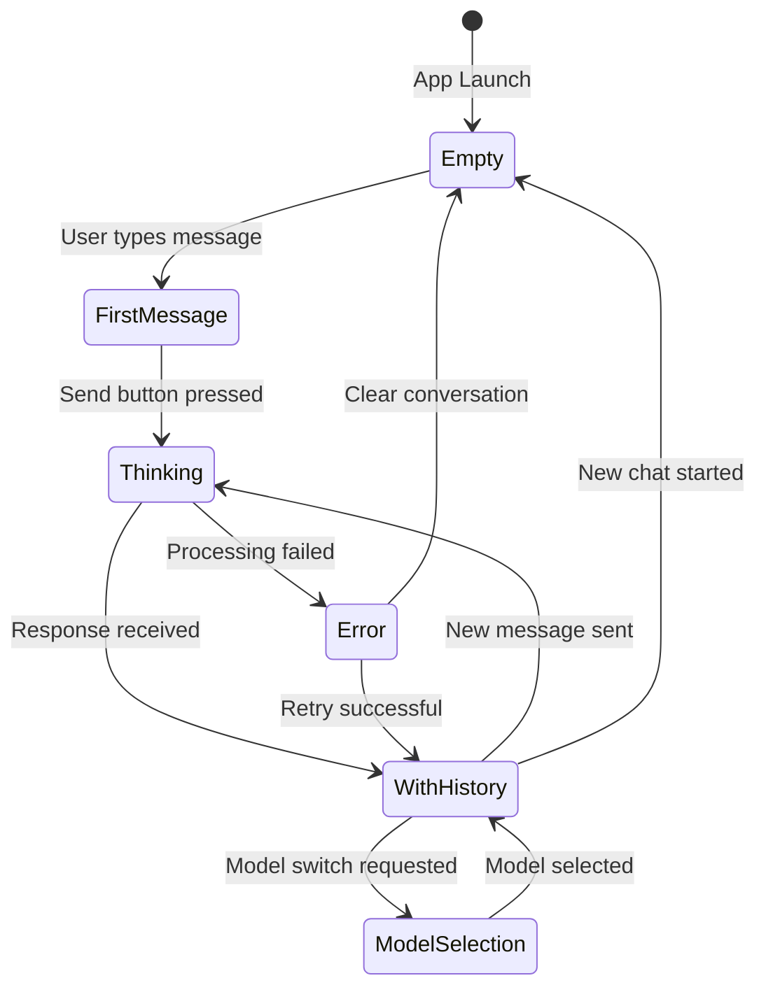
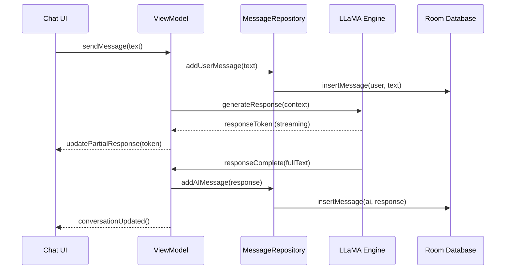

# Chat Interface Specification

## Business Goals

Create an intuitive, responsive chat interface that feels natural for AI conversation while providing clear feedback about system state and model performance. The interface should accommodate both novice users seeking simple chat and power users wanting detailed control.

**Primary Objectives**:
- Enable natural conversation flow with minimal friction
- Provide clear feedback on AI processing state and performance
- Support conversation history and context management
- Maintain responsive UI even during intensive AI processing

## User Stories & Acceptance Tests

### Epic: Basic Conversation Flow

**US-001: Send and receive messages**
- *As a user, I want to type a message and receive an AI response so that I can have a conversation*
- **AC1**: User can type message in input field and send via button or Enter key
- **AC2**: Message appears immediately in conversation with timestamp
- **AC3**: AI processing indicator shows while response is being generated
- **AC4**: AI response appears in conversation thread with clear visual distinction
- **AC5**: Conversation scrolls automatically to show latest message

**US-002: Conversation History**
- *As a user, I want to see my previous messages so that I can maintain context*
- **AC1**: Previous messages persist between app sessions
- **AC2**: Conversation history scrollable with smooth performance
- **AC3**: Message timestamps shown for reference
- **AC4**: Clear visual distinction between user and AI messages

**US-003: Conversation Management**
- *As a user, I want to start new conversations and manage existing ones*
- **AC1**: "New Chat" button clears current conversation
- **AC2**: Confirmation dialog for clearing when messages exist
- **AC3**: Conversation state preserved during navigation to other screens

### Epic: Input and Interaction

**US-004: Rich Text Input**
- *As a user, I want flexible input options for different types of queries*
- **AC1**: Multi-line text input with auto-expanding height
- **AC2**: Voice input button triggers speech-to-text
- **AC3**: Paste button for clipboard content
- **AC4**: Input field maintains focus and cursor position appropriately

**US-005: Message Actions**
- *As a user, I want to interact with messages for better conversation control*
- **AC1**: Long-press message to copy text to clipboard
- **AC2**: Copy button available for AI responses
- **AC3**: Regenerate response option for AI messages
- **AC4**: Toast feedback for successful actions

### Epic: System Feedback

**US-006: Processing Status**
- *As a user, I want clear feedback about what the AI is doing*
- **AC1**: Loading indicator shows during model inference
- **AC2**: Processing time displayed after response completion
- **AC3**: Token generation rate shown for power users
- **AC4**: Error messages provide actionable guidance

**US-007: Model Information**
- *As a user, I want to know which model is responding to my queries*
- **AC1**: Current model name visible in interface
- **AC2**: Model performance metrics available on request
- **AC3**: Quick model switching option accessible

## UI States & Navigation

### Primary States



### Screen Layouts

**Empty State**:
- Welcome message with app branding
- Suggested conversation starters (3-4 examples)
- Model selection indicator
- Input field with placeholder text

**Active Conversation**:
- Scrollable message list taking majority of screen
- Fixed input area at bottom with auto-expanding text field
- Send button enabled only when text present
- Voice input and paste buttons available

**Processing State**:
- Loading animation in AI message bubble
- Disable input during processing
- Cancel option for long-running requests
- Real-time processing metrics (optional)

### Responsive Design

- **Phone Portrait**: Single column, full-width messages
- **Phone Landscape**: Slightly wider message bubbles for readability
- **Tablet**: Centered conversation with max width for optimal reading
- **Accessibility**: Large text support, screen reader compatibility

## Data Flow & Boundaries

### Input Processing Flow



### State Management

**ViewModel State**:
```kotlin
data class ChatUiState(
    val messages: List<Message> = emptyList(),
    val currentInput: String = "",
    val isProcessing: Boolean = false,
    val currentModel: String = "",
    val error: String? = null,
    val processingMetrics: ProcessingMetrics? = null
)
```

**Message Data Model**:
```kotlin
data class Message(
    val id: String,
    val content: String,
    val isFromUser: Boolean,
    val timestamp: Instant,
    val processingTimeMs: Long? = null,
    val tokenCount: Int? = null
)
```

### Component Boundaries

- **MainChatScreen**: Orchestrates overall chat experience
- **MessageList**: Handles conversation display and scrolling
- **MessageBubble**: Individual message rendering with actions
- **InputArea**: Text input, voice, and send functionality
- **ProcessingIndicator**: AI thinking state and metrics

## Non-Functional Requirements

### Performance

- **Message Rendering**: 60 FPS scrolling with 1000+ messages
- **Input Responsiveness**: <100ms delay from typing to display
- **Memory Usage**: <100MB for conversation with 500 messages
- **AI Response Time**: First token within 2 seconds, complete response within 30 seconds

### Internationalization (i18n)

- **Text Strings**: All UI text externalized to string resources
- **RTL Support**: Proper layout for right-to-left languages
- **Date/Time**: Locale-appropriate formatting
- **Cultural Sensitivity**: Appropriate conversation starters for different regions

### Accessibility

- **Screen Reader**: Full TalkBack/VoiceOver support
- **Keyboard Navigation**: Complete keyboard-only operation
- **Color Contrast**: WCAG AA compliance for all text
- **Large Text**: Scaling support up to 200%
- **Motor Accessibility**: Minimum 44dp touch targets

### Error Handling

- **Network Failures**: N/A (on-device processing)
- **Model Loading Errors**: Clear guidance and retry options
- **Memory Constraints**: Graceful degradation, conversation truncation
- **Input Validation**: Handle special characters, excessive length
- **Crash Recovery**: Restore conversation state after app restart

## Test Plan

### Unit Tests

**ViewModel Tests**:
- Message sending and state updates
- Error handling scenarios
- Input validation and sanitization
- Conversation management operations

**Repository Tests**:
- Message persistence and retrieval
- Database migration scenarios
- Conversation history management

**Utility Tests**:
- Message formatting and timestamps
- Text processing and validation
- Performance metrics calculation

### UI Tests (Compose)

**Message Display Tests**:
```kotlin
@Test
fun messageList_displays_user_and_ai_messages_correctly() {
    // Test message bubble appearance, timestamps, action buttons
}

@Test
fun conversation_scrolls_to_latest_message_automatically() {
    // Test auto-scroll behavior
}
```

**Input Tests**:
```kotlin
@Test
fun input_field_sends_message_on_enter_key() {
    // Test keyboard interaction
}

@Test
fun send_button_enabled_only_with_text() {
    // Test button state management
}
```

**State Tests**:
```kotlin
@Test
fun processing_indicator_shows_during_ai_response() {
    // Test loading states
}

@Test
fun error_state_displays_retry_option() {
    // Test error handling UI
}
```

### Integration Tests

**Chat Flow Tests**:
- Complete send→process→receive cycle
- Conversation persistence across app lifecycle
- Model switching during active conversation

**Performance Tests**:
- Large conversation rendering performance
- Memory usage during extended sessions
- Scroll performance with mixed content types

### Instrumented Tests

**Device Compatibility**:
- Test on various screen sizes and densities
- Verify performance on different hardware configurations
- Validate accessibility features across Android versions

## Telemetry **NOT** Collected

In accordance with our privacy-first approach, the following telemetry will **NOT** be collected:

❌ **User Messages**: No conversation content or user input  
❌ **AI Responses**: No generated content or model outputs  
❌ **Personal Identifiers**: No device IDs, user accounts, or tracking  
❌ **Usage Patterns**: No conversation frequency or timing data  
❌ **Performance Data**: No inference metrics transmitted externally  
❌ **Error Details**: No crash reports with sensitive context  

**Local Metrics Only**: Performance and error information remains on-device for debugging and optimization.

## Merge Checklist

### Development Complete
- [ ] All user stories implemented with acceptance criteria met
- [ ] Unit tests written and passing (≥80% coverage)
- [ ] UI tests covering critical user interactions
- [ ] Integration tests for ViewModel-Repository communication
- [ ] Performance benchmarks meet requirements

### Code Quality
- [ ] Kotlin code follows project style guide (ktlint passing)
- [ ] No lint warnings or static analysis issues
- [ ] All public APIs documented with KDoc
- [ ] Complex business logic has explanatory comments
- [ ] Error handling implemented for all failure modes

### UI/UX Standards
- [ ] Compose UI follows Material Design 3 guidelines
- [ ] Accessibility features tested with TalkBack
- [ ] All text externalized to string resources
- [ ] Color contrast meets WCAG AA standards
- [ ] Touch targets minimum 44dp in size

### Testing & Validation
- [ ] Manual testing on multiple device configurations
- [ ] Conversation persistence verified across app restarts
- [ ] Memory usage acceptable during extended sessions
- [ ] No memory leaks detected in UI tests
- [ ] Voice input integration working correctly

### Documentation
- [ ] Implementation matches specification requirements
- [ ] Any deviations from spec documented and justified
- [ ] Public API changes reflected in documentation
- [ ] Screenshots updated for UI changes

### Security & Privacy
- [ ] No conversation data transmitted externally
- [ ] Local storage properly encrypted
- [ ] Input validation prevents injection attacks
- [ ] No hardcoded secrets or credentials

---

## Implementation Notes (MVP 2)

### Message Persistence with Room

**Completed**: January 2025

**Overview**: Implemented local message persistence using Room database to preserve conversation history across app sessions.

**Components Added**:

1. **Database Layer** (`app/src/main/java/com/nervesparks/iris/data/local/`):
   - `MessageEntity`: Room entity representing persisted messages with columns for id, content, role, timestamp, processingTimeMs, and tokenCount
   - `MessageDao`: Data Access Object providing methods for insert, query, and delete operations with both suspend functions and Flow support
   - `AppDatabase`: Room database singleton with thread-safe initialization
   - `MessageMapper`: Utility to convert between domain `Message` and database `MessageEntity`, handling Instant↔Long and enum↔String conversions

2. **Testing**:
   - Unit tests for `MessageMapper` covering conversion, null handling, round-trip preservation, and edge cases (13 tests)
   - Instrumented tests for `MessageDao` covering CRUD operations, ordering, batch inserts, and conflict resolution (11 tests)
   - Compose UI test for message history restoration verifying correct display after reload (5 test scenarios)

**Key Design Decisions**:
- Used Room 2.6.1 with KSP for annotation processing
- Stored timestamps as Long (epoch milliseconds) for database compatibility
- Implemented REPLACE conflict strategy to handle duplicate message IDs
- Used Flow for reactive updates and suspend functions for one-time queries
- Singleton database pattern with double-checked locking for thread safety

**Database Schema**:
```sql
CREATE TABLE messages (
    id TEXT PRIMARY KEY NOT NULL,
    content TEXT NOT NULL,
    role TEXT NOT NULL,
    timestamp INTEGER NOT NULL,
    processingTimeMs INTEGER,
    tokenCount INTEGER
)
```

**Integration Points**:
- Messages should be persisted via `messageDao.insertMessage()` when sent or received
- History should be restored at app startup using `messageDao.getAllMessages().first()`
- ViewModel integration pending to connect persistence with UI layer

**Testing Coverage**:
- MessageMapper: 100% (all conversion paths tested)
- MessageDao: 100% (all database operations tested)
- UI restoration: Verified message display after simulated restart

**Future Enhancements**:
- Add conversation management (multiple conversations)
- Implement message search and filtering
- Add database migrations for schema changes
- Consider conversation archival for old messages

---

*Specification Version: 1.0*  
*Last Updated: October 2025*  
*Implementation Target: Milestone 1*