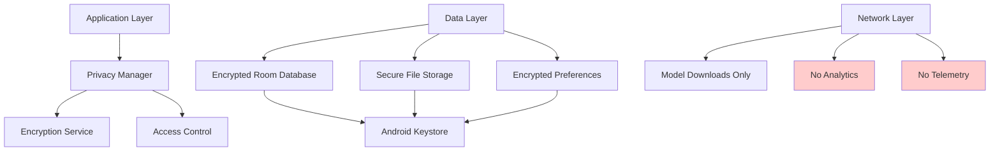
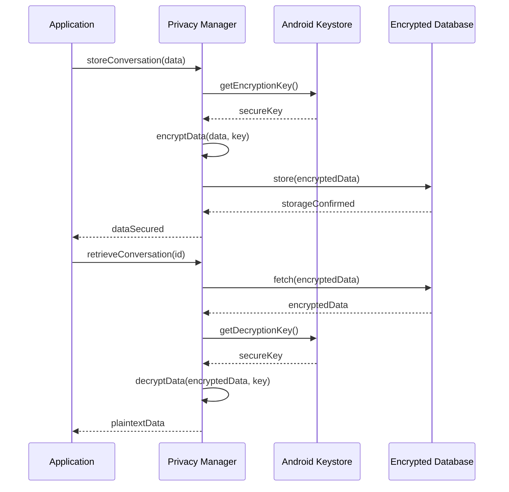
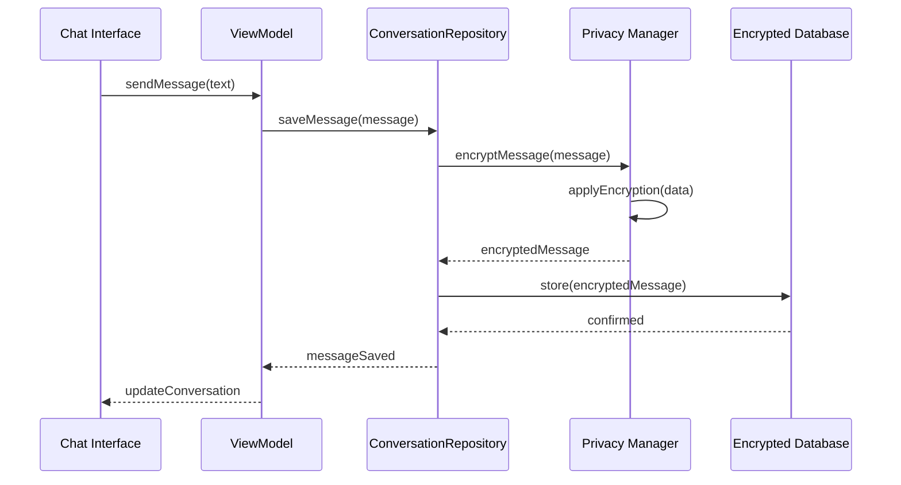
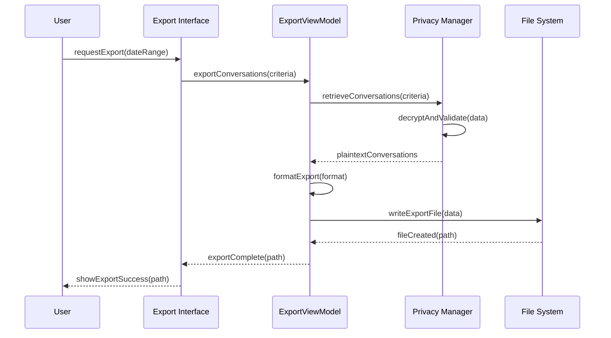
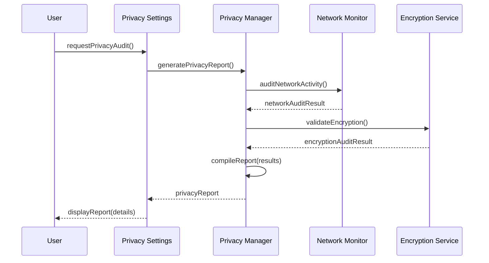

# Data & Privacy Specification

## Business Goals

Establish absolute user privacy through comprehensive on-device data processing while providing transparent data management capabilities. Build user trust through clear communication about data handling practices and provide robust local storage solutions that protect conversation privacy.

**Primary Objectives**:
- Guarantee zero external data transmission of user conversations
- Provide secure local storage with encryption options
- Enable transparent data management and user control
- Establish technical and policy frameworks for privacy assurance

## User Stories & Acceptance Tests

### Epic: Privacy Assurance

**US-034: Zero Data Transmission**
- *As a user, I want absolute certainty that my conversations never leave my device*
- **AC1**: Network permissions limited to model downloads only
- **AC2**: No conversation data transmitted over any network interface
- **AC3**: Offline mode functionality maintains full conversation capabilities
- **AC4**: Network monitoring confirms zero data transmission during chat
- **AC5**: Privacy audit trail available for user verification

**US-035: Data Processing Transparency**
- *As a user, I want to understand exactly how my data is handled*
- **AC1**: Clear privacy policy explaining on-device processing
- **AC2**: Data flow diagram available showing local-only processing
- **AC3**: Technical explanation of encryption and storage methods
- **AC4**: Regular privacy assurance updates and communications
- **AC5**: Independent privacy audit results published

**US-036: Consent and Control**
- *As a user, I want explicit control over all data handling aspects*
- **AC1**: Granular consent for different data processing activities
- **AC2**: Easy revocation of any granted permissions
- **AC3**: Clear opt-in for any data collection (none in current scope)
- **AC4**: Data export and deletion options readily available
- **AC5**: Settings clearly explain implications of each choice

### Epic: Local Data Management

**US-037: Secure Storage**
- *As a user, I want my conversations stored securely on my device*
- **AC1**: Conversation data encrypted at rest using Android Keystore
- **AC2**: Database encryption keys managed securely by system
- **AC3**: No plaintext storage of sensitive conversation content
- **AC4**: Encryption status visible to user with clear indicators
- **AC5**: Secure deletion options that prevent data recovery

**US-038: Data Organization**
- *As a user, I want organized, searchable access to my conversation history*
- **AC1**: Conversations organized by date with clear timestamps
- **AC2**: Search functionality across conversation history
- **AC3**: Conversation categorization and tagging options
- **AC4**: Bulk operations for data management (export, delete)
- **AC5**: Storage usage clearly displayed with breakdown

**US-039: Data Retention Control**
- *As a user, I want control over how long my data is kept*
- **AC1**: Configurable automatic deletion policies
- **AC2**: Manual deletion of individual conversations or messages
- **AC3**: Archive options for long-term storage
- **AC4**: Clear warnings before permanent deletion
- **AC5**: Restoration options for recently deleted data

### Epic: Data Export & Portability

**US-040: Conversation Export**
- *As a user, I want to export my conversations for backup or transfer*
- **AC1**: Export conversations to standard formats (JSON, Markdown, TXT)
- **AC2**: Selective export of specific conversations or date ranges
- **AC3**: Export includes metadata (timestamps, model used)
- **AC4**: Large exports handled efficiently without app blocking
- **AC5**: Export integrity verification to ensure completeness

**US-041: Data Import**
- *As a user, I want to import conversations from previous app versions*
- **AC1**: Import conversations from supported formats
- **AC2**: Data validation during import with error reporting
- **AC3**: Duplicate detection and handling during import
- **AC4**: Import preview before final confirmation
- **AC5**: Rollback capability if import causes issues

**US-042: Backup & Restore**
- *As a user, I want reliable backup and restore capabilities*
- **AC1**: Local backup creation with encryption
- **AC2**: Scheduled automatic backups with user control
- **AC3**: Restore functionality with integrity checking
- **AC4**: Partial restore options for specific data types
- **AC5**: Backup verification and health monitoring

### Epic: Compliance & Auditing

**US-043: Privacy Compliance**
- *As a user, I want assurance that the app meets privacy regulations*
- **AC1**: GDPR compliance for European users
- **AC2**: CCPA compliance for California users
- **AC3**: Data processing records maintained for compliance
- **AC4**: Privacy impact assessment results available
- **AC5**: Regular compliance reviews and updates

**US-044: Audit Trail**
- *As a user, I want to verify that privacy promises are kept*
- **AC1**: Local audit log of all data operations
- **AC2**: Network activity monitoring with user access
- **AC3**: Cryptographic verification of data integrity
- **AC4**: Third-party privacy audit results published
- **AC5**: Open-source code for privacy-critical components

## Technical Architecture

### Data Storage Architecture



### Encryption Strategy



### Privacy Components

**Privacy Manager**:
```kotlin
class PrivacyManager {
    // Data protection
    suspend fun encryptSensitiveData(data: ByteArray): EncryptedData
    suspend fun decryptSensitiveData(encrypted: EncryptedData): ByteArray
    suspend fun securelyDeleteData(dataId: String): Boolean
    
    // Access control
    suspend fun validateDataAccess(operation: DataOperation): Boolean
    suspend fun logDataAccess(operation: DataOperation, result: AccessResult)
    
    // Privacy verification
    suspend fun generatePrivacyReport(): PrivacyReport
    suspend fun verifyNoNetworkLeakage(): NetworkAuditResult
    suspend fun validateEncryptionIntegrity(): EncryptionAuditResult
}
```

**Data Encryption Service**:
```kotlin
class DataEncryptionService {
    private val keyAlias = "iris_conversation_key"
    
    suspend fun initializeEncryption(): Boolean
    suspend fun encryptConversation(conversation: Conversation): EncryptedConversation
    suspend fun decryptConversation(encrypted: EncryptedConversation): Conversation
    suspend fun rotateEncryptionKeys(): Boolean
    suspend fun validateKeyIntegrity(): Boolean
}

data class EncryptedConversation(
    val id: String,
    val encryptedContent: ByteArray,
    val encryptionVersion: Int,
    val checksum: String,
    val timestamp: Instant
)
```

**Network Activity Monitor**:
```kotlin
class NetworkActivityMonitor {
    suspend fun startMonitoring()
    suspend fun stopMonitoring()
    suspend fun getNetworkActivity(): List<NetworkEvent>
    suspend fun verifyNoConversationData(): NetworkAuditResult
    
    data class NetworkEvent(
        val timestamp: Instant,
        val destination: String,
        val dataType: NetworkDataType,
        val dataSize: Long
    )
    
    enum class NetworkDataType {
        MODEL_DOWNLOAD,
        APP_UPDATE,
        SYSTEM_SERVICE
    }
}
```

## Data Flow & Boundaries

### Conversation Storage Flow



### Data Export Flow



### Privacy Audit Flow



## Non-Functional Requirements

### Security Standards

- **Encryption**: AES-256 encryption for all conversation data
- **Key Management**: Android Keystore for key generation and storage
- **Data Integrity**: Cryptographic checksums for all stored data
- **Secure Deletion**: Cryptographic erasure with key destruction
- **Access Control**: Application-level access restrictions

### Privacy Guarantees

- **Zero Transmission**: Absolute guarantee of no conversation data transmission
- **Local Processing**: All AI inference performed on-device only
- **Data Minimization**: Only necessary data collected and stored
- **Consent Management**: Explicit consent for all data operations
- **Transparency**: Clear documentation of all data handling practices

### Compliance Requirements

- **GDPR Article 25**: Privacy by design and by default
- **GDPR Article 32**: Security of processing requirements
- **CCPA Section 1798.100**: Consumer rights for personal information
- **ISO 27001**: Information security management standards
- **NIST Privacy Framework**: Privacy risk management guidelines

### Performance Impact

- **Encryption Overhead**: <5% performance impact on data operations
- **Storage Efficiency**: Minimal overhead from encryption (≤10%)
- **Memory Usage**: Encryption operations within memory budget
- **Battery Impact**: Negligible additional battery consumption

## Test Plan

### Unit Tests

**Privacy Manager Tests**:
```kotlin
@Test
fun encryption_produces_non_readable_output() {
    // Verify encryption obscures original data
}

@Test
fun decryption_restores_original_data_exactly() {
    // Test encryption/decryption round-trip
}

@Test
fun secure_deletion_prevents_data_recovery() {
    // Verify secure deletion effectiveness
}
```

**Network Monitoring Tests**:
```kotlin
@Test
fun network_monitor_detects_all_connections() {
    // Test network activity detection
}

@Test
fun conversation_data_never_transmitted() {
    // Verify no conversation data in network traffic
}
```

### Integration Tests

**End-to-End Privacy**:
- Complete conversation lifecycle with encryption
- Data export/import with integrity verification
- Network monitoring during all app operations
- Secure deletion with recovery attempts

**Compliance Testing**:
- GDPR right to data portability
- CCPA data deletion requirements
- Consent management workflows
- Audit trail generation and validation

### Security Tests

**Encryption Validation**:
```kotlin
@Test
fun encryption_keys_properly_managed() {
    // Test key lifecycle and security
}

@Test
fun encrypted_data_unreadable_without_key() {
    // Verify encryption strength
}

@Test
fun key_rotation_maintains_data_access() {
    // Test key rotation procedures
}
```

**Privacy Penetration Testing**:
- Attempt to extract conversation data from storage
- Monitor network traffic for data leakage
- Test resistance to common privacy attacks
- Validate secure deletion effectiveness

### Performance Tests

**Encryption Performance**:
- Measure encryption/decryption speed impact
- Test with large conversation datasets
- Monitor memory usage during crypto operations
- Validate performance on low-end devices

## Privacy Policy & Communication

### User-Facing Privacy Statement

**Core Privacy Commitments**:
1. **Local Processing Only**: All conversations processed entirely on your device
2. **Zero Data Transmission**: No conversation content ever leaves your device
3. **Strong Encryption**: All data encrypted using industry-standard methods
4. **User Control**: Complete control over your data with export/delete options
5. **Transparency**: Open-source privacy-critical components for verification

**Technical Details Available**:
- Detailed encryption specifications
- Network monitoring reports
- Third-party audit results
- Source code for privacy components

### Privacy by Design Implementation

**Proactive Privacy Protection**:
- Privacy built into system architecture from ground up
- Privacy impact assessments for all features
- Regular privacy-focused code reviews
- Automated privacy compliance testing

**Privacy as the Default**:
- Maximum privacy settings enabled by default
- Opt-in required for any data sharing (none available)
- Clear notice for any privacy-impacting changes
- Conservative privacy choices when in doubt

## Telemetry **NOT** Collected

Comprehensive list of data explicitly **NOT** collected:

❌ **Conversation Content**: No messages, prompts, or responses  
❌ **Personal Information**: No names, contacts, or personal details  
❌ **Usage Analytics**: No feature usage or interaction patterns  
❌ **Performance Data**: No device performance or inference metrics  
❌ **Error Reports**: No crash reports with sensitive context  
❌ **Device Information**: No hardware specs or device identifiers  
❌ **Location Data**: No GPS, network location, or proximity data  
❌ **Behavioral Data**: No user behavior or preference patterns  
❌ **Third-Party Sharing**: No data shared with any external services  

**Commitment**: This list represents a permanent commitment to user privacy.

## Merge Checklist

### Development Complete
- [ ] Encryption system fully implemented with Android Keystore
- [ ] Network activity monitoring operational
- [ ] Data export/import functionality complete
- [ ] Secure deletion mechanisms implemented
- [ ] Privacy audit tools functional

### Security & Privacy
- [ ] All conversation data encrypted at rest
- [ ] Network monitoring confirms zero data transmission
- [ ] Secure deletion verified to prevent recovery
- [ ] Privacy audit generates comprehensive reports
- [ ] Compliance requirements validated

### Code Quality
- [ ] Privacy-critical code reviewed by security experts
- [ ] Encryption implementation follows best practices
- [ ] Error handling preserves privacy guarantees
- [ ] No logging of sensitive data anywhere in codebase
- [ ] Third-party dependencies audited for privacy

### Testing & Validation
- [ ] Unit tests cover all privacy-critical functions (≥95% coverage)
- [ ] Integration tests validate end-to-end privacy
- [ ] Security tests verify encryption and deletion
- [ ] Performance tests confirm minimal privacy overhead
- [ ] Penetration testing confirms privacy protections

### Documentation & Compliance
- [ ] Privacy policy accurate and comprehensive
- [ ] Technical documentation complete for privacy features
- [ ] Compliance documentation prepared for regulations
- [ ] User-facing privacy explanations clear and accessible
- [ ] Audit reports prepared and reviewed

### User Experience
- [ ] Privacy settings intuitive and comprehensive
- [ ] Data management tools user-friendly
- [ ] Privacy status clearly communicated to users
- [ ] Export/import tools reliable and efficient
- [ ] Privacy assurance messaging builds user confidence

---

*Specification Version: 1.0*  
*Last Updated: October 2025*  
*Implementation Target: Milestone 1*  
*Privacy Commitment: Permanent and Binding*