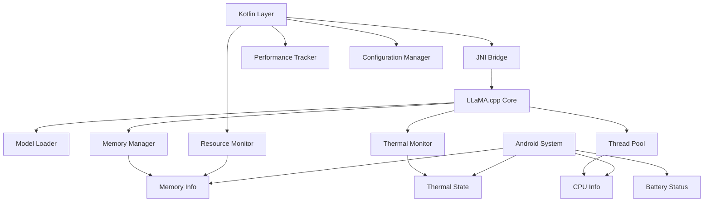
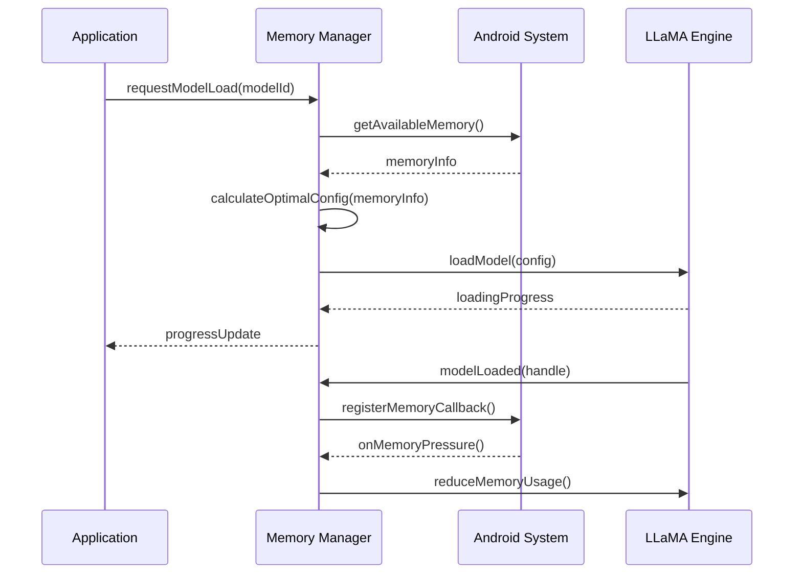
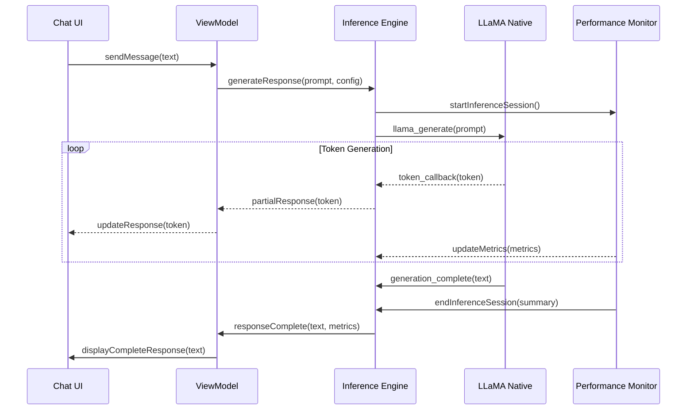
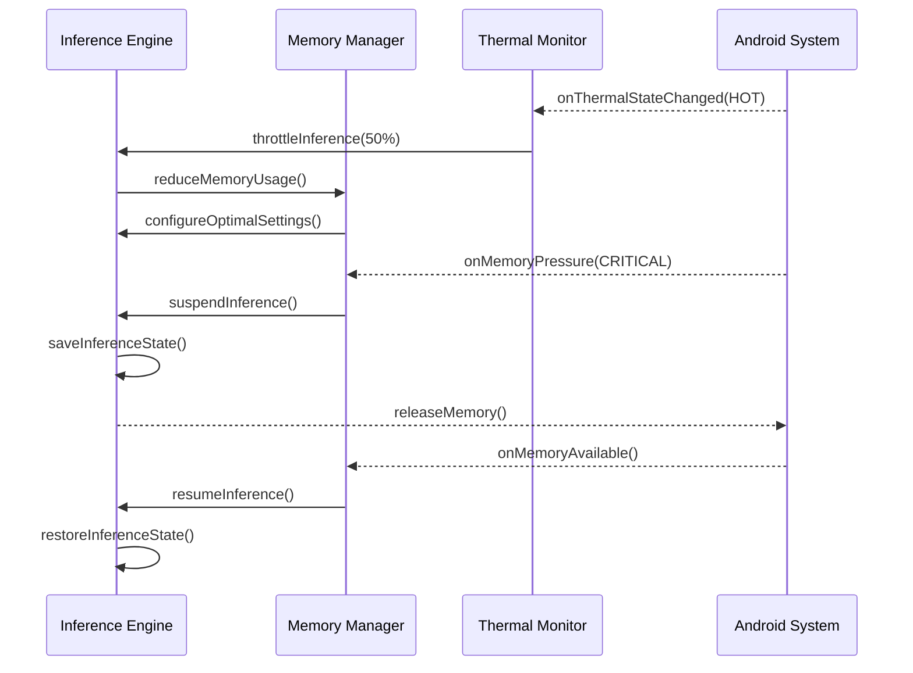

# On-Device Inference Engine Specification

## Business Goals

Create a robust, efficient inference engine that provides high-quality AI responses while respecting device constraints and user privacy. The engine should deliver consistent performance across diverse Android hardware while maintaining thermal safety and battery efficiency.

**Primary Objectives**:
- Optimize LLaMA.cpp integration for Android platform constraints
- Implement intelligent resource management for memory and thermal safety
- Provide consistent inference performance across diverse device capabilities
- Enable seamless model loading and switching without data loss

## User Stories & Acceptance Tests

### Epic: Model Loading & Management

**US-026: Efficient Model Loading**
- *As a user, I want models to load quickly so I can start conversations immediately*
- **AC1**: 7B parameter models load within 10 seconds on mid-range devices
- **AC2**: Loading progress indicator shows meaningful progress updates
- **AC3**: Model loading cancellable if user changes their mind
- **AC4**: Memory allocation optimized based on available system RAM
- **AC5**: Model loading failures provide clear error messages and recovery options

**US-027: Dynamic Memory Management**
- *As a user, I want the app to work smoothly without affecting other apps*
- **AC1**: Memory usage adapts automatically to available system memory
- **AC2**: Background apps not killed due to excessive memory usage
- **AC3**: Graceful degradation when memory is constrained
- **AC4**: Model unloading releases memory completely
- **AC5**: Memory pressure detected and handled proactively

**US-028: Model Switching**
- *As a user, I want to switch models without losing my conversation*
- **AC1**: Model switch completes within 15 seconds for typical models
- **AC2**: Previous conversation context preserved during switch
- **AC3**: Switch operation cancellable with rollback to previous model
- **AC4**: Clear feedback during switch operation with progress indication
- **AC5**: Switch failures handled gracefully with error recovery

### Epic: Inference Performance

**US-029: Response Generation**
- *As a user, I want fast, high-quality responses to my questions*
- **AC1**: First token generated within 2 seconds of request
- **AC2**: Response streaming provides real-time feedback
- **AC3**: Complete responses generated within 30 seconds for typical queries
- **AC4**: Response quality consistent across different model sizes
- **AC5**: Generation cancellable if response is taking too long

**US-030: Performance Optimization**
- *As a user, I want the app to adapt to my device's capabilities*
- **AC1**: Thread count automatically optimized for device CPU cores
- **AC2**: Quantization level selected based on available memory
- **AC3**: Batch size tuned for optimal throughput on device
- **AC4**: GPU acceleration utilized when available and beneficial
- **AC5**: Performance metrics available for troubleshooting

**US-031: Thermal Management**
- *As a user, I want the app to not overheat my device*
- **AC1**: CPU usage throttled when device temperature rises
- **AC2**: Inference paused if thermal threshold exceeded
- **AC3**: User notified of thermal throttling with clear explanation
- **AC4**: Automatic recovery when device temperature normalizes
- **AC5**: Thermal sensitivity configurable in advanced settings

### Epic: Resource Efficiency

**US-032: Battery Optimization**
- *As a user, I want reasonable battery usage during AI conversations*
- **AC1**: Battery usage comparable to other intensive apps (video streaming)
- **AC2**: Power management respects device battery saver mode
- **AC3**: Inference optimized for efficiency vs. speed based on battery level
- **AC4**: Background processing minimized when not actively using app
- **AC5**: Battery impact clearly communicated to user

**US-033: Storage Efficiency**
- *As a user, I want efficient use of device storage for models*
- **AC1**: Model files compressed efficiently without quality loss
- **AC2**: Temporary files cleaned up automatically after use
- **AC3**: Incremental model loading reduces storage requirements
- **AC4**: Shared model components deduplicated across models
- **AC5**: Storage usage reporting accurate and helpful

## Technical Architecture

### Inference Engine Architecture



### Memory Management Strategy



### Core Components

**JNI Bridge (`llama-android.cpp`)**:
```cpp
class LLaMAAndroid {
public:
    // Model lifecycle management
    jint loadModel(const char* model_path, const ModelConfig& config);
    jint unloadModel(jint model_handle);
    
    // Inference operations
    jint generateResponse(jint model_handle, const char* prompt, 
                         ResponseCallback callback);
    jint cancelGeneration(jint generation_handle);
    
    // Resource management
    void setMemoryLimit(size_t max_memory_mb);
    void setThermalCallback(ThermalCallback callback);
    void setThreadCount(int thread_count);
    
    // Performance monitoring
    PerformanceMetrics getMetrics(jint model_handle);
};
```

**Kotlin Memory Manager**:
```kotlin
class MemoryManager {
    suspend fun optimizeForDevice(): ModelConfig
    suspend fun monitorMemoryPressure(): Flow<MemoryState>
    suspend fun handleMemoryWarning(level: MemoryWarningLevel)
    suspend fun calculateOptimalBatchSize(): Int
    suspend fun shouldUnloadModel(): Boolean
}

sealed class MemoryState {
    object Normal : MemoryState()
    object Warning : MemoryState()
    object Critical : MemoryState()
}
```

**Performance Monitor**:
```kotlin
data class InferenceMetrics(
    val tokensPerSecond: Double,
    val memoryUsageMB: Int,
    val cpuUsagePercent: Double,
    val thermalState: ThermalState,
    val batteryDrainRate: Double,
    val latencyMs: Long
)

class PerformanceMonitor {
    fun startMonitoring(modelHandle: Int)
    fun getRealtimeMetrics(): Flow<InferenceMetrics>
    fun getSessionSummary(): InferenceSessionSummary
    fun detectPerformanceIssues(): List<PerformanceIssue>
}
```

## Data Flow & Boundaries

### Inference Request Flow



### Resource Management Flow



### Error Handling & Recovery

```kotlin
sealed class InferenceError {
    object ModelNotLoaded : InferenceError()
    object OutOfMemory : InferenceError()
    object ThermalThrottling : InferenceError()
    data class ModelCorrupted(val details: String) : InferenceError()
    data class NativeError(val errorCode: Int, val message: String) : InferenceError()
}

class ErrorRecoveryManager {
    suspend fun handleInferenceError(error: InferenceError): RecoveryAction
    suspend fun attemptModelRecovery(modelId: String): Boolean
    suspend fun gracefulDegradation(constraint: ResourceConstraint): ModelConfig
}
```

## Non-Functional Requirements

### Performance Targets

- **Model Loading**: ≤10 seconds for 7B models, ≤30 seconds for 13B models
- **First Token Latency**: ≤2 seconds on mid-range devices
- **Token Generation Rate**: ≥2 tokens/second sustained
- **Memory Efficiency**: Model memory usage ≤80% of available RAM
- **Thermal Stability**: No thermal shutdown during normal usage

### Scalability

- **Model Sizes**: Support 1B to 70B parameter models
- **Device Range**: Smooth operation on devices with 4GB+ RAM
- **Concurrent Operations**: Handle model loading while inference continues
- **Context Length**: Support up to 8K context length efficiently

### Reliability

- **Crash Prevention**: Zero crashes due to memory or thermal issues
- **State Recovery**: Resume inference after app backgrounding
- **Error Resilience**: Graceful handling of all native library errors
- **Data Integrity**: Conversation state preserved during errors

### Efficiency

- **CPU Utilization**: Optimal thread usage without blocking UI
- **Memory Footprint**: Minimal overhead beyond model requirements
- **Battery Impact**: Comparable to video streaming applications
- **Network Usage**: Zero network dependency for inference

## Test Plan

### Unit Tests

**Memory Management Tests**:
```kotlin
@Test
fun memoryManager_calculates_optimal_config_for_device() {
    // Test memory configuration logic
}

@Test
fun memoryPressure_triggers_appropriate_cleanup() {
    // Test memory pressure handling
}

@Test
fun outOfMemory_handled_gracefully() {
    // Test OOM recovery
}
```

**Inference Engine Tests**:
```kotlin
@Test
fun modelLoading_respects_memory_constraints() {
    // Test model loading with memory limits
}

@Test
fun inference_cancellation_releases_resources() {
    // Test resource cleanup on cancellation
}

@Test
fun thermal_throttling_maintains_stability() {
    // Test thermal management
}
```

### Integration Tests

**End-to-End Inference**:
- Complete model loading and inference cycle
- Context preservation across multiple requests
- Performance monitoring throughout session
- Error recovery and state restoration

**Resource Management**:
- Memory pressure simulation and response
- Thermal state changes during inference
- Battery optimization behavior
- Multi-model management scenarios

### Performance Tests

**Benchmarking**:
```kotlin
@Test
fun inference_speed_meets_performance_targets() {
    // Measure tokens per second across models
}

@Test
fun memory_usage_stays_within_limits() {
    // Monitor memory usage during inference
}

@Test
fun thermal_impact_acceptable() {
    // Measure temperature increase during sustained use
}
```

**Load Testing**:
- Extended inference sessions (1+ hours)
- Rapid model switching scenarios
- High-frequency request patterns
- Memory pressure stress testing

### Device Compatibility Tests

**Hardware Variation**:
- Test across different Android devices and API levels
- Validate performance on various RAM configurations
- Verify CPU architecture compatibility (ARM64, ARM32)
- Test thermal behavior on different device types

## Telemetry **NOT** Collected

Maintaining privacy-first principles:

❌ **Model Outputs**: No generated text or conversation content  
❌ **Performance Metrics**: No inference speed or efficiency data transmitted  
❌ **Device Information**: No hardware specifications or capabilities  
❌ **Usage Patterns**: No model usage frequency or preferences  
❌ **Error Details**: No crash reports with sensitive context  
❌ **Optimization Data**: No configuration or tuning information  

**Local Monitoring Only**: All performance data remains on-device for optimization.

## Merge Checklist

### Development Complete
- [ ] LLaMA.cpp integration fully functional with JNI bridge
- [ ] Memory management system operational with pressure handling
- [ ] Thermal monitoring and throttling implemented
- [ ] Performance monitoring provides comprehensive metrics
- [ ] Error handling and recovery mechanisms tested

### Code Quality
- [ ] Native code follows secure programming practices
- [ ] Memory leaks prevented and tested
- [ ] Thread safety ensured across all components
- [ ] Error conditions properly handled with recovery
- [ ] Resource cleanup verified in all scenarios

### Performance & Efficiency
- [ ] Performance targets met across supported device range
- [ ] Memory usage optimized and constrained appropriately
- [ ] Thermal management prevents device overheating
- [ ] Battery usage within acceptable limits
- [ ] Model loading times meet user expectations

### Testing & Validation
- [ ] Unit tests cover critical inference logic (≥80% coverage)
- [ ] Integration tests validate end-to-end inference flow
- [ ] Performance tests verify efficiency targets
- [ ] Device compatibility tested across hardware range
- [ ] Stress testing confirms stability under load

### Security & Safety
- [ ] No buffer overflows or memory corruption possible
- [ ] Input validation prevents malicious exploitation
- [ ] Resource limits enforced to prevent system impact
- [ ] Thermal safety mechanisms prevent hardware damage
- [ ] No sensitive data exposed through error messages

### Documentation
- [ ] Native API thoroughly documented
- [ ] Performance characteristics documented for users
- [ ] Troubleshooting guide for common issues
- [ ] Device compatibility matrix maintained

---

*Specification Version: 1.0*  
*Last Updated: October 2025*  
*Implementation Target: Milestone 1*