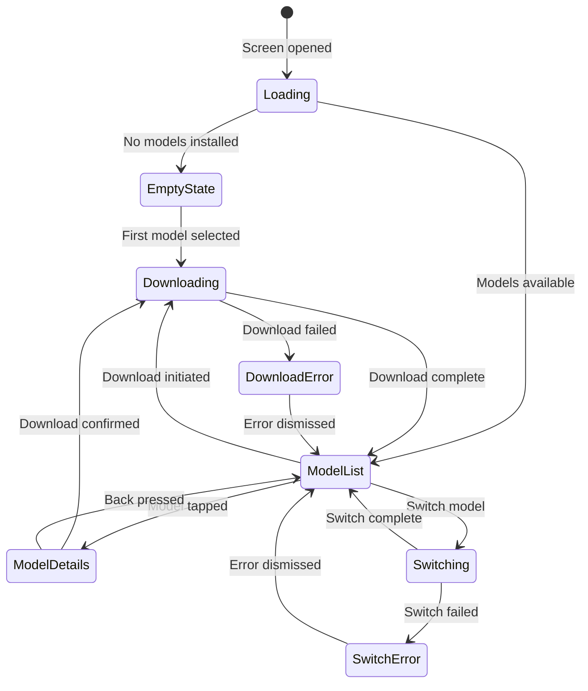
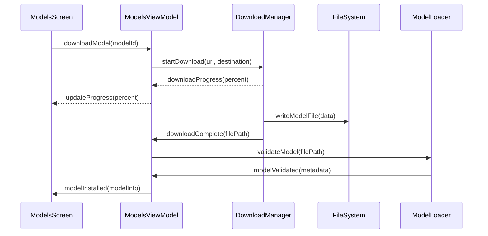
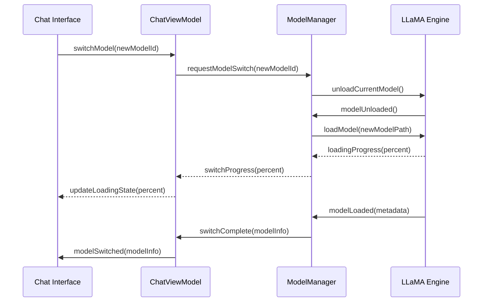

# Model Management Specification

## Business Goals

Provide a seamless experience for discovering, downloading, managing, and optimizing AI models on Android devices. Users should be able to easily switch between models based on their needs (speed vs. quality) while understanding the trade-offs and system impact.

**Primary Objectives**:
- Simplify model discovery and acquisition for users
- Enable efficient model switching without app restarts
- Provide clear information about model capabilities and resource requirements
- Optimize storage and memory usage for multiple models

## User Stories & Acceptance Tests

### Epic: Model Discovery & Download

**US-008: Browse Available Models**
- *As a user, I want to see available AI models so that I can choose the best one for my needs*
- **AC1**: Model list shows name, size, description, and performance characteristics
- **AC2**: Models filtered by device compatibility (RAM, storage)
- **AC3**: Download status clearly indicated (available, downloading, installed)
- **AC4**: Search functionality to find specific models
- **AC5**: Recommended models highlighted based on device capabilities

**US-009: Download Models**
- *As a user, I want to download models with clear progress feedback*
- **AC1**: Download progress shown with percentage and estimated time
- **AC2**: Download can be paused and resumed
- **AC3**: Network requirements clearly communicated (WiFi recommended)
- **AC4**: Storage space checked before download begins
- **AC5**: Download continues in background with notification

**US-010: Model Information**
- *As a user, I want detailed information about models before downloading*
- **AC1**: Model card shows parameters, quantization, memory requirements
- **AC2**: Expected performance metrics (speed, quality) displayed
- **AC3**: Use case recommendations (creative writing, coding, general chat)
- **AC4**: Changelog and version information available

### Epic: Model Management

**US-011: Installed Models**
- *As a user, I want to see and manage my downloaded models*
- **AC1**: Installed models list shows storage usage and last used date
- **AC2**: Currently active model clearly highlighted
- **AC3**: Model details accessible via tap/long-press
- **AC4**: Delete option with confirmation for unused models
- **AC5**: Model performance statistics available

**US-012: Model Switching**
- *As a user, I want to switch between models based on my current needs*
- **AC1**: Model switch completes within 10 seconds for typical models
- **AC2**: Conversation context preserved during switch
- **AC3**: Clear feedback during model loading process
- **AC4**: Previous model gracefully unloaded to free memory
- **AC5**: Switch cancellation option during loading

**US-013: Storage Management**
- *As a user, I want to understand and control storage usage*
- **AC1**: Total storage used by models clearly displayed
- **AC2**: Available device storage shown for context
- **AC3**: Automatic cleanup suggestions for unused models
- **AC4**: Option to move models to external storage (if available)
- **AC5**: Low storage warnings before downloads

### Epic: Custom Models

**US-014: Custom Model Import**
- *As a power user, I want to import my own models*
- **AC1**: File picker supports common model formats (GGUF, ONNX)
- **AC2**: Model validation before import with clear error messages
- **AC3**: Custom model metadata can be edited (name, description)
- **AC4**: Import progress shown for large files
- **AC5**: Custom models clearly distinguished from official ones

**US-015: Model Configuration**
- *As a power user, I want to configure model parameters*
- **AC1**: Quantization options available for supported models
- **AC2**: Context length limits configurable within model constraints
- **AC3**: Memory allocation preferences (conservative/aggressive)
- **AC4**: Model-specific parameters accessible
- **AC5**: Configuration presets for common use cases

## UI States & Navigation

### State Machine



### Screen Layouts

**Models List Screen**:
- Search bar at top for model filtering
- Available models section with download buttons
- Installed models section with management options
- Storage usage indicator at bottom
- Floating action button for custom model import

**Model Details Dialog**:
- Model card with comprehensive information
- Performance benchmarks and comparisons
- Download/install/delete actions
- Configuration options for installed models

**Download Progress**:
- Large progress indicator with percentage
- Download speed and estimated time remaining
- Pause/resume/cancel controls
- Background download notification

### Component Architecture

```kotlin
// Main models screen composable
@Composable
fun ModelsScreen(
    viewModel: ModelsViewModel,
    onModelSelected: (String) -> Unit
)

// Individual model card
@Composable
fun ModelCard(
    model: ModelInfo,
    onDownload: () -> Unit,
    onDelete: () -> Unit,
    onSwitch: () -> Unit
)

// Model details bottom sheet
@Composable
fun ModelDetailsSheet(
    model: ModelInfo,
    onDismiss: () -> Unit
)
```

## Data Flow & Boundaries

### Model Download Flow



### Model Switching Flow



### Data Models

**Model Information**:
```kotlin
data class ModelInfo(
    val id: String,
    val name: String,
    val description: String,
    val parameters: String, // "7B", "13B", etc.
    val quantization: String, // "Q4_0", "Q8_0", etc.
    val fileSizeBytes: Long,
    val memoryRequirementMB: Int,
    val downloadUrl: String?,
    val isInstalled: Boolean,
    val isActive: Boolean,
    val installPath: String?,
    val lastUsed: Instant?,
    val performanceMetrics: PerformanceMetrics?
)

data class PerformanceMetrics(
    val tokensPerSecond: Double,
    val averageLatencyMs: Long,
    val memoryUsageMB: Int,
    val batteryImpactScore: Int // 1-10 scale
)
```

**Download State**:
```kotlin
sealed class DownloadState {
    object NotDownloaded : DownloadState()
    data class Downloading(val progress: Float, val speedBytesPerSec: Long) : DownloadState()
    object Downloaded : DownloadState()
    data class Error(val message: String) : DownloadState()
}
```

### Repository Pattern

```kotlin
interface ModelRepository {
    suspend fun getAvailableModels(): List<ModelInfo>
    suspend fun getInstalledModels(): List<ModelInfo>
    suspend fun downloadModel(modelId: String): Flow<DownloadState>
    suspend fun deleteModel(modelId: String)
    suspend fun validateModel(filePath: String): ModelInfo?
    suspend fun importCustomModel(uri: Uri): ModelInfo
}
```

## Non-Functional Requirements

### Performance

- **Model Loading**: ≤10 seconds for 7B parameter models
- **Download Speed**: Utilize full network bandwidth, resume capability
- **Memory Efficiency**: Only one model loaded at a time
- **Storage Optimization**: Efficient compression and deduplication

### Storage Management

- **Space Calculation**: Real-time available space monitoring
- **Cleanup Strategy**: LRU-based suggestions for model removal
- **External Storage**: Support for SD card storage where available
- **Incremental Downloads**: Resume interrupted downloads

### Network Requirements

- **Download Optimization**: Prefer WiFi, warn on cellular
- **Bandwidth Adaptation**: Throttle during low battery
- **Offline Capability**: Graceful degradation without network
- **CDN Integration**: Fast global model distribution

### Device Compatibility

- **RAM Requirements**: Detect and recommend appropriate models
- **Architecture Support**: ARM64 optimized, fallback for other architectures
- **Android Version**: Support API 24+ with feature graceful degradation
- **Performance Scaling**: Adjust recommendations based on device capabilities

## Test Plan

### Unit Tests

**Model Repository Tests**:
```kotlin
@Test
fun downloadModel_updates_progress_correctly() {
    // Test download progress reporting
}

@Test
fun modelValidation_rejects_corrupted_files() {
    // Test model validation logic
}

@Test
fun storageCalculation_accurate_space_reporting() {
    // Test storage space calculations
}
```

**ViewModel Tests**:
```kotlin
@Test
fun modelSwitch_preserves_conversation_context() {
    // Test context preservation during model switching
}

@Test
fun downloadError_provides_actionable_feedback() {
    // Test error handling and user feedback
}
```

### UI Tests

**Model List Tests**:
```kotlin
@Test
fun modelList_displays_installed_and_available_separately() {
    // Test UI organization and filtering
}

@Test
fun downloadProgress_updates_realtime() {
    // Test progress indicator behavior
}

@Test
fun modelSwitch_provides_loading_feedback() {
    // Test switch operation UI feedback
}
```

**Model Details Tests**:
```kotlin
@Test
fun modelDetails_shows_comprehensive_information() {
    // Test model information display
}

@Test
fun customModel_import_validates_files() {
    // Test custom model import flow
}
```

### Integration Tests

**Download Management**:
- End-to-end download and installation
- Download resumption after app restart
- Network error handling and retry logic
- Storage space validation

**Model Switching**:
- Complete model switch during active conversation
- Memory management during switch operations
- Error recovery from failed switches

### Performance Tests

**Memory Usage**:
- Monitor memory during model loading/unloading
- Verify no memory leaks during model operations
- Test multiple model management scenarios

**Storage Efficiency**:
- Measure actual storage usage vs. reported
- Test cleanup and optimization operations
- Validate storage calculations across devices

## Telemetry **NOT** Collected

In alignment with privacy-first principles:

❌ **Model Usage Patterns**: No tracking of which models users prefer  
❌ **Download Behavior**: No analytics on download times or failures  
❌ **Performance Metrics**: No inference speed or efficiency data transmitted  
❌ **Device Information**: No hardware specifications or capabilities shared  
❌ **Model Content**: No model outputs or generated content  
❌ **User Preferences**: No configuration choices or settings  

**Local Analytics Only**: Performance and usage data remains on-device for optimization.

## Merge Checklist

### Development Complete
- [ ] All user stories implemented with acceptance criteria met
- [ ] Model download and installation fully functional
- [ ] Model switching works reliably without data loss
- [ ] Custom model import supports common formats
- [ ] Storage management features operational

### Code Quality
- [ ] Repository pattern properly implemented
- [ ] Download manager handles all edge cases
- [ ] Model validation comprehensive and secure
- [ ] Error handling provides actionable user feedback
- [ ] Memory management prevents leaks

### UI/UX Standards
- [ ] Model list performance acceptable with large datasets
- [ ] Download progress indicators responsive and accurate
- [ ] Model switching provides clear feedback
- [ ] Storage information presented clearly
- [ ] Accessibility features implemented

### Testing & Validation
- [ ] Unit tests cover critical business logic (≥80% coverage)
- [ ] UI tests validate user interaction flows
- [ ] Integration tests cover download and switch operations
- [ ] Performance tests verify memory and storage efficiency
- [ ] Device compatibility tested across range of hardware

### Security & Privacy
- [ ] Model downloads verified and validated
- [ ] No telemetry data transmitted
- [ ] File system access properly scoped
- [ ] Network operations secure and validated

### Performance
- [ ] Model loading times meet performance targets
- [ ] Download speeds optimized for network conditions
- [ ] Memory usage within acceptable limits
- [ ] Storage calculations accurate and efficient

---

*Specification Version: 1.0*  
*Last Updated: October 2025*  
*Implementation Target: Milestone 1*