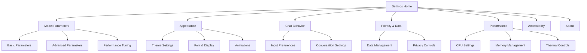
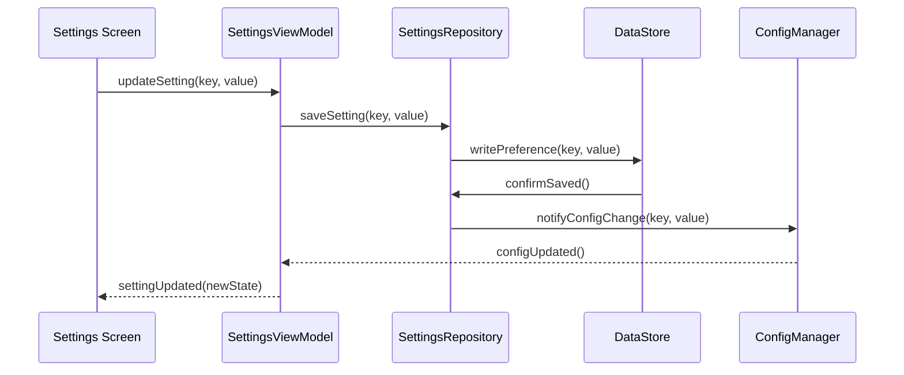
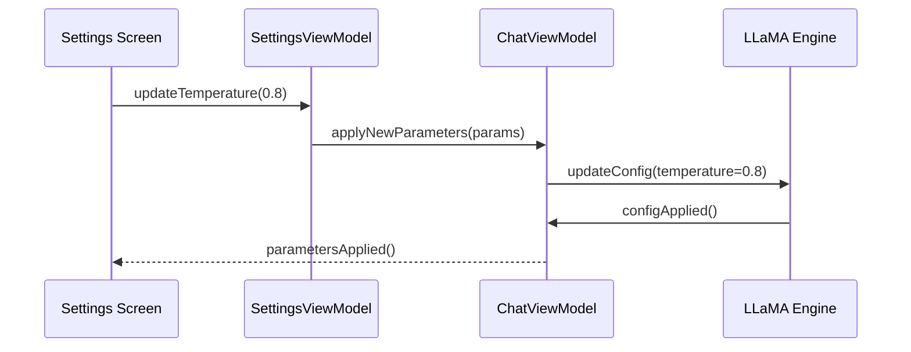

# Settings & Configuration Specification

## Business Goals

Provide comprehensive configuration options that allow users to customize their AI experience while maintaining sensible defaults. Enable both casual users to get started quickly and power users to fine-tune performance for their specific needs and device capabilities.

**Primary Objectives**:
- Offer intuitive configuration options for model behavior and performance
- Provide clear explanations for technical parameters
- Enable device-specific optimizations
- Maintain user preferences across app sessions

## User Stories & Acceptance Tests

### Epic: Model Parameters

**US-016: Basic Parameter Control**
- *As a user, I want to adjust how creative or focused the AI responses are*
- **AC1**: Temperature slider with real-time preview of effect (0.1-2.0 range)
- **AC2**: Top-p slider for nucleus sampling control (0.1-1.0 range)
- **AC3**: Preset configurations for common use cases (Creative, Balanced, Precise)
- **AC4**: Reset to defaults button with confirmation
- **AC5**: Parameter changes apply to new conversations immediately

**US-017: Advanced Parameters**
- *As a power user, I want fine-grained control over model behavior*
- **AC1**: Context length adjustment within model limits
- **AC2**: Repetition penalty configuration to reduce repetitive outputs
- **AC3**: Top-k sampling parameter for response diversity
- **AC4**: Batch size configuration for performance tuning
- **AC5**: Advanced parameters hidden by default, accessible via toggle

**US-018: Performance Tuning**
- *As a user, I want to optimize performance for my device*
- **AC1**: Thread count adjustment based on device CPU cores
- **AC2**: Memory allocation preferences (conservative/balanced/aggressive)
- **AC3**: GPU acceleration toggle where supported
- **AC4**: Thermal throttling sensitivity adjustment
- **AC5**: Performance mode presets (Battery Saver, Balanced, Performance)

### Epic: User Interface Preferences

**US-019: Appearance Customization**
- *As a user, I want to customize the app appearance to my preferences*
- **AC1**: Dark/light/system theme selection
- **AC2**: Font size adjustment for conversation display
- **AC3**: Message bubble style options
- **AC4**: Color scheme customization for accessibility
- **AC5**: Animation preferences (reduced motion support)

**US-020: Chat Behavior**
- *As a user, I want to control how conversations behave*
- **AC1**: Auto-scroll to latest message toggle
- **AC2**: Message timestamps display options
- **AC3**: Conversation auto-save frequency settings
- **AC4**: Maximum conversation length before archiving
- **AC5**: New conversation behavior (clear vs. start fresh)

**US-021: Input Preferences**
- *As a user, I want to customize input methods and behavior*
- **AC1**: Voice input language selection
- **AC2**: Send button behavior (always visible vs. auto-hide)
- **AC3**: Enter key behavior (send vs. new line)
- **AC4**: Auto-correction and suggestions toggle
- **AC5**: Clipboard access preferences

### Epic: Privacy & Security

**US-022: Data Management**
- *As a user, I want control over my conversation data*
- **AC1**: Conversation history retention period settings
- **AC2**: Clear all conversations with confirmation
- **AC3**: Export conversations to text/markdown files
- **AC4**: Automatic cleanup preferences for old conversations
- **AC5**: Storage encryption toggle with security implications explained

**US-023: Privacy Controls**
- *As a user, I want to understand and control privacy settings*
- **AC1**: Data collection explanation (none for this app)
- **AC2**: Local processing confirmation and benefits
- **AC3**: Network permissions and usage transparency
- **AC4**: Crash reporting preferences (local only)
- **AC5**: Analytics opt-out (not applicable but clearly stated)

### Epic: System Integration

**US-024: Accessibility Settings**
- *As a user with accessibility needs, I want appropriate accommodations*
- **AC1**: Screen reader compatibility settings
- **AC2**: High contrast mode for visual impairments
- **AC3**: Large text support beyond system settings
- **AC4**: Voice control sensitivity adjustments
- **AC5**: Haptic feedback preferences

**US-025: Notifications & Alerts**
- *As a user, I want control over system notifications*
- **AC1**: Model download completion notifications
- **AC2**: Low storage warning preferences
- **AC3**: Performance alert settings
- **AC4**: Background processing notifications
- **AC5**: Quiet hours for non-critical notifications

## UI States & Navigation

### Settings Navigation Structure



### Settings Screen Layouts

**Settings Home**:
- Categorized list of setting groups
- Quick toggles for frequently used settings
- Search functionality for finding specific options
- Current active model display with quick switch

**Parameter Configuration**:
- Slider controls with real-time preview
- Preset buttons for common configurations
- Description text explaining each parameter's effect
- Reset to defaults option

**Data Management**:
- Storage usage visualization
- Conversation count and total storage
- Export and cleanup options
- Privacy policy and data handling explanation

### State Management

```kotlin
data class SettingsUiState(
    val modelParameters: ModelParameters,
    val uiPreferences: UiPreferences,
    val privacySettings: PrivacySettings,
    val performanceConfig: PerformanceConfig,
    val isLoading: Boolean = false,
    val error: String? = null
)

data class ModelParameters(
    val temperature: Float = 0.7f,
    val topP: Float = 0.9f,
    val topK: Int = 40,
    val repeatPenalty: Float = 1.1f,
    val contextLength: Int = 2048,
    val batchSize: Int = 8
)

data class UiPreferences(
    val theme: Theme = Theme.SYSTEM,
    val fontSize: FontSize = FontSize.MEDIUM,
    val autoScroll: Boolean = true,
    val showTimestamps: Boolean = true,
    val animationsEnabled: Boolean = true
)
```

## Data Flow & Boundaries

### Settings Persistence Flow



### Parameter Application Flow



### Repository Pattern

```kotlin
interface SettingsRepository {
    suspend fun getModelParameters(): ModelParameters
    suspend fun saveModelParameters(params: ModelParameters)
    suspend fun getUiPreferences(): UiPreferences
    suspend fun saveUiPreferences(prefs: UiPreferences)
    suspend fun exportConversations(): Uri
    suspend fun clearAllData()
    fun observeSettingsChanges(): Flow<SettingsChange>
}

sealed class SettingsChange {
    data class ModelParameterChange(val params: ModelParameters) : SettingsChange()
    data class UiPreferenceChange(val prefs: UiPreferences) : SettingsChange()
    data class PerformanceConfigChange(val config: PerformanceConfig) : SettingsChange()
}
```

## Non-Functional Requirements

### Performance

- **Setting Changes**: Apply immediately without app restart
- **Parameter Validation**: Real-time validation with helpful error messages
- **Search Functionality**: Fast filtering across all settings
- **Persistence**: Changes saved immediately to prevent data loss

### Usability

- **Discoverability**: Settings organized logically with clear categorization
- **Explanations**: Technical parameters explained in user-friendly language
- **Defaults**: Sensible defaults that work well for most users
- **Recovery**: Easy reset options for misconfigured settings

### Compatibility

- **Device Adaptation**: Parameter limits adjusted based on device capabilities
- **Android Versions**: Graceful degradation on older Android versions
- **Screen Sizes**: Responsive layout for phones and tablets
- **Accessibility**: Full compatibility with assistive technologies

### Data Integrity

- **Validation**: All parameter values validated before application
- **Backup**: Settings backed up to prevent loss
- **Migration**: Smooth migration between app versions
- **Consistency**: Settings synchronized across app components

## Test Plan

### Unit Tests

**Settings Repository Tests**:
```kotlin
@Test
fun modelParameters_validation_rejects_invalid_values() {
    // Test parameter validation logic
}

@Test
fun settings_persistence_maintains_data_integrity() {
    // Test data storage and retrieval
}

@Test
fun settings_changes_propagate_to_dependent_components() {
    // Test change notification system
}
```

**ViewModel Tests**:
```kotlin
@Test
fun parameter_changes_update_ui_state_correctly() {
    // Test state management
}

@Test
fun invalid_settings_show_appropriate_error_messages() {
    // Test error handling
}

@Test
fun reset_to_defaults_restores_original_configuration() {
    // Test reset functionality
}
```

### UI Tests

**Settings Navigation Tests**:
```kotlin
@Test
fun settings_categories_navigate_correctly() {
    // Test navigation between setting screens
}

@Test
fun search_functionality_finds_relevant_settings() {
    // Test settings search
}
```

**Parameter Adjustment Tests**:
```kotlin
@Test
fun sliders_update_values_with_proper_precision() {
    // Test slider controls
}

@Test
fun preset_buttons_apply_correct_configurations() {
    // Test preset functionality
}

@Test
fun parameter_changes_show_immediate_feedback() {
    // Test real-time updates
}
```

### Integration Tests

**Settings Application**:
- Parameter changes applied to inference engine
- UI preferences reflected across app screens
- Performance settings impact model behavior
- Privacy settings control data handling

**Data Management**:
- Conversation export functionality
- Data cleanup operations
- Settings backup and restore
- Migration between app versions

### Accessibility Tests

**Screen Reader Support**:
- All settings announced clearly
- Slider values communicated effectively
- Navigation flow logical for assistive technology

**Visual Accessibility**:
- High contrast mode effectiveness
- Large text scaling support
- Color contrast compliance

## Telemetry **NOT** Collected

Consistent with privacy-first approach:

❌ **Setting Preferences**: No data on which settings users choose  
❌ **Parameter Values**: No information about model parameter configurations  
❌ **Usage Patterns**: No tracking of settings access frequency  
❌ **Device Performance**: No hardware capability or performance data  
❌ **Error Events**: No crash or error reporting with personal context  
❌ **Feature Usage**: No analytics on which features are used  

**Local Configuration Only**: All settings remain on-device for user privacy.

## Merge Checklist

### Development Complete
- [ ] All settings categories implemented with full functionality
- [ ] Parameter validation working for all model settings
- [ ] UI preferences apply correctly across app
- [ ] Data export and cleanup features operational
- [ ] Performance settings integrate with inference engine

### Code Quality
- [ ] Settings repository properly abstracts data storage
- [ ] Parameter validation comprehensive and user-friendly
- [ ] Change notification system reliable
- [ ] Error handling provides actionable feedback
- [ ] Settings migration strategy implemented

### UI/UX Standards
- [ ] Settings organized logically with clear navigation
- [ ] All technical parameters explained clearly
- [ ] Slider controls responsive and precise
- [ ] Search functionality fast and accurate
- [ ] Reset options clearly labeled and confirmed

### Testing & Validation
- [ ] Unit tests cover settings logic (≥80% coverage)
- [ ] UI tests validate all interactive elements
- [ ] Integration tests verify settings application
- [ ] Accessibility testing with assistive technologies
- [ ] Performance testing for settings changes

### Security & Privacy
- [ ] No sensitive data transmitted externally
- [ ] Local storage properly secured
- [ ] Data export/import secure and validated
- [ ] Privacy implications clearly communicated

### Performance
- [ ] Settings changes apply without delays
- [ ] Large settings lists perform smoothly
- [ ] Search functionality responsive
- [ ] Memory usage minimal for settings storage

---

*Specification Version: 1.0*  
*Last Updated: October 2025*  
*Implementation Target: Milestone 1*

## Implementation Notes (MVP 5)

**Model Switch Handoff Implementation** - *Completed: October 2025*

### Overview
Implemented model switching functionality with UI state management to allow users to switch between downloaded AI models while ensuring in-flight requests complete on the old model before switching.

### Changes Made

#### 1. ViewModel State Management (`MainViewModel.kt`)
- Added `isSwitchingModel` state to track model switching in progress
- Added `_pendingModelSwitch` to defer model switches when a request is in-flight
- Implemented `switchModel()` method that:
  - Checks if a request is currently being processed (`getIsSending()`)
  - If sending, defers the switch until the request completes
  - If not sending, switches immediately
- Implemented `performModelSwitch()` to execute the actual model switch operation
- Added `checkAndExecutePendingModelSwitch()` called after send operations complete
- Updates default model preference after successful switch

#### 2. Settings UI (`MainChatScreen.kt`)
Added model selection section to `SettingsBottomSheet`:
- **Model dropdown**: Shows all downloaded models with current model highlighted
- **Active indicator**: Displays currently active model with checkmark
- **Switching feedback**: Shows "Switching model..." message during switch
- **Filtering**: Only shows models that exist in the device storage
- **Color coding**: Current model highlighted in purple, others in white

#### 3. Chat Header Chip (`MainChatScreen.kt`)
Added active model indicator at top of chat screen:
- **Model name display**: Shows truncated model name (30 chars + "...")
- **Status indicator**: Color-coded dot (purple=active, orange=switching)
- **Responsive design**: Chip adapts to model name length
- **Minimal visual footprint**: Small, unobtrusive design

#### 4. Unit Tests (`MainViewModelModelSwitchTest.kt`)
Created comprehensive test suite covering:
- Immediate switching when no request in-flight
- Deferred switching when request is in-flight
- Default model preference updates
- Multiple sequential model switches
- Initial state validation
- Thread count application

### Behavior Details

**In-Flight Request Handling**:
1. User initiates model switch while AI is generating a response
2. Switch is deferred and `isSwitchingModel` state set to `true`
3. Current request completes on the old model
4. After completion, `checkAndExecutePendingModelSwitch()` executes the pending switch
5. New model is loaded and subsequent requests use the new model

**UI Feedback**:
- Settings dropdown shows current model with checkmark and highlight
- Chat header chip shows orange dot during switch, purple when active
- "Switching model..." text appears in settings during switch operation

### Testing Coverage
- ✅ Unit tests for model switching logic (8 test cases)
- ✅ State management validation
- ✅ In-flight request handling
- ✅ Default preference persistence

---

## Implementation Notes (MVP 7)

### Privacy Guards (Redaction Pre-Send)

**Objective**: Add local PII redaction capability with a settings toggle to protect user privacy before sending messages to the AI model.

**Date**: October 2025  
**Scope**: Privacy protection, PII redaction, user notification

### Changes Made

#### 1. PrivacyGuard Utility (`util/PrivacyGuard.kt`)

Created a utility class for detecting and redacting personally identifiable information:

**Redaction Patterns**:
- **Emails**: Matches standard email format (user@domain.com)
- **Phone Numbers**: Supports multiple formats
  - US format: 555-123-4567, (555) 123-4567
  - International: +1-555-123-4567, +44 20 1234 5678
- **IDs**: Detects ID-like patterns
  - SSN: 123-45-6789
  - Credit cards: 1234-5678-9012-3456
  - Generic IDs: 8+ digit sequences

**API**:
```kotlin
// Redact PII and get results
val result = PrivacyGuard.redactPII(text)
// result.redactedText contains sanitized text
// result.wasRedacted indicates if any redaction occurred
// result.redactionCount shows number of items redacted

// Check for PII without redacting
val hasPII = PrivacyGuard.containsPII(text)
```

#### 2. User Preferences (`data/UserPreferencesRepository.kt`)

Added methods to persist privacy redaction setting:
- `getPrivacyRedactionEnabled(): Boolean` - Defaults to `false` (opt-in)
- `setPrivacyRedactionEnabled(enabled: Boolean)` - Saves setting

#### 3. ViewModel Integration (`MainViewModel.kt`)

**State Management**:
- `wasLastMessageRedacted: Boolean` - Tracks if last message was redacted
- `lastRedactionCount: Int` - Number of items redacted in last message
- `getPrivacyRedactionEnabled()` - Gets current setting
- `setPrivacyRedactionEnabled(enabled)` - Updates setting
- `clearRedactionBanner()` - Dismisses redaction notification

**Message Processing**:
The `send()` method now checks if redaction is enabled and applies it before sending:
```kotlin
val finalMessage = if (userPreferencesRepository.getPrivacyRedactionEnabled()) {
    val redactionResult = PrivacyGuard.redactPII(userMessage)
    if (redactionResult.wasRedacted) {
        wasLastMessageRedacted = true
        lastRedactionCount = redactionResult.redactionCount
    }
    redactionResult.redactedText
} else {
    userMessage
}
```

#### 4. RedactionBanner Component (`ui/components/RedactionBanner.kt`)

A Compose component that displays when PII has been redacted:

**Design**:
- Blue info icon and color scheme (distinguishes from error banner)
- Shows "Privacy Protected" title
- Displays count of redacted items with proper pluralization
- Dismiss button to clear the notification
- Clear explanation: "Redacted N item(s) (emails, phones, or IDs)"

**Usage**:
```kotlin
RedactionBanner(
    redactionCount = viewModel.lastRedactionCount,
    onDismiss = { viewModel.clearRedactionBanner() }
)
```

#### 5. MainChatScreen Integration (`ui/MainChatScreen.kt`)

Added RedactionBanner display logic after the ErrorBanner:
```kotlin
if (viewModel.wasLastMessageRedacted) {
    RedactionBanner(
        redactionCount = viewModel.lastRedactionCount,
        onDismiss = { viewModel.clearRedactionBanner() }
    )
}
```

#### 6. Settings Screen (`ui/SettingsScreen.kt`)

Added a new "Privacy" section with a toggle control:

**UI Components**:
- `PrivacyToggleRow` - Custom composable for toggle with description
- Toggle defaults to OFF (opt-in approach)
- Description: "Automatically redact emails, phone numbers, and IDs before sending"
- State is persisted immediately on toggle change

### Behavior Details

**Redaction Flow**:
1. User types a message containing PII (e.g., "Email me at john@example.com")
2. User sends the message
3. If redaction is enabled, `PrivacyGuard.redactPII()` processes the text
4. PII is replaced with placeholders: "Email me at [EMAIL_REDACTED]"
5. Redacted message is sent to the AI model
6. RedactionBanner appears showing "Redacted 1 item (emails, phones, or IDs)"
7. User can dismiss the banner by clicking "Dismiss"

**UI Feedback**:
- RedactionBanner uses blue color scheme (vs. error banner's red)
- Banner persists until dismissed or new message is sent
- Settings toggle provides immediate visual feedback
- Clear description in settings explains what will be redacted

**Edge Cases**:
- If message has no PII, redaction is a no-op (original text sent)
- Multiple PII items are all redacted and counted
- Redaction works on retry/edit operations
- Banner clears when starting a new message

### Testing Coverage

**Unit Tests** (`util/PrivacyGuardTest.kt` - 18 tests):
- ✅ Email redaction (single and multiple)
- ✅ Phone number redaction (US, international, various formats)
- ✅ SSN redaction
- ✅ Credit card redaction
- ✅ Generic ID redaction (8+ digits)
- ✅ Mixed PII redaction
- ✅ No PII detection (returns original text)
- ✅ Empty string handling
- ✅ PII detection without redaction
- ✅ Context preservation around redactions

**Compose UI Tests** (`ui/components/RedactionBannerTest.kt` - 10 tests):
- ✅ Title display ("Privacy Protected")
- ✅ Singular message format (1 item)
- ✅ Plural message format (N items)
- ✅ Dismiss button display and functionality
- ✅ Info icon display
- ✅ Multiple clicks handling
- ✅ Edge cases (zero count, large counts)

### Design Decisions

1. **Opt-in Default**: Redaction defaults to OFF to avoid surprising users. Users must explicitly enable it in settings.

2. **Placeholder Style**: Using `[EMAIL_REDACTED]`, `[PHONE_REDACTED]`, `[ID_REDACTED]` for clarity. Square brackets indicate system modification.

3. **Notification Banner**: Informing users when redaction occurs maintains transparency and trust.

4. **Regex Patterns**: Balanced between catching common PII formats and avoiding false positives. Patterns may need tuning based on user feedback.

5. **Local Processing**: All redaction happens locally before sending. No PII ever leaves the device in original form.

6. **No Persistent Redacted History**: The original message is not stored; only the redacted version exists in the conversation.

### Security & Privacy Implications

**Benefits**:
- Prevents accidental PII leakage to AI models
- Works entirely locally (no external API calls)
- User maintains control via settings toggle
- Transparent operation (banner notification)

**Limitations**:
- Regex-based detection may miss creative PII formats
- Cannot detect context-based PII (e.g., "my address is 123 Main St")
- Users can disable redaction, removing protection
- Redaction is irreversible once sent

**Future Enhancements**:
- Add more PII patterns (addresses, dates of birth, etc.)
- ML-based PII detection for better accuracy
- Warning dialog before sending detected PII when redaction is off
- Configurable redaction patterns in advanced settings


### Design Decisions

1. **Deferred switching**: Ensures conversation context and current response integrity by completing in-flight requests before switching
2. **Visual feedback**: Clear indicators in both settings and chat header to show active model and switching state
3. **Minimal UI changes**: Chip design is small and non-intrusive, following existing app design patterns
4. **Filter downloaded only**: Only shows models that exist on device to prevent user confusion

### Future Enhancements
- Add model switching progress bar with percentage
- Show model metadata (size, parameters) in dropdown
- Add model performance metrics in settings
- Implement model preloading for faster switches

---

## Implementation Notes (MVP 11)

### Theme & Language Preferences

**Objective**: Add theme selector (Light/Dark/System) and language selector (English/Spanish) to Settings screen with persistence via SharedPreferences.

### Changes Made

#### 1. UserPreferencesRepository (`data/UserPreferencesRepository.kt`)

**Enums Added**:
- `ThemePreference` - LIGHT, DARK, SYSTEM
- `LanguagePreference` - ENGLISH, SPANISH

**New Methods**:
- `getThemePreference(): ThemePreference` - Returns saved theme, defaults to SYSTEM
- `setThemePreference(theme: ThemePreference)` - Persists theme choice
- `getLanguagePreference(): LanguagePreference` - Returns saved language, defaults to ENGLISH
- `setLanguagePreference(language: LanguagePreference)` - Persists language choice

**Storage**:
- Uses SharedPreferences with keys `theme_preference` and `language_preference`
- Enum values stored as strings (e.g., "LIGHT", "DARK", "SYSTEM")
- Graceful fallback to defaults if invalid values are found

#### 2. String Resources (`res/values/strings.xml`, `res/values-es/strings.xml`)

**English (`values/strings.xml`)**:
- Added settings_appearance, settings_theme, settings_theme_light/dark/system
- Added settings_language, settings_language_english/spanish
- Updated settings_privacy strings to use string resources

**Spanish (`values-es/strings.xml`)**:
- Complete Spanish translations for all settings strings
- Example localization: "Tema" (Theme), "Claro" (Light), "Oscuro" (Dark)

#### 3. SettingsScreen (`ui/SettingsScreen.kt`)

**New Component**: `SettingsSelector<T>`
- Generic selector component for any enum or type
- Displays label and horizontally arranged option buttons
- Visual feedback: selected option has blue background and border
- Reusable for theme, language, or other multi-option settings

**New Section**: Appearance
- Theme selector with Light/Dark/System options
- Language selector with English/Spanish options
- Grouped in single card with section title "Appearance"
- Positioned between navigation items and Privacy section

**Integration**:
- Reads initial values from ViewModel using `remember { mutableStateOf() }`
- Updates immediately when user clicks an option
- Persists changes via ViewModel -> UserPreferencesRepository

#### 4. MainViewModel (`MainViewModel.kt`)

**New Methods**:
- `getThemePreference(): ThemePreference` - Delegates to repository
- `setThemePreference(theme: ThemePreference)` - Delegates to repository
- `getLanguagePreference(): LanguagePreference` - Delegates to repository
- `setLanguagePreference(language: LanguagePreference)` - Delegates to repository

### Testing Coverage

**Unit Tests** (`data/UserPreferencesRepositoryTest.kt` - 14 tests):
- ✅ Theme preference defaults to SYSTEM
- ✅ Theme preference saves and retrieves LIGHT, DARK, SYSTEM
- ✅ Theme preference persists across repository instances
- ✅ Language preference defaults to ENGLISH
- ✅ Language preference saves and retrieves ENGLISH, SPANISH
- ✅ Language preference persists across repository instances
- ✅ Theme and language can both be saved
- ✅ Preferences are independent of each other
- ✅ Privacy redaction default value (false) still works
- ✅ All preferences can be set and retrieved together

**Compose UI Tests** (`ui/SettingsSelectorTest.kt` - 11 tests):
- ✅ Theme selector displays all options (Light/Dark/System)
- ✅ Selected option is highlighted (visual state)
- ✅ Click option calls callback with correct value
- ✅ Multiple clicks call callback multiple times
- ✅ Language selector displays all options (English/Spanish)
- ✅ Language selector click calls callback
- ✅ Selector works with 2 options
- ✅ Selector works with 3 options
- ✅ Clicking selected option still calls callback
- ✅ Label and options are displayed correctly

### Design Decisions

1. **SharedPreferences over DataStore**: Used existing SharedPreferences pattern for consistency with other preferences (model name, privacy redaction). Future migration to DataStore can be done together for all preferences.

2. **Enum-based preferences**: Using enums (ThemePreference, LanguagePreference) provides type safety and prevents invalid values. Stored as strings for SharedPreferences compatibility.

3. **Generic SettingsSelector component**: Created a reusable generic component that works with any type (Theme, Language, or custom types). This reduces code duplication and ensures consistent UI/UX.

4. **Immediate visual feedback**: Changes are applied immediately when user clicks an option. No "Save" button needed since SharedPreferences writes are fast and synchronous.

5. **Default to system preferences**: Theme defaults to SYSTEM (respects OS dark mode setting), Language defaults to ENGLISH (matches primary development language).

6. **i18n example with Spanish**: Added Spanish as a demonstration of i18n support. Resource-based strings allow easy addition of more languages in the future.

### Behavior Details

**Theme Selector**:
- Light: Forces light mode (white background, dark text)
- Dark: Forces dark mode (dark background, light text)  
- System: Follows Android system theme setting (default)

**Language Selector**:
- English: All UI text in English
- Spanish: All UI text in Spanish (where translations exist)
- NOTE: Language change requires app restart to take effect fully (limitation of current implementation)

### Security & Privacy Implications

- **Local storage only**: Theme and language preferences stored in SharedPreferences, never transmitted
- **No PII**: User preferences do not contain personal information
- **App-private storage**: SharedPreferences are in app-private directory, not accessible to other apps

### Future Enhancements

**Theme**:
- Apply theme dynamically without app restart
- Add custom theme colors (accent, primary, etc.)
- Add OLED black theme option for battery saving
- Per-conversation theme override

**Language**:
- Apply language change without app restart using Configuration change
- Add more languages (French, German, Chinese, etc.)
- Detect system language and offer to switch
- In-app language tutorial/onboarding

**Settings UI**:
- Add search/filter for settings
- Add "Reset all to defaults" button
- Settings import/export for backup
- Settings presets (e.g., "Privacy-focused", "Performance")
