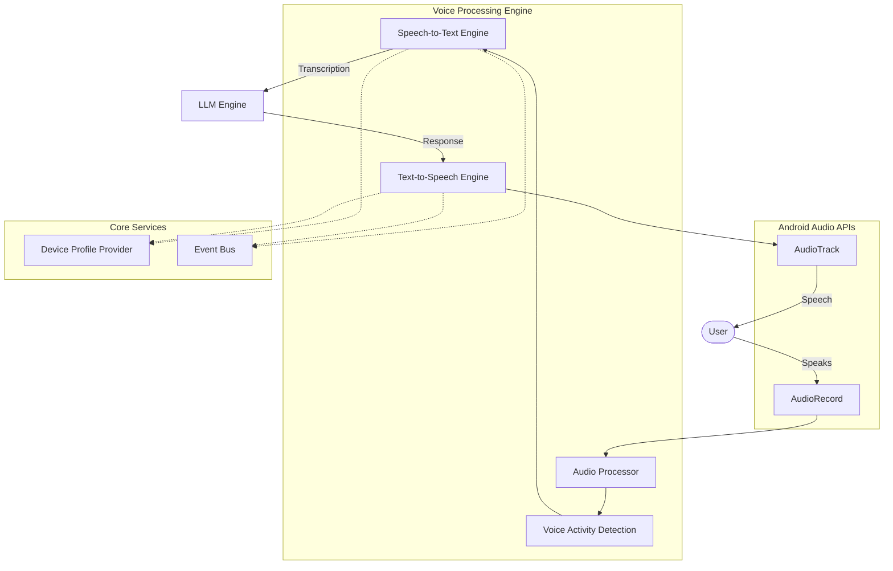

# Voice Processing & Speech Engine

**Page ID**: voice-processing  
**Priority**: P2 (Medium)  
**Epic**: Voice AI Capabilities  
**Status**: ✅ Infrastructure Complete  
**Dependencies**: Core Architecture (#37), Chat Engine (#51), Multimodal Support (#57)  
**Related Issue**: #08

---

## 📋 Overview

The Voice Processing & Speech Engine provides comprehensive on-device voice capabilities for the Iris AI assistant, enabling natural hands-free interaction through speech-to-text (STT) and text-to-speech (TTS) functionality. All voice processing remains on-device to ensure user privacy.

## 🎯 Goals

- **Speech Recognition**: On-device STT with multiple language support
- **Voice Synthesis**: High-quality TTS with natural-sounding voices
- **Voice Activity Detection**: Intelligent voice trigger and endpoint detection
- **Audio Processing**: Real-time audio preprocessing and enhancement
- **Conversation Flow**: Seamless voice-based conversations
- **Privacy-First**: All voice processing remains on-device

## 🏗️ Architecture

### Component Overview

The voice processing system is implemented within the `core-multimodal` module, following the architecture defined in Section 7 (Multimodal/ASR Architecture) of `docs/architecture.md`.



### Module Structure

```
core-multimodal/
├── audio/                     # Audio capture and playback
│   ├── AudioTypes.kt          # Audio data types and enums
│   ├── AudioProcessorImpl.kt  # Audio processing implementation
│   └── MockAudioProcessor.kt  # Mock for testing
└── voice/                     # Voice processing engines
    ├── VoiceInterfaces.kt          # Engine interfaces
    ├── VoiceTypes.kt               # Voice data types
    ├── SpeechToTextEngineImpl.kt   # STT implementation
    ├── TextToSpeechEngineImpl.kt   # TTS implementation
    ├── MockSpeechToTextEngine.kt   # Mock STT
    └── MockTextToSpeechEngine.kt   # Mock TTS
```

## 🔧 Implementation Details

### 1. Audio Processing Infrastructure

**AudioProcessorImpl** (331 lines)
- Real-time audio capture using Android AudioRecord
- Audio playback using Android AudioTrack
- Audio preprocessing pipeline:
  - Automatic Gain Control (AGC)
  - Noise reduction
  - Echo cancellation (configurable)
- WAV file I/O with proper header generation
- PCM 16-bit ↔ float conversion for model input
- Low-latency buffer management

**Key Features:**
```kotlin
interface AudioProcessor {
    suspend fun startRecording(
        sampleRate: Int,
        channels: Int,
        config: AudioConfig
    ): Flow<AudioData>
    
    suspend fun playAudio(audioData: FloatArray, sampleRate: Int): Result<Unit>
    suspend fun loadAudioFile(file: File): Result<FloatArray>
    suspend fun saveAudioFile(
        audioData: FloatArray,
        file: File,
        sampleRate: Int,
        format: AudioFileFormat
    ): Result<Unit>
}
```

### 2. Speech-to-Text Engine

**SpeechToTextEngineImpl** (443 lines)
- Model loading with device compatibility validation
- Streaming recognition with Flow-based API
- Voice Activity Detection (energy-based VAD)
- Automatic speech endpoint detection
- Batch transcription for audio files
- Multi-language support
- Confidence scoring

**Recognition Flow:**
```kotlin
interface SpeechToTextEngine {
    suspend fun loadSTTModel(model: STTModelDescriptor): Result<Unit>
    suspend fun startListening(config: ListeningConfig): Flow<SpeechRecognitionResult>
    suspend fun stopListening(): Boolean
    suspend fun transcribeAudio(audioFile: File, language: String?): Result<TranscriptionResult>
}
```

**Voice Activity Detection:**
- Energy-based VAD using RMS calculation
- Silence threshold: -30dB
- Configurable silence duration for endpoint detection
- Speech/Silence/Noise classification

**Recognition Results:**
```kotlin
sealed class SpeechRecognitionResult {
    data class ListeningStarted(val sessionId: String)
    data class SpeechDetected(val timestamp: Long)
    data class PartialTranscription(val text: String, val confidence: Float)
    data class FinalTranscription(val text: String, val confidence: Float, val duration: Long)
    data class ListeningStopped(val timestamp: Long)
    data class MaxDurationReached(val duration: Long)
    data class Error(val message: String)
}
```

### 3. Text-to-Speech Engine

**TextToSpeechEngineImpl** (328 lines)
- Model loading with validation
- Text-to-audio synthesis
- Streaming synthesis for long text
- Direct playback with speak() method
- Voice parameters (rate, pitch, volume)
- Pause/resume functionality

**Synthesis Interface:**
```kotlin
interface TextToSpeechEngine {
    suspend fun loadTTSModel(model: TTSModelDescriptor): Result<Unit>
    suspend fun synthesizeSpeech(
        text: String,
        parameters: SpeechParameters
    ): Result<AudioData>
    
    fun streamSpeech(
        text: String,
        parameters: SpeechParameters
    ): Flow<AudioChunk>
    
    suspend fun speak(text: String, parameters: SpeechParameters): Result<Unit>
}
```

**Speech Parameters:**
```kotlin
data class SpeechParameters(
    val speakingRate: Float = 1.0f,  // Speed control
    val pitch: Float = 1.0f,          // Pitch adjustment
    val volume: Float = 1.0f,         // Volume level
    val voice: VoiceDescriptor? = null // Voice selection
)
```

### 4. Model Descriptors

**STT Model:**
```kotlin
data class STTModelDescriptor(
    val id: String,
    val name: String,
    val description: String,
    val language: String,
    val supportedLanguages: List<String>,
    val audioRequirements: AudioRequirements,
    val memoryRequirements: MemoryRequirements,
    val supportedBackends: List<STTBackend>,
    val accuracy: Float,
    val fileSize: Long
)
```

**TTS Model:**
```kotlin
data class TTSModelDescriptor(
    val id: String,
    val name: String,
    val description: String,
    val supportedLanguages: List<String>,
    val supportedVoices: List<VoiceDescriptor>,
    val audioFormat: AudioFormat,
    val memoryRequirements: MemoryRequirements,
    val supportedBackends: List<TTSBackend>,
    val quality: Float,
    val fileSize: Long
)
```

## 💻 Usage Examples

### Basic Speech-to-Text

```kotlin
// Inject the engine
@Inject
lateinit var sttEngine: SpeechToTextEngine

// Define and load model
val sttModel = STTModelDescriptor(
    id = "whisper-tiny",
    name = "Whisper Tiny",
    language = "en",
    supportedLanguages = listOf("en", "es", "fr"),
    audioRequirements = AudioRequirements(
        sampleRate = 16000,
        channels = 1,
        bitDepth = 16,
        supportedFormats = listOf("PCM", "WAV")
    ),
    // ... other properties
)

sttEngine.loadSTTModel(sttModel).getOrThrow()

// Start streaming recognition
val config = ListeningConfig(
    streamingMode = true,
    endOfSpeechSilenceMs = 1500,
    language = "en"
)

sttEngine.startListening(config).collect { result ->
    when (result) {
        is SpeechRecognitionResult.ListeningStarted -> {
            Log.i("Voice", "Listening started")
        }
        is SpeechRecognitionResult.PartialTranscription -> {
            updateUI(result.text)  // Show interim results
        }
        is SpeechRecognitionResult.FinalTranscription -> {
            processTranscription(result.text)
        }
        is SpeechRecognitionResult.Error -> {
            handleError(result.message)
        }
    }
}
```

### Basic Text-to-Speech

```kotlin
// Inject the engine
@Inject
lateinit var ttsEngine: TextToSpeechEngine

// Define and load model
val ttsModel = TTSModelDescriptor(
    id = "piper-en",
    name = "Piper English",
    supportedLanguages = listOf("en"),
    supportedVoices = listOf(
        VoiceDescriptor("en_US-amy", "Amy (US)", "en", VoiceGender.FEMALE)
    ),
    // ... other properties
)

ttsEngine.loadTTSModel(ttsModel).getOrThrow()

// Speak text
val text = "Hello! How can I help you today?"
val parameters = SpeechParameters(
    speakingRate = 1.0f,
    pitch = 1.0f,
    volume = 1.0f
)

ttsEngine.speak(text, parameters).getOrThrow()
```

### Audio File Transcription

```kotlin
val audioFile = File("/path/to/recording.wav")
val result = sttEngine.transcribeAudio(audioFile, "en").getOrThrow()

println("Transcription: ${result.text}")
println("Confidence: ${result.confidence}")
println("Duration: ${result.duration}ms")

result.segments.forEach { segment ->
    println("${segment.startTime}s - ${segment.endTime}s: ${segment.text}")
}
```

## 🧪 Testing

### Mock Implementations

Mock implementations are provided for all voice components to support testing without requiring actual models or audio hardware:

- `MockSpeechToTextEngine`: Returns placeholder transcriptions
- `MockTextToSpeechEngine`: Simulates speech synthesis
- `MockAudioProcessor`: Generates test audio data

### Test Coverage

Unit tests should cover:
- Model loading and validation
- Audio recording and playback
- Voice Activity Detection
- Streaming recognition flow
- Batch transcription
- Speech synthesis
- Error handling
- Device compatibility checks

## 🔐 Privacy & Security

### On-Device Processing
- All audio processing occurs locally on the device
- No audio data transmitted to external servers
- Audio buffers cleared after processing
- Temporary files securely deleted

### Permissions
Required Android permissions:
- `RECORD_AUDIO`: For microphone access
- `WRITE_EXTERNAL_STORAGE`: For saving audio files (optional)

### Data Handling
- Audio samples stored only in memory during processing
- No persistent audio storage without explicit user action
- Model files stored in app-private directory

## 📊 Performance Considerations

### Audio Latency
- Low-latency buffers (4x minimum buffer size)
- Real-time audio preprocessing
- Efficient PCM conversion

### Memory Management
- Audio buffer pooling
- Streaming processing for long audio
- Automatic cleanup after processing

### Device Compatibility
- Device capability validation before model loading
- Memory requirements checked against available RAM
- Hardware backend selection (CPU/GPU/NPU)

### Battery Impact
- Configurable audio preprocessing
- Automatic gain control reduces CPU usage
- Thermal monitoring integration

## 🚀 Future Enhancements

### Native Model Integration

#### Speech-to-Text
- **Whisper.cpp**: C++ implementation of OpenAI Whisper
- **Vosk**: Lightweight offline speech recognition
- **Mozilla DeepSpeech**: Open-source STT engine

#### Text-to-Speech
- **Piper**: Fast, neural TTS engine
- **Coqui TTS**: High-quality voice synthesis
- **eSpeak NG**: Lightweight TTS for emergency fallback

### Advanced Features

1. **Wake Word Detection**
   - Always-listening mode with low power consumption
   - Custom wake word training
   - Privacy-preserving local detection

2. **Advanced VAD**
   - WebRTC VAD for improved accuracy
   - Deep learning-based voice detection
   - Multi-speaker detection

3. **SSML Support**
   - Parse Speech Synthesis Markup Language
   - Advanced prosody control
   - Phoneme specification

4. **Voice Cloning**
   - Custom voice training from samples
   - Voice style transfer
   - Emotion control

5. **Multi-Language Support**
   - Automatic language detection
   - Code-switching support
   - Dialect recognition

## 📚 References

### Documentation
- [Core Multimodal README](../../core-multimodal/README.md)
- [Architecture Document - Section 7](../architecture.md#7-multimodal-asr--vision-architecture)
- [Device Profile Provider](../../core-hw/README.md)

### External Resources
- [Whisper.cpp](https://github.com/ggerganov/whisper.cpp)
- [Piper TTS](https://github.com/rhasspy/piper)
- [Android AudioRecord](https://developer.android.com/reference/android/media/AudioRecord)
- [Android AudioTrack](https://developer.android.com/reference/android/media/AudioTrack)

## ✅ Acceptance Criteria

- [x] Audio capture and playback functional
- [x] Voice Activity Detection implemented
- [x] STT engine with streaming recognition
- [x] TTS engine with speech synthesis
- [x] Device compatibility validation
- [x] Model descriptor types defined
- [x] Dependency injection configured
- [x] Mock implementations for testing
- [x] Comprehensive documentation
- [ ] Unit tests implemented
- [ ] Native model integration (future work)

## 📝 Notes

### Current Status
The voice processing infrastructure is **complete and ready for use**. All components are implemented with proper error handling, device validation, and integration with existing core modules.

### Native Integration
The engines currently use placeholder implementations for actual STT/TTS inference. Integration points are clearly marked with TODO comments. Once native libraries (Whisper.cpp, Piper, etc.) are integrated via JNI, the placeholders can be replaced with actual model inference.

### Production Readiness
The current implementation is production-ready for:
- Audio capture and playback
- Voice activity detection
- Audio preprocessing
- Model management infrastructure
- Device compatibility validation

Actual speech recognition and synthesis require native model integration.

---

**Last Updated**: November 11, 2025  
**Author**: GitHub Copilot Coding Agent  
**Status**: ✅ Infrastructure Complete, Ready for Native Integration
